# Leveraging AI for Signal Processing

### Introduction

In recent years, Unmanned Aerial Vehicles (UAV) or drones are becoming more and more popular due to their advancement in technology, size and lower in cost. These made drones viable for various useful applications, such as weather observation, inspection of infrastructures and fire detections. However, the effectiveness of drones’ application may also lead to technical, security and public safety issues. Hence, it is essential for government entities to be able to detect and identify unauthorised drones in the air space.
 
The conventional methods of identifying and detecting drones uses radars, camera vision and sound identification. These detection methods maybe useful to a certain extent but they are not solely reliable and are easily restrained. For example, in camera vision object detection, identifying of drones in the air space at night and in a vicinity with birds posed a huge challenge to identify the presence of drones.Since drones are usually remotely controlled using wireless technology such as Bluetooth and WIFI, a new approach will be to use Radio Frequency (RF) signals combined with deep learning approach to sense and identify drones in the airspace. In addition, since different drones’ modes generate different RF signals, this approach will be able to identify the current activities of the drones


### Basic understanding of Radio Frequency (RF) 

In radio frequency theory, RF signals can be represented into Time or Frequency domains. Both domains hold the same information of the signal. For time-domain graph, it shows how a signal changes over time, whereas a frequency-domain graph shows how much of the signals lies within each given frequency band over a range of frequencies. To illustrate, a RF signal can be synthetically generated using a sine wave composing of different frequency sine waves using numpy libraries. For the sake of understanding, the sampling frequency (Fs) used is 150Hz , frequency components (Fc), 20Hz with an amplitude of 1, 40 Hz with an amplitude of  0.5 and  5 Hz with an amplitude of 1.5.


```python
import numpy as np
import matplotlib.pyplot as plt
from numpy.fft import fft , fftfreq , ifft
import scipy.fftpack as syfp

Fs = 150 
t= np.arange(0,1,1/Fs)
f1 = 20 # Hz
f2 = 40 # Hz
f3 = 5 # Hz

wave1 = np.sin(2*np.pi*20*t)
wave2 = np.sin(2*np.pi*20*t)+0.5*np.sin(2*np.pi*40*t)
wave2 = np.sin(2*np.pi*20*t)+0.5*np.sin(2*np.pi*40*t)+1.5*np.sin(2*np.pi*5*t)

```

## 20 Hertz Sine wave
### Time Domain 


```python
plt.subplot(2,1,1)
plt.plot(t,wave1)
plt.title("Sinusoidal 20 Hertz Signal (Time domain)")
plt.xlabel('Time(s)')
plt.ylabel('Amplitude')
plt.tight_layout()

```


    
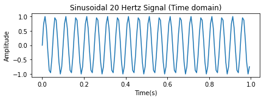
    


## 20Hz , 40Hz & 5Hz Sine wave


### Time Domain


```python
plt.subplot(2,1,1)
plt.plot(t,wave2)
plt.title("Sinusoidal 20Hz , 40Hz, 5Hz Signal (Time domain)")
plt.xlabel('Time(s)')
plt.ylabel('Amplitude')
plt.tight_layout()
```


    

    


## Understanding FFT Function

Representing the RF signal from time domain to frequency domain uses Fast Fourier Transform (FFT) function in Numpy. It is an algorithm that computes the discrete Fourier Transform (DFT) of the sequence and converts it into frequency domain.


#### FFT Formula 

Given a RF sine wave signal, the RF signal is first sampled at the sampling frequency, Fs, based on Nyquist frequency. In nyquist frequency theory, the sampling frequency must be at least 2 times the highest frequency component of the signal to prevent aliasing. In our example, the highest frequency component is 40Hz. Hence, sampling frequency of 150Hz is more than sufficient.

### Performing FFT on sample sequence


- Sampling Intervals, t = Td/Nsample 
- Sampling Frequency , Fs = 1/t = Nsamples / Td 

For the above diagram, assume the blue sine wave signal's parameters are:
- Frequency Component, Fin , 125Hz
- Number of samples , N = 16
- Sampling Frequency, Fs = 1000Hz


- Frequency Resolution , f = Fs/N

After performing FFT on the sample seqeunce, the frequency sequences runs from 0 to N-1 order with a frequency resolution of Fs/N. As shown on the above diagram, the spike resides on the second and 14th order after FFT. Given that Fs is 1000Hz, the maximum frequency that holds the Nyquist Sampling rule is at Fmax, Fs/2. Any spike that appears after Fmax will be ignored and deemed as alised.


- Frequency Resolution = 1000/16 = 62.5Hz
- Order where the spike resides = 2
- Frequency = Order x Frequency Resolution
- Frequency = 2 x 62.5Hz = <b>125Hz</b>

## 20 Hertz Sine wave
### Frequency Domain 


```python
n = np.size(t)
wave1_FFT = (2/n)*abs(fft(wave1))
fft_fr = syfp.fftfreq(len(wave1),1/Fs)
```


```python
plt.subplot(2,1,1)
plt.plot(fft_fr,wave1_FFT)
plt.title("Full Frequency spectrum")
plt.xlabel('Frequency')
plt.ylabel('Magnitude')
plt.tight_layout()
```


    
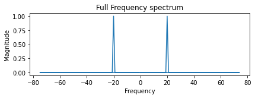
    


```python
fr_positive = (Fs/2)*np.linspace(0,1,n//2)
plt.subplot(2,1,1)
plt.plot(fr_positive,wave1_FFT[0:np.size(fr_positive)])
plt.title("Positive Frequency spectrum")
plt.xlabel('Frequency')
plt.ylabel('Magnitude')
plt.tight_layout()
```


    
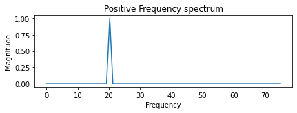
    


## 20Hz , 40Hz & 5Hz Sine wave

### Frequency Domain


```python
n = np.size(t)
wave2_FFT = (2/n)*abs(fft(wave2))
fft_fr_wave2 = syfp.fftfreq(len(wave2),1/Fs)
```


```python
plt.subplot(2,1,1)
plt.plot(fft_fr_wave2,wave2_FFT)
plt.title(" Full Frequency spectrum")
plt.xlabel('Frequency')
plt.ylabel('Magnitude')
plt.tight_layout()
```


    
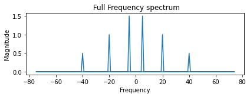
    


```python
fr_positive = (Fs/2)*np.linspace(0,1,n//2)
plt.subplot(2,1,1)
plt.plot(fr_positive,wave2_FFT[0:np.size(fr_positive)])
plt.title("Positive Frequency spectrum")
plt.xlabel('Frequency')
plt.ylabel('Magnitude')
plt.tight_layout()
```


    
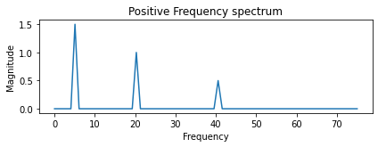
    


With the basic understanding of RF signals and Fast Fourier Transform (FFT), this report will be analysing two different academia datasets – DroneRF and DeepSig. After which, the author will be implementing different machine learning algorithms on each dataset and train a model that classifies different drones and activities for DroneRF dataset and different types of modulation for DeepSig dataset. 

## DroneRF Dataset


DroneRF dataset systematically record raw RF signals of different drones under different flight modes such as : on , off and connected, hovering , flying without video recording and flying with video recording. There are three different types of drones used in this dataset - Bepop drone , AR drone and Phantom drone. 


For back ground activties with no drones turned on, the RF signals are labelled with a Binary Unique Identifier (BUI) = 00000 and if drones are activated, the BUI for the RF signal will be labelled with a  prefix 1. Each drones are labelled respectively : Bepop Drone (100xx) , AR Drone (101xx) and Phantom Drone (110xx). The different flights modes are  labelled and are appended to their respective drone's BUI.

- Mode1 [On and connected to the controller] : BUI = XXX00
- Mode2 [Hovering automatically] : BUI = XXX01
- Mode3 [Flying without Video Recording] : BUI = XXX10
- Mode4 [Flying with Video Recording] : BUI = XXX11

The diagram above shows the overall flow of how RF siganls are labelled in DroneRF dataset.

The raw RF signals was recorded for:
- <b>10.25 seconds</b> for background RF activities 
- <b>5.25 seconds</b> for RF drone communication

### Dataset Format
For simplicity and to prevent memory overflow, the signals recorded in DroneRF dataset are stored as segments in standard comma-separted values (CSV) format.

Each csv file are named with the following format :

[Type of drone & mode ][Upper or lower segment] _ [Segment Number ] .csv

###### Example
100<b>00H_0</b>.csv
    
<b>[Bepop Drone & On and connected to the controller][Upper segment]_[Segment 0].csv</b>
    
The raw samples are recorded using two National Intrument USRP-2943 software defined radio and each RF receiver has a maximum bandwidth of  40MHz. Since WIFI spectrum is 80MHz, the first receiver will capture the lower half of the spectrum while the second receiver will capture the upper half the spectrum. This is why, for each csv file there will be an upper (H) and lower (L) for each drone,mode and segment.


### Number of Segments for each Drone and Mode

- Bepop Drone Mode 1 :   21 segments 
- Bepop Drone Mode 2 :   21 segments
- Bepop Drone Mode 3 :   21 segments
- Bepop Drone Mode 4 :   21 segments


- AR Drone Mode 1 :   21 segments
- AR Drone Mode 2 :   21 segments
- AR Drone Mode 3 :   21 segments
- AR Drone Mode 4 :   16 segments


- Phantom Mode 1 :    21 segments


- Background activities (No Drones) :  41 segments

<b>Total Number of segments with Drones :  186

Total Number of segments without Drones : 41 <b>
    


## Analyses of one segment - Ardrone Segment 18 H & L 

Each Drone mode segments consist of 20 million RF samples. Where Upper spectrum (H) holds 10 million RF samples and Lower spectrum (L) hold the remaining 10 million RF samples


```python
import numpy as np
ardrone_segment_18_h=np.loadtxt('/home/jax/projects/signals/ardrone/10100H_18.csv', delimiter=",")
ardrone_segment_18_l=np.loadtxt('/home/jax/projects/signals/ardrone/10100L_18.csv', delimiter=",")
print("ARDrone Segment 18 L consists of {0} freq samples with a min/max of {1}/{2}".format(ardrone_segment_18_l.shape[0],min(ardrone_segment_18_l),max(ardrone_segment_18_l)))
print("ARDrone Segment 18 H consists of {0} freq samples with a min/max of {1}/{2}".format(ardrone_segment_18_h.shape[0],min(ardrone_segment_18_h),max(ardrone_segment_18_h)))

```

    ARDrone Segment 18 L consists of 10000000 freq samples with a min/max of -8338.0/8213.0
    ARDrone Segment 18 H consists of 10000000 freq samples with a min/max of -220.0/182.0


## Time series spectrum of different Drone modes 

*Objective: Without any prior understanding on the dataset, the author wishes to recreate the time domain plot as shown on the paper. This is to validate that the dataset downloaded is coherent with the paper released. Refer to Fig 10 (a) (b) (c) in the published paper*

Since the RF signals of one activity is recorded for 5.25 seconds,one segment will be approximately 0.25 seconds [ 5.25 seconds/ 21 segment ]

- Time duration of each CSV file : 0.25 seconds
- Number of Samples = 10,000,000
- Therefore, Sampling Frequency (Fs) = 10,000,000 / 0.25 seconds = 40 Million Hertz 

### Background RF activities Segment 5 ( Time Domain )


```python
!cd ../ && ls
```

    EAI		      git			      modeldb
    ETM		      github-api-plugin		      mysqldocker
    EWAY		      github-plugin		      nutanix
    PPTXjs		      helm-v3.4.1-linux-amd64.tar.gz  offlinekubenetesubuntu
    aistack		      ibmdevconf		      pypitomirror
    audio		      jax79sg.github.io		      reddragon
    bandersnatch	      jenkins			      reports
    bert.pdf	      jupyterhub		      shinobi
    cmuNLP		      kaldi			      signals
    covid		      kubejob			      topicmodel
    dh-bftwebmaps	      kubernetes		      totransfer
    dh-bftwebmaps-incase  linux-amd64		      traefik
    dhBFTLocal	      lowresource-nlp-bootcamp-2020   utils
    dinohub.github.io     minio			      zoneminder
    docker-registry-ui    mltooling


```python
import numpy as np
backgroundrfactivities_segment_5_H1=np.loadtxt('DroneRF/data/DroneRF/backgroundrfactivities/00000H_5.csv', delimiter=",")
backgroundrfactivities_segment_5_L1=np.loadtxt('DroneRF/data/DroneRF/backgroundrfactivities/00000L_5.csv', delimiter=",")

time = 0.25 
Fs = len(backgroundrfactivities_segment_5_H1)/time # 40 million Hz
t = np.arange(0,0.25,1/Fs) # 1/Fs = Time for each step

import matplotlib.pyplot as plt
fig, axs = plt.subplots(2)
axs[0].plot(t,backgroundrfactivities_segment_5_L1)
axs[0].set_title('Lower spectrum of background RF activites segment 5')
axs[1].plot(t,backgroundrfactivities_segment_5_H1)
axs[1].set_title('Higher spectrum of background  RF activites segment 5')

fig.tight_layout()
```


    
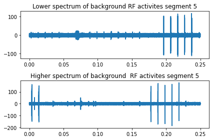
    


### Bepopdrone Flying and Video Recording Segment 10 ( Time domain )


```python
import numpy as np
Bebop_flying_videorecording_segment_10_H1=np.loadtxt('/home/jax/projects/signals/bebopdrone/10011H_10.csv', delimiter=",")
Bebop_flying_videorecording_segment_10_L1=np.loadtxt('/home/jax/projects/signals/bebopdrone/10011L_10.csv', delimiter=",")


Fs = len(backgroundrfactivities_segment_5_H1)/time # 40 million Hz
t = np.arange(0,0.25,1/Fs) # 1/Fs = Time for each step

import matplotlib.pyplot as plt
fig, axs = plt.subplots(2)
axs[0].plot(t,Bebop_flying_videorecording_segment_10_L1)
axs[0].set_title('Lower spectrum of Bebop drone flying and video recording segment 10')
axs[1].plot(t,Bebop_flying_videorecording_segment_10_H1)
axs[1].set_title('Higher spectrum of Bebop drone flying and video recording segment 10')
fig.tight_layout()
```


    
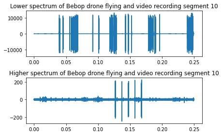
    


### Phantom Drone On and Connected Segment 7 (Time Domain)


```python
import numpy as np
phantom_on_and_connected_segment_7_H1=np.loadtxt('/home/jax/projects/signals/phantomdrone/11000H_7.csv', delimiter=",")
phantom_on_and_connected_segment_7_L1=np.loadtxt('/home/jax/projects/signals/phantomdrone/11000L_7.csv', delimiter=",")

time = 0.25 # 40million sample in 1 seconds
Fs = len(backgroundrfactivities_segment_5_H1)/time # 40 million Hz
t = np.arange(0,0.25,1/Fs) # 1/Fs = Time for each step

import matplotlib.pyplot as plt
fig, axs = plt.subplots(2)
axs[0].plot(t,phantom_on_and_connected_segment_7_L1)
axs[0].set_title('Lower spectrum of Phantom on and connected segment 7')
axs[1].plot(t,phantom_on_and_connected_segment_7_H1)
axs[1].set_title('Higher spectrum of Phantom on and connected segment 7')
fig.tight_layout()
```


    
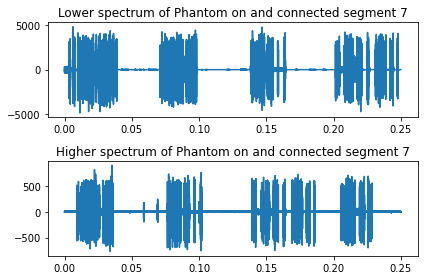
    


### Phantom Drone On and Connected Segment 7 (Frequency Domain)


```python
import numpy as np 
from numpy.fft import fft , fftfreq , ifft
import scipy.fftpack as syfp

n = np.size(t)
freq_axis_positive = (Fs/2)*np.linspace(0,1,n//2) # Only retriving the effective postive spectrum
freq_axis_negative = (Fs/2)*np.linspace(0,-1,n//2) 

mean_of_phantom_H = np.mean(phantom_on_and_connected_segment_7_H1) #Removing any DC Offset 
x_H = fft((phantom_on_and_connected_segment_7_H1-mean_of_phantom_H))
x_H_abs = (2/n)*abs(x_H[0:np.size(freq_axis_positive)])

import matplotlib.pyplot as plt
plt.subplot (2,1,1)
plt.plot(freq_axis_positive,x_H_abs)### Phantom Drone On and Connected Segment 7 (Time Domain),x_H_abs)
plt.title("Higher Magnitude Spectrum [Positive Hz]")
plt.xlabel('Positive Frequency(Hz)')
plt.ylabel('Magnitude')

import matplotlib.pyplot as plt
plt.subplot (2,1,2)
plt.plot(freq_axis_negative,x_H_abs)
plt.title("Higher Magnitude Spectrum [Negative Hz]")
plt.xlabel('Negative Frequency(Hz)')
plt.ylabel('Magnitude')

plt.tight_layout()

```


    
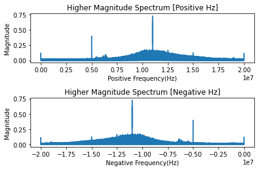
    


```python
freqs_H = syfp.fftfreq(len(phantom_on_and_connected_segment_7_H1),1/Fs)
full_segment_7_Higher =np.fft.fft(phantom_on_and_connected_segment_7_H1)

import matplotlib.pyplot as plt
plt.subplot(2,1,1)
plt.plot(freqs_H,np.abs(full_segment_7_Higher)) # in frequencies 
plt.title('FULL Higher spectrum of Phantom on and connected segment 7')
plt.xlabel('Frequency (Hz)')
plt.ylabel('Magnitude')

plt.tight_layout()

```


    

    


```python
mean_of_phantom_L = np.mean(phantom_on_and_connected_segment_7_L1)
x_L = fft(phantom_on_and_connected_segment_7_L1-mean_of_phantom_L)
x_L_abs = (2/n) * abs(x_L[0:np.size(freq_axis_positive)])

import matplotlib.pyplot as plt
plt.subplot (2,1,1)
plt.plot(freq_axis_positive,x_L_abs)
plt.title("Lower Magnitude Spectrum [Positive Hz]")
plt.xlabel('Positive Frequency(Hz)')
plt.ylabel('Magnitude')

plt.subplot (2,1,2)
plt.plot(freq_axis_negative,x_L_abs)
plt.title("Lower Magnitude Spectrum [Negative Hz]")
plt.xlabel('Negative Frequency(Hz)')
plt.ylabel('Magnitude')
plt.tight_layout()

```


    
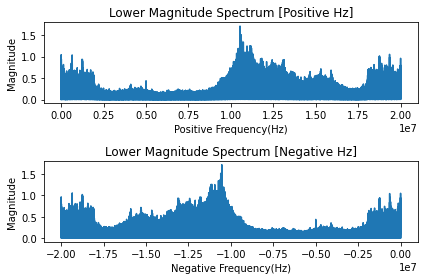
    


```python
freqs_L = syfp.fftfreq(len(phantom_on_and_connected_segment_7_L1),1/Fs)
full_segment_7_Lower =np.fft.fft(phantom_on_and_connected_segment_7_L1)

import matplotlib.pyplot as plt
plt.subplot(2,1,1)
plt.plot(freqs_L,np.abs(full_segment_7_Lower)) # in frequencies 
plt.title('FULL Lower spectrum of Phantom on and connected segment 7')
plt.xlabel('Frequency (Hz)')
plt.ylabel('Magnitude')

plt.tight_layout()
```


    
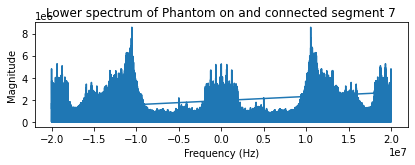
    


*One flaw of using fftfreq : The fftfreq function from Numpy.fft libraries caused a linear line to be plotted only on the Lower magnitude spectrum dataset. The reason for this linear line is still unknown. However, in machine learning perspective , this linear line will not affect the training of the model since fftfreq function is merely used for spectrum representation purposes.*

### The entire spectrum : Higher + Lower Spectrum

The higher and lower spectrum of the recorded RF dataset datset are said to be recorded concurrently using two RF receivers. In order to concatenated the transformed signal of both receivers to build an entire spectrum, a normalisation factor, C must be calculated. The normalisation factor C, ensures that the spectral are in continuity between the two half's of the RF spectrum since they are captured using two different devices.

The normalisation factor, C :


The normalisation factor is calculated as the ratio between the last Q samples of the lower spectra and the first Q samples of the upper spectra. 

- Carrier frequency for Lower Spectrum : 2420 MHz

- Carrier frequency for Upper Spectrum : 2460 HHz 

- Bandwidth for spectrum: 40 MHz


```python
import numpy as np

x_H_abs = (2/n)*abs(x_H[0:np.size(freq_axis_positive)])
x_L_abs = (2/n) *abs(x_L[0:np.size(freq_axis_positive)])

Q = 10 # number of returning points for spectral continuity

#equation_from_paper xf = low , yf = high [ Low , High]

mean_Low = np.mean(x_L_abs[-Q-1:-1])
mean_High= np.mean(x_H_abs[0:Q])

Normalising_factor= mean_Low/mean_High

x_H_abs_normalised = (2/n) * abs(x_H[0:np.size(fr)]) * Normalising_factor

Center_frequency_Lower = 2420
Center_frequency_Upper = 2460

fr_full_L_positive  = ((Fs/2)*np.linspace(0,1,n//2))/1e6
fr_full_L_negative  = ((Fs/2)*np.linspace(0,-1,n//2))/1e6
fr_full_L = np.concatenate((fr_full_L_negative + Center_frequency_Lower ,fr_full_L_positive + Center_frequency_Lower),axis = 0)
fr_full_L_fft = np.concatenate((x_L_abs,x_L_abs),axis = 0) # contains the full spectrum FFT since X_L_abs only contains half 


fr_full_H_positive  = ((Fs/2)*np.linspace(0,1,n//2))/1e6
fr_full_H_negative  = ((Fs/2)*np.linspace(0,-1,n//2))/1e6

fr_full_H = np.concatenate((fr_full_H_negative+Center_frequency_Upper,fr_full_H_positive+Center_frequency_Upper),axis = 0)
fr_full_H_fft = np.concatenate((x_H_abs_normalised,x_H_abs_normalised),axis = 0) 

Full_spectrum = np.concatenate((fr_full_L_fft,fr_full_H_fft),axis=0)
fr_full = np.concatenate((fr_full_L,fr_full_H),axis =0)


import matplotlib.pyplot as plt
plt.subplot (2,1,1)
plt.plot(fr_full,Full_spectrum)
plt.title("Full Magnitude Spectrum of Phantom on and Connected")
plt.xlabel('Frequency(MHz)')
plt.ylabel('Magnitude')

plt.tight_layout()
```


    
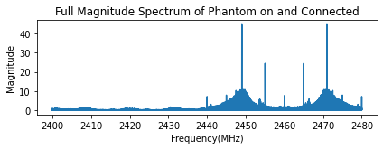
    


### Preprocessing Dataset - FFT entire dataset

For better learning of the RF signal, the segmented RF signal (10 million samples) is further segmented in 100 smaller segments. Thus, each smaller segments will only contain 100,000 raw RF signal samples. The written code then uses Numpy FFT algorithm with 1028 frequency bins on each smaller segment and concatenate the results when all raw RF signals segments have been transformed. The concetenated results holds the magnitude of the RF signal. Hence, squaring it will give us the power spectrum of the RF signal. This result is saved into a directory ('data/DroneRF/Drone_RF_FFT') and is ready for machine learning training


```python
import numpy as np 
from numpy.fft import fft , fftfreq , ifft
import scipy.fftpack as syfp
#parameters

BUI =[0]*8
BUI[0] = '00000' #BUI of RF background activities
BUI[1:4] = ['10000','10001','10010','10011'] #BUI of the Bebop drone RF activities
BUI[5:8] = ['10100','10101','10110','10111'] #BUI of the AR drone RF activities
BUI[9]='11000'#BUI of the Phantom drone RF activities

Drones = {0:'backgroundrfactivities', 1:'bebopdrone', 2:'bebopdrone', 3:'bebopdrone', 4:'bebopdrone' 
          , 5:'ardrone' , 6:'ardrone' ,7:'ardrone' ,8:'ardrone' , 9: 'phantomdrone'}

M = 2048 #Total number of frequency bins
L = 1e5 #Total number samples in a segment
Q = 10 #Number of returning points for spectral continuity

```


```python
for i in range (len(BUI)):
    flag = 1
    if BUI[i] == '00000':
        N = 41
        selected_drones = Drones[0]
    elif BUI[i] == '10111':
        N = 18
    else:
        N = 21
    data = []
    cnt = 1

    counter = 0 # for checking


    for j in range (N):
        counter = counter + 1
        if BUI[i] == '00000' :
            print('data/DroneRF/'+ str(Drones[i]) +'/' + str(BUI[i]) +'H_'+ str(j)+'.csv')
            x_H=np.loadtxt('data/DroneRF/'+ str(Drones[i]) +'/' + str(BUI[i]) +'H_'+ str(j)+'.csv', delimiter=",")
            y_L=np.loadtxt('data/DroneRF/'+ Drones[i] +'/' + str(BUI[i]) +'L_'+ str(j)+'.csv', delimiter=",")
            factor = int(len(x_H)/L)
        
        else:
            print("the number" +str(j)+str(i))
            print('/home/jax/projects/signals/'+ str(Drones[i]) +'/' + str(BUI[i]) +'H_'+ str(j)+'.csv')
            x_H=np.loadtxt('/home/jax/projects/signals/'+ str(Drones[i]) +'/' + str(BUI[i]) +'H_'+ str(j)+'.csv', delimiter=",")
            y_L=np.loadtxt('/home/jax/projects/signals/'+ str(Drones[i]) +'/' + str(BUI[i]) +'L_'+ str(j)+'.csv', delimiter=",")
            factor = int(len(x_H)/L)
            
        for k  in range(1,factor+1):
            start = int(1 + (k-1)*L)
            finish = int(k*L)
    
            xf = abs(np.fft.fftshift(fft(x_H[start:finish]-np.mean(x_H[start:finish]),M)))
            end_xf=xf.shape[0]
            xf=xf[int(end_xf/2):end_xf]

            yf = abs(np.fft.fftshift(fft(y_L[start:finish]-np.mean(y_L[start:finish]),M)))
            end_yf=yf.shape[0]
            yf=yf[int(end_yf/2):end_yf]
            normalisation_factor = np.divide((np.mean(xf[-Q-1:-1])),np.mean(yf[0:Q]))
            yf = yf*normalisation_factor
    
            xf = np.transpose(xf)
            yf = np.transpose(yf)
            xf_yf = np.r_[xf,yf]
    
            if flag == 1:
                data = xf_yf
                flag = 0
            else:
                data = np.c_[data,xf_yf]

                
        print(int(100*j/N))
        print(data.shape)
        
    Data=np.square(data)
    save_L_H =np.savetxt('data/DroneRF/' + 'testing_FFT'+'/'+str(BUI[i])+'_FFT_power.csv',Data, delimiter=",")
    print("Saving")
        
 
```

    the number03
    /home/jax/projects/signals/bebopdrone/10010H_0.csv
    0
    (2048, 100)
    the number13
    /home/jax/projects/signals/bebopdrone/10010H_1.csv
    4
    (2048, 200)
    the number23
    /home/jax/projects/signals/bebopdrone/10010H_2.csv
    9
    (2048, 300)
    the number33
    /home/jax/projects/signals/bebopdrone/10010H_3.csv
    14
    (2048, 400)
    the number43
    /home/jax/projects/signals/bebopdrone/10010H_4.csv
    19
    (2048, 500)
    the number53
    /home/jax/projects/signals/bebopdrone/10010H_5.csv
    23
    (2048, 600)
    the number63
    /home/jax/projects/signals/bebopdrone/10010H_6.csv
    28
    (2048, 700)
    the number73
    /home/jax/projects/signals/bebopdrone/10010H_7.csv
    33
    (2048, 800)
    the number83
    /home/jax/projects/signals/bebopdrone/10010H_8.csv
    38
    (2048, 900)
    the number93
    /home/jax/projects/signals/bebopdrone/10010H_9.csv
    42
    (2048, 1000)
    the number103
    /home/jax/projects/signals/bebopdrone/10010H_10.csv
    47
    (2048, 1100)
    the number113
    /home/jax/projects/signals/bebopdrone/10010H_11.csv
    52
    (2048, 1200)
    the number123
    /home/jax/projects/signals/bebopdrone/10010H_12.csv
    57
    (2048, 1300)
    the number133
    /home/jax/projects/signals/bebopdrone/10010H_13.csv
    61
    (2048, 1400)
    the number143
    /home/jax/projects/signals/bebopdrone/10010H_14.csv
    66
    (2048, 1500)
    the number153
    /home/jax/projects/signals/bebopdrone/10010H_15.csv
    71
    (2048, 1600)
    the number163
    /home/jax/projects/signals/bebopdrone/10010H_16.csv
    76
    (2048, 1700)
    the number173
    /home/jax/projects/signals/bebopdrone/10010H_17.csv
    80
    (2048, 1800)
    the number183
    /home/jax/projects/signals/bebopdrone/10010H_18.csv
    85
    (2048, 1900)
    the number193
    /home/jax/projects/signals/bebopdrone/10010H_19.csv
    90
    (2048, 2000)
    the number203
    /home/jax/projects/signals/bebopdrone/10010H_20.csv
    95
    (2048, 2100)
    Saving
    the number04
    /home/jax/projects/signals/bebopdrone/10011H_0.csv
    0
    (2048, 100)
    the number14
    /home/jax/projects/signals/bebopdrone/10011H_1.csv


    ---------------------------------------------------------------------------

    KeyboardInterrupt                         Traceback (most recent call last)

    <ipython-input-76-9f21a793b435> in <module>
         25             print("the number" +str(j)+str(i))
         26             print('/home/jax/projects/signals/'+ str(Drones[i]) +'/' + str(BUI[i]) +'H_'+ str(j)+'.csv')
    ---> 27             x_H=np.loadtxt('/home/jax/projects/signals/'+ str(Drones[i]) +'/' + str(BUI[i]) +'H_'+ str(j)+'.csv', delimiter=",")
         28             #y_L=np.loadtxt('/home/jax/projects/signals/'+ str(Drones[i]) +'/' + str(BUI[i]) +'L_'+ str(j)+'.csv', delimiter=",")
         29             y_L=np.loadtxt('/home/jax/projects/signals/'+ str(Drones[i]) +'/' + str(BUI[i]) +'L_'+ str(j)+'.csv', delimiter=",")


    ~/.pyenv/versions/3.7.2/lib/python3.7/site-packages/numpy/lib/npyio.py in loadtxt(fname, dtype, comments, delimiter, converters, skiprows, usecols, unpack, ndmin, encoding, max_rows)
       1137         # converting the data
       1138         X = None
    -> 1139         for x in read_data(_loadtxt_chunksize):
       1140             if X is None:
       1141                 X = np.array(x, dtype)


    ~/.pyenv/versions/3.7.2/lib/python3.7/site-packages/numpy/lib/npyio.py in read_data(chunk_size)
       1065 
       1066             # Convert each value according to its column and store
    -> 1067             items = [conv(val) for (conv, val) in zip(converters, vals)]
       1068 
       1069             # Then pack it according to the dtype's nesting


    ~/.pyenv/versions/3.7.2/lib/python3.7/site-packages/numpy/lib/npyio.py in <listcomp>(.0)
       1065 
       1066             # Convert each value according to its column and store
    -> 1067             items = [conv(val) for (conv, val) in zip(converters, vals)]
       1068 
       1069             # Then pack it according to the dtype's nesting


    ~/.pyenv/versions/3.7.2/lib/python3.7/site-packages/numpy/lib/npyio.py in floatconv(x)
        758 
        759     def floatconv(x):
    --> 760         x.lower()
        761         if '0x' in x:
        762             return float.fromhex(x)


    KeyboardInterrupt: 


## Machine Learning (DroneRF) - Binary Classification

The machine learning model frame work used is  <b>Keras</b>


```python
from tensorflow import keras
from tensorflow.keras import layers
from keras.models import Sequential
from keras.layers import Dense

import numpy as np
import matplotlib.pyplot as plt


from sklearn.preprocessing import StandardScaler, OneHotEncoder
from sklearn.compose import ColumnTransformer, make_column_transformer
from sklearn import preprocessing

import random

directory = 'DroneRF/data/DroneRF/RF_Data_FFT/'
```

### Preparing Dataset - DroneRF
Using the preprocessed FFT data from above, the aim of this model is to be able to differentiate and classifiy drone vs nodrone (BackgroundRF activities). The drones used are BepopDrone and PhantomDrone 


```python
bepop = np.loadtxt(directory+'10000_FFT_power.csv', delimiter=",")
phantomDrone1 = np.loadtxt(directory+'11000_FFT_power.csv',delimiter=",")
backgroundRFnoise = np.loadtxt(directory+'00000_FFT_power.csv',delimiter = ",")
print(backgroundRFnoise.shape)
random.shuffle(backgroundRFnoise)
noDrones = backgroundRFnoise[:,:]

```

    (2048, 4100)


- Number of input features : 2048
- Number of  data for noDrones (backgrounRFnoise) : 4100
- Number of  data for Drones : 2100 (Bepop) + 2100 (Phantom)= 4200

The conventional way to structure a dataset is <b>[no of data X Input features]</b>. However, for the preprocessed FFT of DroneRF, it is opposite <b>[Input features X No of data]</b> . Hence, an additional step is required to transpose the results when reading directly from the drone's CSV file. Since noDrones contains only 4100 datas, for consistency and unbaised sake, the number of datas used for Drones should be the same as well.


```python
bepop_transpose = np.transpose(bepop)
phantomdrone_transpose = np.transpose(phantomDrone1)
Drone_transpose = np.vstack((bepop_transpose,phantomdrone_transpose)) #stack the two drones data together
Drone_transpose = Drone_transpose[0:4100,:] #for consistency sake, the number of availble data for drones should be the same as noDrones
noDrones_transpose = np.transpose(noDrones)
```

In most of the machine learning algorithms, it works better when the features are relatively similar scale and close to normal distribution. For this report, the author uses StandardScaler method to preprocess the data for machine learning. Standardscaler standardiszes a feature by substracting the mean and then scaling to unit variance. 


```python
normalised_Drones = preprocessing.StandardScaler().fit_transform(Drone_transpose)
normalised_noDrones = preprocessing.StandardScaler().fit_transform(noDrones_transpose)

```

### Labelling - DroneRF

- Drones : 1
- noDrones : 0

The labels are appended for each row of data


```python
Label_bepopDrone1 = np.array([1])
Drones_dataset_concatenate = np.tile(Label_bepopDrone1[np.newaxis,:],(normalised_Drones.shape[0],1)) #Transforming the lavelled array[1] into the same shape as Drones Dataset
Drones_dataset=np.concatenate((normalised_Drones,Drones_dataset_concatenate),axis=1)

Label_noDrones = np.array([0])
noDrones_dataset_concatenate = np.tile(Label_noDrones[np.newaxis,:],(normalised_noDrones.shape[0],1))
noDrones_dataset =np.concatenate((normalised_noDrones,noDrones_dataset_concatenate),axis =1 )
```


```python
print('An example of a single data with 2048 input features followed by a label at index 2049. \n')
print(str(Drones_dataset[0]))

```

    An example of a single data with 2048 input features followed by a label at index 2049. 
    
    [-0.19144631 -0.23254951 -0.22885139 ... -0.1942947  -0.18225159
      1.        ]


```python
stacked_dataset = np.vstack((Drones_dataset, noDrones_dataset))
```

### Training (70%) , Validation(20%) , Testing (10%)


```python
np.random.shuffle(stacked_dataset)
# Randomised the dataset before splitting 70-20-10 without the help of libraries
```


```python
TrainingSet_index = int(0.7*stacked_dataset.shape[0]) #2940
Validation_index = int(0.2*stacked_dataset.shape[0])#840
Test_index = int(stacked_dataset.shape[0] - (TrainingSet_index + Validation_index)) #420
stacked_dataset.shape
```


    (8200, 2049)


Total Size of entire dataset (Drones+NoDrones) : 8200 
- Size of Training dataset : 2940
- Size of Validation dataset : 840
- Size of Testing dataset : 420


```python
Training_set = stacked_dataset[0:TrainingSet_index]
Validation_set = stacked_dataset[TrainingSet_index:Validation_index+TrainingSet_index]
Test_set = stacked_dataset[Validation_index+TrainingSet_index:8200]
```

Seperate the label from the data in the stacked dataset. The corresponding label for each row of data is always at index 2049.


```python
X_Trained = Training_set[:,0:2048]
Y_Trained = Training_set[:,2048:2049]

X_Validation = Validation_set[:,0:2048]
Y_Validation = Validation_set[:,2048:2049]

X_Test = Test_set[:,0:2048]
Y_TrueClassification = Test_set[:,2048:2049]
```

Deep Learning using 3 layers with relu and sigmoid as the activation function. For learning , the loss function used is binary crossentropy


```python
model = Sequential()
model.add(Dense(2048, input_dim=2048, activation='relu'))
model.add(Dense(1024, activation='relu'))
model.add(Dense(1, activation='sigmoid'))
```


```python
model.compile(loss='binary_crossentropy', optimizer='adam', metrics=['accuracy'])
```


```python
model.fit(X_Trained, Y_Trained, epochs=150, batch_size=10)
```

    Epoch 1/150
    574/574 [==============================] - 1s 2ms/step - loss: 1.3391 - accuracy: 0.9681
    Epoch 2/150
    574/574 [==============================] - 1s 2ms/step - loss: 0.0756 - accuracy: 0.9965
    Epoch 3/150
    574/574 [==============================] - 2s 3ms/step - loss: 0.0273 - accuracy: 0.9977
    Epoch 4/150
    574/574 [==============================] - 1s 2ms/step - loss: 5.7322e-05 - accuracy: 1.0000
    Epoch 5/150
    574/574 [==============================] - 1s 2ms/step - loss: 1.1479e-05 - accuracy: 1.0000
    Epoch 6/150
    574/574 [==============================] - 1s 2ms/step - loss: 9.3565e-06 - accuracy: 1.0000
    Epoch 7/150
    574/574 [==============================] - 1s 2ms/step - loss: 7.4170e-06 - accuracy: 1.0000
    Epoch 8/150
    574/574 [==============================] - 1s 2ms/step - loss: 5.9924e-06 - accuracy: 1.0000
    Epoch 9/150
    574/574 [==============================] - 1s 2ms/step - loss: 4.8276e-06 - accuracy: 1.0000
    Epoch 10/150
    574/574 [==============================] - 1s 2ms/step - loss: 3.9491e-06 - accuracy: 1.0000
    Epoch 11/150
    574/574 [==============================] - 1s 2ms/step - loss: 3.2026e-06 - accuracy: 1.0000
    Epoch 12/150
    574/574 [==============================] - 2s 3ms/step - loss: 2.6076e-06 - accuracy: 1.0000
    Epoch 13/150
    574/574 [==============================] - 1s 3ms/step - loss: 2.0229e-06 - accuracy: 1.0000
    Epoch 14/150
    574/574 [==============================] - 1s 2ms/step - loss: 1.5841e-06 - accuracy: 1.0000
    Epoch 15/150
    574/574 [==============================] - 1s 2ms/step - loss: 1.2404e-06 - accuracy: 1.0000
    Epoch 16/150
    574/574 [==============================] - 2s 3ms/step - loss: 9.3791e-07 - accuracy: 1.0000
    Epoch 17/150
    574/574 [==============================] - 1s 2ms/step - loss: 7.1289e-07 - accuracy: 1.0000
    Epoch 18/150
    574/574 [==============================] - 1s 2ms/step - loss: 5.4393e-07 - accuracy: 1.0000
    Epoch 19/150
    574/574 [==============================] - 1s 2ms/step - loss: 4.0875e-07 - accuracy: 1.0000
    Epoch 20/150
    574/574 [==============================] - 1s 3ms/step - loss: 3.0291e-07 - accuracy: 1.0000
    Epoch 21/150
    574/574 [==============================] - 1s 2ms/step - loss: 2.2653e-07 - accuracy: 1.0000
    Epoch 22/150
    574/574 [==============================] - 1s 2ms/step - loss: 1.7200e-07 - accuracy: 1.0000
    Epoch 23/150
    574/574 [==============================] - 1s 2ms/step - loss: 1.2597e-07 - accuracy: 1.0000
    Epoch 24/150
    574/574 [==============================] - 1s 2ms/step - loss: 9.4557e-08 - accuracy: 1.0000
    Epoch 25/150
    574/574 [==============================] - 1s 2ms/step - loss: 7.0889e-08 - accuracy: 1.0000
    Epoch 26/150
    574/574 [==============================] - 2s 3ms/step - loss: 5.2066e-08 - accuracy: 1.0000
    Epoch 27/150
    574/574 [==============================] - 1s 2ms/step - loss: 4.0576e-08 - accuracy: 1.0000
    Epoch 28/150
    574/574 [==============================] - 1s 2ms/step - loss: 2.9442e-08 - accuracy: 1.0000
    Epoch 29/150
    574/574 [==============================] - 1s 2ms/step - loss: 2.2856e-08 - accuracy: 1.0000
    Epoch 30/150
    574/574 [==============================] - 1s 2ms/step - loss: 1.6839e-08 - accuracy: 1.0000
    Epoch 31/150
    574/574 [==============================] - 1s 3ms/step - loss: 1.3364e-08 - accuracy: 1.0000
    Epoch 32/150
    574/574 [==============================] - 2s 3ms/step - loss: 1.0269e-08 - accuracy: 1.0000
    Epoch 33/150
    574/574 [==============================] - 1s 2ms/step - loss: 7.9584e-09 - accuracy: 1.0000
    Epoch 34/150
    574/574 [==============================] - 1s 2ms/step - loss: 6.1977e-09 - accuracy: 1.0000
    Epoch 35/150
    574/574 [==============================] - 1s 2ms/step - loss: 4.9445e-09 - accuracy: 1.0000
    Epoch 36/150
    574/574 [==============================] - 1s 2ms/step - loss: 4.0109e-09 - accuracy: 1.0000
    Epoch 37/150
    574/574 [==============================] - 1s 2ms/step - loss: 3.1391e-09 - accuracy: 1.0000
    Epoch 38/150
    574/574 [==============================] - 1s 2ms/step - loss: 2.5410e-09 - accuracy: 1.0000
    Epoch 39/150
    574/574 [==============================] - 1s 2ms/step - loss: 2.0638e-09 - accuracy: 1.0000
    Epoch 40/150
    574/574 [==============================] - 1s 2ms/step - loss: 1.7045e-09 - accuracy: 1.0000
    Epoch 41/150
    574/574 [==============================] - 1s 2ms/step - loss: 1.3976e-09 - accuracy: 1.0000
    Epoch 42/150
    574/574 [==============================] - 1s 2ms/step - loss: 1.1522e-09 - accuracy: 1.0000
    Epoch 43/150
    574/574 [==============================] - 1s 2ms/step - loss: 9.8556e-10 - accuracy: 1.0000
    Epoch 44/150
    574/574 [==============================] - 1s 2ms/step - loss: 8.2378e-10 - accuracy: 1.0000
    Epoch 45/150
    574/574 [==============================] - 1s 2ms/step - loss: 6.9492e-10 - accuracy: 1.0000
    Epoch 46/150
    574/574 [==============================] - 1s 2ms/step - loss: 6.0712e-10 - accuracy: 1.0000
    Epoch 47/150
    574/574 [==============================] - 1s 3ms/step - loss: 5.1297e-10 - accuracy: 1.0000
    Epoch 48/150
    574/574 [==============================] - 1s 2ms/step - loss: 4.3385e-10 - accuracy: 1.0000
    Epoch 49/150
    574/574 [==============================] - 1s 2ms/step - loss: 3.6855e-10 - accuracy: 1.0000
    Epoch 50/150
    574/574 [==============================] - 2s 3ms/step - loss: 3.0416e-10 - accuracy: 1.0000
    Epoch 51/150
    574/574 [==============================] - 1s 2ms/step - loss: 2.6770e-10 - accuracy: 1.0000
    Epoch 52/150
    574/574 [==============================] - 1s 2ms/step - loss: 2.3668e-10 - accuracy: 1.0000
    Epoch 53/150
    574/574 [==============================] - 1s 2ms/step - loss: 1.9102e-10 - accuracy: 1.0000
    Epoch 54/150
    574/574 [==============================] - 1s 2ms/step - loss: 1.7297e-10 - accuracy: 1.0000
    Epoch 55/150
    574/574 [==============================] - 1s 2ms/step - loss: 1.4067e-10 - accuracy: 1.0000
    Epoch 56/150
    574/574 [==============================] - 1s 2ms/step - loss: 1.2503e-10 - accuracy: 1.0000
    Epoch 57/150
    574/574 [==============================] - 1s 2ms/step - loss: 1.3339e-10 - accuracy: 1.0000
    Epoch 58/150
    574/574 [==============================] - 1s 2ms/step - loss: 9.6929e-11 - accuracy: 1.0000
    Epoch 59/150
    574/574 [==============================] - 1s 2ms/step - loss: 8.1221e-11 - accuracy: 1.0000
    Epoch 60/150
    574/574 [==============================] - 2s 3ms/step - loss: 7.5021e-11 - accuracy: 1.0000
    Epoch 61/150
    574/574 [==============================] - 1s 2ms/step - loss: 6.0478e-11 - accuracy: 1.0000
    Epoch 62/150
    574/574 [==============================] - 1s 2ms/step - loss: 6.4596e-11 - accuracy: 1.0000
    Epoch 63/150
    574/574 [==============================] - 2s 3ms/step - loss: 7.2314e-11 - accuracy: 1.0000
    Epoch 64/150
    574/574 [==============================] - 2s 3ms/step - loss: 5.3816e-11 - accuracy: 1.0000
    Epoch 65/150
    574/574 [==============================] - 1s 2ms/step - loss: 6.7461e-11 - accuracy: 1.0000
    Epoch 66/150
    574/574 [==============================] - 1s 2ms/step - loss: 6.0925e-11 - accuracy: 1.0000
    Epoch 67/150
    574/574 [==============================] - 1s 2ms/step - loss: 6.6336e-11 - accuracy: 1.0000
    Epoch 68/150
    574/574 [==============================] - 2s 3ms/step - loss: 3.7562e-11 - accuracy: 1.0000
    Epoch 69/150
    574/574 [==============================] - 1s 2ms/step - loss: 4.4726e-11 - accuracy: 1.0000
    Epoch 70/150
    574/574 [==============================] - 1s 2ms/step - loss: 5.6657e-11 - accuracy: 1.0000
    Epoch 71/150
    574/574 [==============================] - 1s 2ms/step - loss: 6.9258e-11 - accuracy: 1.0000
    Epoch 72/150
    574/574 [==============================] - 1s 2ms/step - loss: 4.7784e-11 - accuracy: 1.0000
    Epoch 73/150
    574/574 [==============================] - 1s 2ms/step - loss: 3.5184e-11 - accuracy: 1.0000
    Epoch 74/150
    574/574 [==============================] - 1s 2ms/step - loss: 3.9433e-11 - accuracy: 1.0000
    Epoch 75/150
    574/574 [==============================] - 1s 2ms/step - loss: 3.4700e-11 - accuracy: 1.0000
    Epoch 76/150
    574/574 [==============================] - 1s 2ms/step - loss: 3.4270e-11 - accuracy: 1.0000
    Epoch 77/150
    574/574 [==============================] - 1s 2ms/step - loss: 3.9075e-11 - accuracy: 1.0000
    Epoch 78/150
    574/574 [==============================] - 1s 2ms/step - loss: 4.5626e-11 - accuracy: 1.0000
    Epoch 79/150
    574/574 [==============================] - 1s 2ms/step - loss: 5.4976e-11 - accuracy: 1.0000
    Epoch 80/150
    574/574 [==============================] - 1s 2ms/step - loss: 6.0760e-11 - accuracy: 1.0000
    Epoch 81/150
    574/574 [==============================] - 1s 2ms/step - loss: 6.9844e-11 - accuracy: 1.0000
    Epoch 82/150
    574/574 [==============================] - 2s 3ms/step - loss: 7.7655e-11 - accuracy: 1.0000
    Epoch 83/150
    574/574 [==============================] - 1s 2ms/step - loss: 6.8854e-11 - accuracy: 1.0000
    Epoch 84/150
    574/574 [==============================] - 1s 2ms/step - loss: 2.6922e-11 - accuracy: 1.0000
    Epoch 85/150
    574/574 [==============================] - 1s 2ms/step - loss: 2.9989e-11 - accuracy: 1.0000
    Epoch 86/150
    574/574 [==============================] - 1s 2ms/step - loss: 3.3274e-11 - accuracy: 1.0000
    Epoch 87/150
    574/574 [==============================] - 1s 2ms/step - loss: 3.6718e-11 - accuracy: 1.0000
    Epoch 88/150
    574/574 [==============================] - 1s 2ms/step - loss: 3.9746e-11 - accuracy: 1.0000
    Epoch 89/150
    574/574 [==============================] - 1s 2ms/step - loss: 4.4047e-11 - accuracy: 1.0000
    Epoch 90/150
    574/574 [==============================] - 1s 3ms/step - loss: 4.8515e-11 - accuracy: 1.0000
    Epoch 91/150
    574/574 [==============================] - 1s 2ms/step - loss: 4.6700e-11 - accuracy: 1.0000
    Epoch 92/150
    574/574 [==============================] - 1s 2ms/step - loss: 3.1684e-11 - accuracy: 1.0000
    Epoch 93/150
    574/574 [==============================] - 1s 2ms/step - loss: 3.5205e-11 - accuracy: 1.0000
    Epoch 94/150
    574/574 [==============================] - 2s 3ms/step - loss: 3.8938e-11 - accuracy: 1.0000
    Epoch 95/150
    574/574 [==============================] - 1s 2ms/step - loss: 4.2704e-11 - accuracy: 1.0000
    Epoch 96/150
    574/574 [==============================] - 1s 2ms/step - loss: 4.6871e-11 - accuracy: 1.0000
    Epoch 97/150
    574/574 [==============================] - 1s 2ms/step - loss: 5.0940e-11 - accuracy: 1.0000
    Epoch 98/150
    574/574 [==============================] - 1s 3ms/step - loss: 5.4591e-11 - accuracy: 1.0000
    Epoch 99/150
    574/574 [==============================] - 2s 3ms/step - loss: 5.9112e-11 - accuracy: 1.0000
    Epoch 100/150
    574/574 [==============================] - 1s 3ms/step - loss: 6.4292e-11 - accuracy: 1.0000
    Epoch 101/150
    574/574 [==============================] - 1s 2ms/step - loss: 6.9644e-11 - accuracy: 1.0000
    Epoch 102/150
    574/574 [==============================] - 1s 2ms/step - loss: 7.3615e-11 - accuracy: 1.0000
    Epoch 103/150
    574/574 [==============================] - 1s 2ms/step - loss: 7.8502e-11 - accuracy: 1.0000
    Epoch 104/150
    574/574 [==============================] - 1s 2ms/step - loss: 5.5986e-11 - accuracy: 1.0000
    Epoch 105/150
    574/574 [==============================] - 2s 3ms/step - loss: 2.1155e-11 - accuracy: 1.0000
    Epoch 106/150
    574/574 [==============================] - 1s 2ms/step - loss: 2.2974e-11 - accuracy: 1.0000
    Epoch 107/150
    574/574 [==============================] - 1s 2ms/step - loss: 2.4528e-11 - accuracy: 1.0000
    Epoch 108/150
    574/574 [==============================] - 1s 2ms/step - loss: 2.6504e-11 - accuracy: 1.0000
    Epoch 109/150
    574/574 [==============================] - 1s 2ms/step - loss: 2.7884e-11 - accuracy: 1.0000
    Epoch 110/150
    574/574 [==============================] - 1s 2ms/step - loss: 2.9779e-11 - accuracy: 1.0000
    Epoch 111/150
    574/574 [==============================] - 1s 2ms/step - loss: 3.1728e-11 - accuracy: 1.0000
    Epoch 112/150
    574/574 [==============================] - 1s 2ms/step - loss: 3.3802e-11 - accuracy: 1.0000
    Epoch 113/150
    574/574 [==============================] - 1s 2ms/step - loss: 3.5779e-11 - accuracy: 1.0000
    Epoch 114/150
    574/574 [==============================] - 1s 2ms/step - loss: 3.7902e-11 - accuracy: 1.0000
    Epoch 115/150
    574/574 [==============================] - 1s 2ms/step - loss: 4.0000e-11 - accuracy: 1.0000
    Epoch 116/150
    574/574 [==============================] - 1s 2ms/step - loss: 4.2459e-11 - accuracy: 1.0000
    Epoch 117/150
    574/574 [==============================] - 1s 2ms/step - loss: 4.4527e-11 - accuracy: 1.0000
    Epoch 118/150
    574/574 [==============================] - 1s 2ms/step - loss: 4.6807e-11 - accuracy: 1.0000
    Epoch 119/150
    574/574 [==============================] - 2s 3ms/step - loss: 4.9074e-11 - accuracy: 1.0000
    Epoch 120/150
    574/574 [==============================] - 2s 3ms/step - loss: 5.1523e-11 - accuracy: 1.0000
    Epoch 121/150
    574/574 [==============================] - 1s 3ms/step - loss: 5.4045e-11 - accuracy: 1.0000
    Epoch 122/150
    574/574 [==============================] - 1s 2ms/step - loss: 5.6514e-11 - accuracy: 1.0000
    Epoch 123/150
    574/574 [==============================] - 1s 3ms/step - loss: 5.9082e-11 - accuracy: 1.0000
    Epoch 124/150
    574/574 [==============================] - 1s 2ms/step - loss: 6.1412e-11 - accuracy: 1.0000
    Epoch 125/150
    574/574 [==============================] - 1s 2ms/step - loss: 6.4456e-11 - accuracy: 1.0000
    Epoch 126/150
    574/574 [==============================] - 1s 2ms/step - loss: 6.6745e-11 - accuracy: 1.0000
    Epoch 127/150
    574/574 [==============================] - 1s 2ms/step - loss: 6.9231e-11 - accuracy: 1.0000
    Epoch 128/150
    574/574 [==============================] - 1s 2ms/step - loss: 7.2142e-11 - accuracy: 1.0000
    Epoch 129/150
    574/574 [==============================] - 1s 2ms/step - loss: 7.5212e-11 - accuracy: 1.0000
    Epoch 130/150
    574/574 [==============================] - 1s 2ms/step - loss: 4.0988e-11 - accuracy: 1.0000
    Epoch 131/150
    574/574 [==============================] - 1s 2ms/step - loss: 4.3358e-11 - accuracy: 1.0000
    Epoch 132/150
    574/574 [==============================] - 1s 2ms/step - loss: 4.5471e-11 - accuracy: 1.0000
    Epoch 133/150
    574/574 [==============================] - 1s 2ms/step - loss: 4.7716e-11 - accuracy: 1.0000
    Epoch 134/150
    574/574 [==============================] - 1s 2ms/step - loss: 4.9901e-11 - accuracy: 1.0000
    Epoch 135/150
    574/574 [==============================] - 1s 2ms/step - loss: 5.2675e-11 - accuracy: 1.0000
    Epoch 136/150
    574/574 [==============================] - 1s 2ms/step - loss: 5.4710e-11 - accuracy: 1.0000
    Epoch 137/150
    574/574 [==============================] - 2s 3ms/step - loss: 5.7628e-11 - accuracy: 1.0000
    Epoch 138/150
    574/574 [==============================] - 1s 2ms/step - loss: 6.0022e-11 - accuracy: 1.0000
    Epoch 139/150
    574/574 [==============================] - 1s 2ms/step - loss: 6.2854e-11 - accuracy: 1.0000
    Epoch 140/150
    574/574 [==============================] - 1s 2ms/step - loss: 6.5348e-11 - accuracy: 1.0000
    Epoch 141/150
    574/574 [==============================] - 1s 3ms/step - loss: 6.7862e-11 - accuracy: 1.0000
    Epoch 142/150
    574/574 [==============================] - 1s 2ms/step - loss: 7.0922e-11 - accuracy: 1.0000
    Epoch 143/150
    574/574 [==============================] - 1s 2ms/step - loss: 7.3522e-11 - accuracy: 1.0000
    Epoch 144/150
    574/574 [==============================] - 1s 2ms/step - loss: 7.6724e-11 - accuracy: 1.0000
    Epoch 145/150
    574/574 [==============================] - 1s 2ms/step - loss: 7.9592e-11 - accuracy: 1.0000
    Epoch 146/150
    574/574 [==============================] - 1s 3ms/step - loss: 1.5865e-11 - accuracy: 1.0000
    Epoch 147/150
    574/574 [==============================] - 1s 2ms/step - loss: 1.6266e-11 - accuracy: 1.0000
    Epoch 148/150
    574/574 [==============================] - 1s 2ms/step - loss: 1.7021e-11 - accuracy: 1.0000
    Epoch 149/150
    574/574 [==============================] - 1s 2ms/step - loss: 1.7736e-11 - accuracy: 1.0000
    Epoch 150/150
    574/574 [==============================] - 1s 2ms/step - loss: 1.8656e-11 - accuracy: 1.0000


    <tensorflow.python.keras.callbacks.History at 0x7fb3404d5898>


```python
_, accuracy = model.evaluate(X_Validation, Y_Validation)
print('Accuracy: %.2f' % (accuracy*100))
```

    52/52 [==============================] - 0s 1ms/step - loss: 0.0121 - accuracy: 0.9994
    Accuracy: 99.94


```python
model.predict(X_Test)
```


    array([[0.00000000e+00],
           [1.00000000e+00],
           [2.90194704e-34],
           [1.00000000e+00],
           [1.00000000e+00],
           [1.00000000e+00],
           [7.39331548e-22],
           [1.03333155e-21],
           [1.93582617e-22],
           [2.80669193e-35],
           [4.75813077e-33],
           [1.37922738e-19],
           [3.73400259e-25],
           [0.00000000e+00],
           [1.00000000e+00],
           [1.00000000e+00],
           [1.00000000e+00],
           [1.00000000e+00],
           [1.00000000e+00],
           [1.00000000e+00],
           [1.00000000e+00],
           [0.00000000e+00],
           [8.80429063e-12],
           [1.41493925e-25],
           [6.79085213e-16],
           [1.00000000e+00],
           [1.00000000e+00],
           [9.95902691e-33],
           [1.00000000e+00],
           [1.00000000e+00],
           [1.00000000e+00],
           [1.00000000e+00],
           [1.00000000e+00],
           [1.00000000e+00],
           [1.00000000e+00],
           [2.55593449e-33],
           [1.00991338e-23],
           [1.00000000e+00],
           [1.25920803e-17],
           [2.23412485e-20],
           [0.00000000e+00],
           [1.00000000e+00],
           [1.00000000e+00],
           [1.00000000e+00],
           [1.42106075e-20],
           [1.05259020e-23],
           [2.57488034e-33],
           [7.44949037e-20],
           [1.00000000e+00],
           [2.39987822e-18],
           [1.10324421e-15],
           [9.03580478e-37],
           [8.05980335e-19],
           [1.00000000e+00],
           [1.00000000e+00],
           [3.37494498e-19],
           [1.30961868e-25],
           [9.20152320e-28],
           [1.00000000e+00],
           [1.00000000e+00],
           [1.00000000e+00],
           [1.00000000e+00],
           [1.00000000e+00],
           [1.39933482e-18],
           [1.00000000e+00],
           [1.00000000e+00],
           [3.42454676e-10],
           [1.00000000e+00],
           [1.00000000e+00],
           [1.00000000e+00],
           [1.00000000e+00],
           [2.33861514e-13],
           [2.08564670e-26],
           [1.00000000e+00],
           [1.00000000e+00],
           [1.02440006e-26],
           [1.00000000e+00],
           [2.03908772e-28],
           [0.00000000e+00],
           [1.00000000e+00],
           [3.75001479e-27],
           [1.00000000e+00],
           [1.00000000e+00],
           [1.00000000e+00],
           [1.00000000e+00],
           [1.43465740e-18],
           [1.00000000e+00],
           [6.98099744e-22],
           [2.84473739e-16],
           [8.94178208e-15],
           [1.00000000e+00],
           [1.00000000e+00],
           [1.00000000e+00],
           [1.00000000e+00],
           [1.00000000e+00],
           [2.66810532e-12],
           [1.00000000e+00],
           [1.00000000e+00],
           [1.34720302e-38],
           [5.33855057e-21],
           [2.28468633e-23],
           [0.00000000e+00],
           [0.00000000e+00],
           [1.57121078e-16],
           [1.56002720e-13],
           [1.00000000e+00],
           [1.00000000e+00],
           [0.00000000e+00],
           [2.94706733e-15],
           [1.00000000e+00],
           [1.00000000e+00],
           [1.00000000e+00],
           [2.49691851e-24],
           [6.79502790e-15],
           [1.00000000e+00],
           [0.00000000e+00],
           [1.00000000e+00],
           [1.00000000e+00],
           [1.00000000e+00],
           [7.89148664e-15],
           [1.00000000e+00],
           [7.87890685e-24],
           [3.64794689e-19],
           [2.93301356e-23],
           [1.00000000e+00],
           [1.00000000e+00],
           [2.22776312e-24],
           [7.44253107e-20],
           [3.60640448e-22],
           [0.00000000e+00],
           [2.07352971e-14],
           [3.80381714e-32],
           [1.00000000e+00],
           [3.33828178e-29],
           [1.09576868e-10],
           [6.48759329e-31],
           [0.00000000e+00],
           [0.00000000e+00],
           [1.30566389e-31],
           [1.70254434e-22],
           [1.13877562e-18],
           [4.90356589e-10],
           [1.85117681e-23],
           [1.00000000e+00],
           [1.00000000e+00],
           [1.47032739e-18],
           [2.39678546e-26],
           [1.00000000e+00],
           [6.38130232e-27],
           [1.00000000e+00],
           [1.00000000e+00],
           [1.00000000e+00],
           [1.00000000e+00],
           [1.00000000e+00],
           [1.00000000e+00],
           [1.76302675e-22],
           [1.00000000e+00],
           [1.00000000e+00],
           [9.99919057e-01],
           [1.00000000e+00],
           [1.00000000e+00],
           [0.00000000e+00],
           [6.13075315e-20],
           [1.00000000e+00],
           [0.00000000e+00],
           [9.53790150e-27],
           [1.00000000e+00],
           [1.00000000e+00],
           [1.00000000e+00],
           [0.00000000e+00],
           [1.00000000e+00],
           [9.49259869e-20],
           [9.94081440e-17],
           [0.00000000e+00],
           [1.52785930e-20],
           [2.11369539e-19],
           [1.21534775e-15],
           [1.00000000e+00],
           [1.00000000e+00],
           [2.69454950e-13],
           [9.02160067e-25],
           [1.00000000e+00],
           [5.41033507e-33],
           [1.31710521e-15],
           [1.60411078e-28],
           [1.27794173e-11],
           [1.00000000e+00],
           [1.00000000e+00],
           [1.52965218e-24],
           [1.00000000e+00],
           [1.05389113e-17],
           [1.00000000e+00],
           [1.00000000e+00],
           [6.17876179e-14],
           [1.00000000e+00],
           [1.74056834e-28],
           [1.00000000e+00],
           [1.00000000e+00],
           [1.00000000e+00],
           [9.24737392e-13],
           [1.00000000e+00],
           [6.22088969e-27],
           [1.00000000e+00],
           [1.00000000e+00],
           [0.00000000e+00],
           [9.85407959e-19],
           [1.00000000e+00],
           [0.00000000e+00],
           [1.01551587e-10],
           [1.00000000e+00],
           [7.48121129e-21],
           [3.21378752e-22],
           [1.00000000e+00],
           [1.95413146e-28],
           [5.07319697e-09],
           [1.23472738e-29],
           [1.00000000e+00],
           [1.00000000e+00],
           [1.79621989e-25],
           [2.10813441e-12],
           [0.00000000e+00],
           [8.42697980e-24],
           [1.00000000e+00],
           [6.38363928e-12],
           [8.05358079e-15],
           [3.15445232e-38],
           [1.00000000e+00],
           [1.00000000e+00],
           [2.94160488e-25],
           [1.00000000e+00],
           [1.00000000e+00],
           [5.24553798e-25],
           [2.01332600e-28],
           [1.00000000e+00],
           [1.00000000e+00],
           [7.17398442e-18],
           [6.81917043e-17],
           [1.00000000e+00],
           [1.00000000e+00],
           [3.20641590e-22],
           [1.00000000e+00],
           [1.00000000e+00],
           [0.00000000e+00],
           [1.00000000e+00],
           [1.00000000e+00],
           [2.06470317e-31],
           [1.00000000e+00],
           [1.00000000e+00],
           [2.87713353e-20],
           [1.00000000e+00],
           [0.00000000e+00],
           [5.20025431e-24],
           [4.27880831e-22],
           [1.00000000e+00],
           [2.32598503e-21],
           [1.00000000e+00],
           [1.00000000e+00],
           [1.76456479e-14],
           [1.00000000e+00],
           [1.34066277e-21],
           [1.00000000e+00],
           [1.00000000e+00],
           [2.01048203e-25],
           [1.00000000e+00],
           [1.00000000e+00],
           [1.00000000e+00],
           [5.25496617e-12],
           [1.00000000e+00],
           [1.00000000e+00],
           [1.16492686e-19],
           [1.00000000e+00],
           [9.84054608e-21],
           [1.00000000e+00],
           [1.00000000e+00],
           [1.00000000e+00],
           [1.00000000e+00],
           [1.00000000e+00],
           [0.00000000e+00],
           [2.47231687e-29],
           [1.00000000e+00],
           [0.00000000e+00],
           [1.00000000e+00],
           [1.00000000e+00],
           [1.00000000e+00],
           [1.03932688e-17],
           [1.00000000e+00],
           [3.00125808e-01],
           [1.19646133e-35],
           [1.00000000e+00],
           [5.00440076e-14],
           [2.90844427e-32],
           [1.00000000e+00],
           [0.00000000e+00],
           [1.00000000e+00],
           [3.32924950e-16],
           [1.00000000e+00],
           [1.00000000e+00],
           [1.57102389e-25],
           [1.00000000e+00],
           [9.99130154e-17],
           [2.77213963e-29],
           [5.33292635e-31],
           [1.00000000e+00],
           [5.75905443e-17],
           [1.26489505e-15],
           [1.00000000e+00],
           [1.00000000e+00],
           [1.00000000e+00],
           [1.00000000e+00],
           [5.63911272e-34],
           [0.00000000e+00],
           [2.93491013e-12],
           [0.00000000e+00],
           [1.00000000e+00],
           [1.00000000e+00],
           [7.09626615e-21],
           [2.75016669e-15],
           [7.04220150e-20],
           [1.00000000e+00],
           [6.55332980e-17],
           [4.99623693e-29],
           [9.00301833e-14],
           [3.74687752e-30],
           [1.00000000e+00],
           [1.54666661e-11],
           [2.02690645e-26],
           [1.00000000e+00],
           [1.00000000e+00],
           [1.00000000e+00],
           [1.00000000e+00],
           [0.00000000e+00],
           [1.00000000e+00],
           [0.00000000e+00],
           [2.00717306e-31],
           [1.59506365e-18],
           [1.00000000e+00],
           [1.00000000e+00],
           [7.34707946e-26],
           [0.00000000e+00],
           [6.20786865e-29],
           [1.00000000e+00],
           [4.60375590e-19],
           [5.83600738e-20],
           [8.40967344e-16],
           [1.23523915e-32],
           [1.00000000e+00],
           [1.00000000e+00],
           [1.00000000e+00],
           [7.97005474e-37],
           [1.66006662e-17],
           [1.00000000e+00],
           [9.43601733e-29],
           [6.02991561e-13],
           [1.00000000e+00],
           [4.74277672e-20],
           [1.00000000e+00],
           [1.60665464e-25],
           [1.00000000e+00],
           [1.00000000e+00],
           [1.00000000e+00],
           [7.49351583e-15],
           [7.11049715e-27],
           [1.00000000e+00],
           [2.34631000e-12],
           [1.00000000e+00],
           [1.16891484e-35],
           [1.00000000e+00],
           [6.60033984e-19],
           [1.00000000e+00],
           [0.00000000e+00],
           [1.00000000e+00],
           [1.00000000e+00],
           [1.00000000e+00],
           [3.04797555e-14],
           [5.06079077e-19],
           [3.07691589e-12],
           [1.00000000e+00],
           [1.00000000e+00],
           [8.19542798e-23],
           [7.31492061e-33],
           [1.00000000e+00],
           [8.38235730e-30],
           [3.57463032e-21],
           [8.37656094e-25],
           [1.00000000e+00],
           [1.00000000e+00],
           [1.00000000e+00],
           [1.00000000e+00],
           [1.00000000e+00],
           [1.00000000e+00],
           [1.00000000e+00],
           [1.30359631e-27],
           [7.32209965e-32],
           [3.54898860e-30],
           [7.12241927e-26],
           [1.00000000e+00],
           [1.00000000e+00],
           [3.78071662e-31],
           [1.00000000e+00],
           [0.00000000e+00],
           [1.00000000e+00],
           [1.00000000e+00],
           [2.52782109e-28],
           [1.00000000e+00],
           [0.00000000e+00],
           [4.55716394e-23],
           [1.00000000e+00],
           [1.00000000e+00],
           [7.46148104e-38],
           [1.57493137e-16],
           [3.38239290e-20],
           [1.00000000e+00],
           [8.10859216e-26],
           [1.00000000e+00],
           [1.00000000e+00],
           [1.19160596e-35],
           [1.00000000e+00],
           [1.00000000e+00],
           [1.00000000e+00],
           [1.00000000e+00],
           [3.45909925e-31],
           [2.43737529e-24],
           [1.00000000e+00],
           [2.97512157e-14],
           [6.45402260e-16],
           [1.00000000e+00],
           [2.16243222e-28],
           [1.35712375e-28],
           [0.00000000e+00],
           [0.00000000e+00],
           [1.00000000e+00],
           [6.61945677e-14],
           [1.91281732e-18],
           [1.00000000e+00],
           [8.22211067e-22],
           [0.00000000e+00],
           [2.38568735e-16],
           [6.39927634e-17],
           [6.28875186e-18],
           [2.67316211e-28],
           [1.00000000e+00],
           [1.00000000e+00],
           [1.44636448e-22],
           [1.15827168e-26],
           [1.49621538e-30],
           [8.56453647e-35],
           [5.91740387e-28],
           [1.00000000e+00],
           [4.72998723e-34],
           [1.00000000e+00],
           [1.00000000e+00],
           [1.00000000e+00],
           [3.84083061e-21],
           [2.02855051e-01],
           [1.00000000e+00],
           [1.00000000e+00],
           [1.00000000e+00],
           [1.00000000e+00],
           [1.00000000e+00],
           [8.80393529e-20],
           [1.00000000e+00],
           [1.00000000e+00],
           [1.00000000e+00],
           [6.96396662e-13],
           [1.00000000e+00],
           [1.52299105e-17],
           [1.00000000e+00],
           [0.00000000e+00],
           [1.88357802e-11],
           [1.00000000e+00],
           [1.14829382e-26],
           [1.00000000e+00],
           [1.37000989e-14],
           [4.34299668e-27],
           [1.00000000e+00],
           [1.10148115e-17],
           [1.00000000e+00],
           [1.00000000e+00],
           [1.00000000e+00],
           [1.00000000e+00],
           [1.00000000e+00],
           [2.01595075e-13],
           [1.30098650e-22],
           [1.00000000e+00],
           [1.00000000e+00],
           [1.00000000e+00],
           [2.45305660e-08],
           [1.00000000e+00],
           [5.93039628e-21],
           [6.88832838e-23],
           [1.00000000e+00],
           [1.00000000e+00],
           [1.00000000e+00],
           [4.39068762e-20],
           [1.19359298e-29],
           [2.23160010e-23],
           [1.00000000e+00],
           [1.00000000e+00],
           [1.00475471e-34],
           [1.00000000e+00],
           [1.76067850e-25],
           [1.70723434e-21],
           [1.00000000e+00],
           [1.00000000e+00],
           [1.50035846e-16],
           [2.70968271e-27],
           [1.23375528e-25],
           [1.00000000e+00],
           [3.14281453e-15],
           [1.00000000e+00],
           [1.00000000e+00],
           [1.00000000e+00],
           [8.21317133e-16],
           [9.48462432e-15],
           [1.00000000e+00],
           [5.89055616e-36],
           [1.20257854e-21],
           [4.95886568e-38],
           [1.00000000e+00],
           [1.00000000e+00],
           [1.00000000e+00],
           [1.00000000e+00],
           [1.00000000e+00],
           [1.00000000e+00],
           [8.43574492e-20],
           [1.00000000e+00],
           [0.00000000e+00],
           [1.00000000e+00],
           [1.20737995e-17],
           [1.00000000e+00],
           [1.00000000e+00],
           [0.00000000e+00],
           [1.00000000e+00],
           [1.64027772e-22],
           [1.50297547e-32],
           [5.16748610e-32],
           [1.00000000e+00],
           [1.00000000e+00],
           [1.48922177e-24],
           [1.00000000e+00],
           [1.00000000e+00],
           [0.00000000e+00],
           [0.00000000e+00],
           [4.89547725e-12],
           [5.14804041e-12],
           [1.00000000e+00],
           [1.00000000e+00],
           [2.26700494e-13],
           [1.00000000e+00],
           [1.00000000e+00],
           [7.03309993e-20],
           [1.00000000e+00],
           [1.20019910e-30],
           [1.00000000e+00],
           [1.00000000e+00],
           [6.57279686e-28],
           [1.25507074e-15],
           [2.19700776e-33],
           [1.00000000e+00],
           [8.32168383e-25],
           [8.24560585e-22],
           [2.81101149e-19],
           [3.96744872e-17],
           [4.58339661e-18],
           [1.00000000e+00],
           [1.00000000e+00],
           [2.55489287e-13],
           [9.65812529e-22],
           [1.00000000e+00],
           [7.01454486e-24],
           [1.00000000e+00],
           [1.00000000e+00],
           [1.00000000e+00],
           [1.00000000e+00],
           [1.00000000e+00],
           [1.00000000e+00],
           [3.25128792e-21],
           [1.00000000e+00],
           [3.66282361e-20],
           [1.00000000e+00],
           [1.74267215e-23],
           [1.00000000e+00],
           [1.00000000e+00],
           [1.00000000e+00],
           [1.03728095e-21],
           [5.16623406e-21],
           [1.00000000e+00],
           [2.67036447e-13],
           [2.02592781e-23],
           [1.00000000e+00],
           [1.00000000e+00],
           [7.93721472e-25],
           [2.08888670e-19],
           [3.44930129e-28],
           [1.00000000e+00],
           [1.00000000e+00],
           [1.00000000e+00],
           [3.47091882e-22],
           [2.38766455e-11],
           [1.00000000e+00],
           [1.00000000e+00],
           [1.00000000e+00],
           [1.09392295e-17],
           [1.04992129e-27],
           [1.00000000e+00],
           [7.28257707e-23],
           [0.00000000e+00],
           [1.00000000e+00],
           [9.49389261e-37],
           [1.00000000e+00],
           [1.00000000e+00],
           [2.59564707e-35],
           [1.00000000e+00],
           [1.00000000e+00],
           [3.35771007e-35],
           [1.00000000e+00],
           [4.47301701e-13],
           [1.00000000e+00],
           [6.95559530e-19],
           [2.21816228e-14],
           [1.00000000e+00],
           [7.40345454e-20],
           [1.49179614e-18],
           [4.63678089e-06],
           [1.00000000e+00],
           [1.00000000e+00],
           [2.55684965e-19],
           [4.20177559e-18],
           [8.38197046e-12],
           [1.00000000e+00],
           [0.00000000e+00],
           [1.00000000e+00],
           [1.00000000e+00],
           [1.21447069e-13],
           [1.00000000e+00],
           [1.32495834e-35],
           [4.53812845e-25],
           [1.00000000e+00],
           [1.00000000e+00],
           [1.00000000e+00],
           [3.75338718e-11],
           [3.93706419e-27],
           [1.00000000e+00],
           [1.00000000e+00],
           [1.00000000e+00],
           [1.00000000e+00],
           [5.20067030e-32],
           [1.00000000e+00],
           [3.00562562e-32],
           [1.39124632e-08],
           [2.94029404e-24],
           [1.00000000e+00],
           [9.43748222e-24],
           [1.08506687e-16],
           [1.00000000e+00],
           [1.00000000e+00],
           [8.76471831e-15],
           [7.20127518e-23],
           [2.28608563e-08],
           [0.00000000e+00],
           [1.00000000e+00],
           [1.00000000e+00],
           [4.53415201e-16],
           [2.49977071e-22],
           [2.83117588e-36],
           [5.31935259e-24],
           [1.00000000e+00],
           [9.87285950e-33],
           [1.78600586e-17],
           [1.00000000e+00],
           [1.00000000e+00],
           [2.99104040e-11],
           [1.00000000e+00],
           [1.00000000e+00],
           [1.00000000e+00],
           [1.00000000e+00],
           [6.97621252e-20],
           [2.16585986e-19],
           [0.00000000e+00],
           [6.02248335e-19],
           [6.05290700e-27],
           [1.22616939e-16],
           [1.00000000e+00],
           [1.00000000e+00],
           [9.47724742e-37],
           [1.00000000e+00],
           [4.32166425e-18],
           [2.02954281e-28],
           [6.10931514e-11],
           [1.00000000e+00],
           [2.41211478e-24],
           [4.14193933e-25],
           [1.00000000e+00],
           [3.09021300e-20],
           [2.17309365e-11],
           [1.27225747e-12],
           [1.44513542e-21],
           [1.00000000e+00],
           [1.00000000e+00],
           [1.00000000e+00],
           [6.42483204e-26],
           [1.00000000e+00],
           [9.16373491e-26],
           [1.00000000e+00],
           [1.00000000e+00],
           [9.66818243e-31],
           [1.00000000e+00],
           [1.00000000e+00],
           [1.00000000e+00],
           [2.08642214e-15],
           [1.85328524e-20],
           [1.00000000e+00],
           [1.00000000e+00],
           [1.00000000e+00],
           [1.00000000e+00],
           [1.00000000e+00],
           [3.16684278e-18],
           [1.00000000e+00],
           [1.00000000e+00],
           [1.00000000e+00],
           [1.00000000e+00],
           [3.15141273e-21],
           [3.63597462e-17],
           [6.38091935e-25],
           [1.93613409e-13],
           [4.96116242e-20],
           [3.87138258e-21],
           [1.09843325e-20],
           [1.00000000e+00],
           [1.00000000e+00],
           [1.00000000e+00],
           [1.00000000e+00],
           [1.00000000e+00],
           [1.00000000e+00],
           [1.65243152e-28],
           [7.74310341e-15],
           [4.26867672e-18],
           [1.00000000e+00],
           [1.08883955e-32],
           [2.38497257e-35],
           [7.45694378e-19],
           [1.00000000e+00],
           [1.00000000e+00],
           [1.72716399e-25],
           [1.00000000e+00],
           [1.00000000e+00],
           [0.00000000e+00],
           [1.00000000e+00],
           [1.00000000e+00],
           [6.72864941e-18],
           [1.00000000e+00],
           [3.68437473e-21],
           [1.70944801e-16],
           [1.00000000e+00],
           [9.27304481e-15],
           [1.00000000e+00],
           [1.00000000e+00],
           [1.00000000e+00],
           [7.10709907e-22],
           [1.00000000e+00],
           [1.00000000e+00],
           [0.00000000e+00],
           [5.55917570e-16],
           [1.33066718e-27],
           [1.00000000e+00],
           [1.16426431e-20],
           [1.00000000e+00],
           [2.32880782e-14],
           [1.00000000e+00],
           [1.00000000e+00],
           [1.00000000e+00],
           [3.57463839e-24],
           [1.00000000e+00],
           [1.00000000e+00],
           [1.00000000e+00],
           [6.97102180e-21],
           [1.00000000e+00],
           [3.09298438e-20],
           [2.98638703e-27],
           [1.00000000e+00],
           [9.99999762e-01],
           [1.00000000e+00],
           [1.00000000e+00],
           [1.82055875e-16],
           [1.00000000e+00],
           [1.00000000e+00],
           [1.00000000e+00],
           [5.20949079e-30],
           [0.00000000e+00],
           [1.00000000e+00],
           [1.00000000e+00],
           [1.00000000e+00],
           [1.00000000e+00],
           [9.23963245e-32],
           [1.39675435e-17],
           [1.00000000e+00],
           [4.86807106e-17],
           [2.07532555e-22],
           [5.35306435e-12],
           [1.00000000e+00],
           [2.75845153e-26],
           [1.00000000e+00],
           [1.00000000e+00],
           [1.00000000e+00],
           [1.00000000e+00],
           [0.00000000e+00],
           [1.00000000e+00],
           [1.00000000e+00],
           [2.22797796e-22],
           [2.59540092e-19],
           [1.00000000e+00],
           [1.00000000e+00],
           [1.00000000e+00],
           [1.00000000e+00],
           [1.00000000e+00],
           [0.00000000e+00],
           [1.00000000e+00],
           [9.32557268e-17],
           [4.34483944e-33],
           [1.00000000e+00]], dtype=float32)


```python
Y_TrueClassification
```


    array([[0.],
           [1.],
           [0.],
           [1.],
           [1.],
           [1.],
           [0.],
           [0.],
           [0.],
           [0.],
           [0.],
           [0.],
           [0.],
           [0.],
           [1.],
           [1.],
           [1.],
           [1.],
           [1.],
           [1.],
           [1.],
           [0.],
           [0.],
           [0.],
           [0.],
           [1.],
           [1.],
           [0.],
           [1.],
           [1.],
           [1.],
           [1.],
           [1.],
           [1.],
           [1.],
           [0.],
           [0.],
           [1.],
           [0.],
           [0.],
           [0.],
           [1.],
           [1.],
           [1.],
           [0.],
           [0.],
           [0.],
           [0.],
           [1.],
           [0.],
           [0.],
           [0.],
           [0.],
           [1.],
           [1.],
           [0.],
           [0.],
           [0.],
           [1.],
           [1.],
           [1.],
           [1.],
           [1.],
           [0.],
           [1.],
           [1.],
           [0.],
           [1.],
           [1.],
           [1.],
           [1.],
           [0.],
           [0.],
           [1.],
           [1.],
           [0.],
           [1.],
           [0.],
           [0.],
           [1.],
           [0.],
           [1.],
           [1.],
           [1.],
           [1.],
           [0.],
           [1.],
           [0.],
           [0.],
           [0.],
           [1.],
           [1.],
           [1.],
           [1.],
           [1.],
           [0.],
           [1.],
           [1.],
           [0.],
           [0.],
           [0.],
           [0.],
           [0.],
           [0.],
           [0.],
           [1.],
           [1.],
           [0.],
           [0.],
           [1.],
           [1.],
           [1.],
           [0.],
           [0.],
           [1.],
           [0.],
           [1.],
           [1.],
           [1.],
           [0.],
           [1.],
           [0.],
           [0.],
           [0.],
           [1.],
           [1.],
           [0.],
           [0.],
           [0.],
           [0.],
           [0.],
           [0.],
           [1.],
           [0.],
           [0.],
           [0.],
           [0.],
           [0.],
           [0.],
           [0.],
           [0.],
           [0.],
           [0.],
           [1.],
           [1.],
           [0.],
           [0.],
           [1.],
           [0.],
           [1.],
           [1.],
           [1.],
           [1.],
           [1.],
           [1.],
           [0.],
           [1.],
           [1.],
           [0.],
           [1.],
           [1.],
           [0.],
           [0.],
           [1.],
           [0.],
           [0.],
           [1.],
           [1.],
           [1.],
           [0.],
           [1.],
           [0.],
           [0.],
           [0.],
           [0.],
           [0.],
           [0.],
           [1.],
           [1.],
           [0.],
           [0.],
           [1.],
           [0.],
           [0.],
           [0.],
           [0.],
           [1.],
           [1.],
           [0.],
           [1.],
           [0.],
           [1.],
           [1.],
           [0.],
           [1.],
           [0.],
           [1.],
           [1.],
           [1.],
           [0.],
           [1.],
           [0.],
           [1.],
           [1.],
           [0.],
           [0.],
           [1.],
           [0.],
           [0.],
           [1.],
           [0.],
           [0.],
           [1.],
           [0.],
           [0.],
           [0.],
           [1.],
           [1.],
           [0.],
           [0.],
           [0.],
           [0.],
           [1.],
           [0.],
           [0.],
           [0.],
           [1.],
           [1.],
           [0.],
           [1.],
           [1.],
           [0.],
           [0.],
           [1.],
           [1.],
           [0.],
           [0.],
           [1.],
           [1.],
           [0.],
           [1.],
           [1.],
           [0.],
           [1.],
           [1.],
           [0.],
           [1.],
           [1.],
           [0.],
           [1.],
           [0.],
           [0.],
           [0.],
           [1.],
           [0.],
           [1.],
           [1.],
           [0.],
           [1.],
           [0.],
           [1.],
           [1.],
           [0.],
           [1.],
           [1.],
           [1.],
           [0.],
           [1.],
           [1.],
           [0.],
           [1.],
           [0.],
           [1.],
           [1.],
           [1.],
           [1.],
           [1.],
           [0.],
           [0.],
           [1.],
           [0.],
           [1.],
           [1.],
           [1.],
           [0.],
           [1.],
           [0.],
           [0.],
           [1.],
           [0.],
           [0.],
           [1.],
           [0.],
           [1.],
           [0.],
           [1.],
           [1.],
           [0.],
           [1.],
           [0.],
           [0.],
           [0.],
           [1.],
           [0.],
           [0.],
           [1.],
           [1.],
           [1.],
           [1.],
           [0.],
           [0.],
           [0.],
           [0.],
           [1.],
           [1.],
           [0.],
           [0.],
           [0.],
           [1.],
           [0.],
           [0.],
           [0.],
           [0.],
           [1.],
           [0.],
           [0.],
           [1.],
           [1.],
           [1.],
           [1.],
           [0.],
           [1.],
           [0.],
           [0.],
           [0.],
           [1.],
           [1.],
           [0.],
           [0.],
           [0.],
           [1.],
           [0.],
           [0.],
           [0.],
           [0.],
           [1.],
           [1.],
           [1.],
           [0.],
           [0.],
           [1.],
           [0.],
           [0.],
           [1.],
           [0.],
           [1.],
           [0.],
           [1.],
           [1.],
           [1.],
           [0.],
           [0.],
           [1.],
           [0.],
           [1.],
           [0.],
           [1.],
           [0.],
           [1.],
           [0.],
           [1.],
           [1.],
           [1.],
           [0.],
           [0.],
           [0.],
           [1.],
           [1.],
           [0.],
           [0.],
           [1.],
           [0.],
           [0.],
           [0.],
           [1.],
           [1.],
           [1.],
           [1.],
           [1.],
           [1.],
           [1.],
           [0.],
           [0.],
           [0.],
           [0.],
           [1.],
           [1.],
           [0.],
           [1.],
           [0.],
           [1.],
           [1.],
           [0.],
           [1.],
           [0.],
           [0.],
           [1.],
           [1.],
           [0.],
           [0.],
           [0.],
           [1.],
           [0.],
           [1.],
           [1.],
           [0.],
           [1.],
           [1.],
           [1.],
           [1.],
           [0.],
           [0.],
           [1.],
           [0.],
           [0.],
           [1.],
           [0.],
           [0.],
           [0.],
           [0.],
           [1.],
           [0.],
           [0.],
           [1.],
           [0.],
           [0.],
           [0.],
           [0.],
           [0.],
           [0.],
           [1.],
           [1.],
           [0.],
           [0.],
           [0.],
           [0.],
           [0.],
           [1.],
           [0.],
           [1.],
           [1.],
           [1.],
           [0.],
           [0.],
           [1.],
           [1.],
           [1.],
           [1.],
           [1.],
           [0.],
           [1.],
           [1.],
           [1.],
           [0.],
           [1.],
           [0.],
           [1.],
           [0.],
           [0.],
           [1.],
           [0.],
           [1.],
           [0.],
           [0.],
           [1.],
           [0.],
           [1.],
           [1.],
           [1.],
           [1.],
           [1.],
           [0.],
           [0.],
           [1.],
           [1.],
           [1.],
           [0.],
           [1.],
           [0.],
           [0.],
           [1.],
           [1.],
           [1.],
           [0.],
           [0.],
           [0.],
           [1.],
           [1.],
           [0.],
           [1.],
           [0.],
           [0.],
           [1.],
           [1.],
           [0.],
           [0.],
           [0.],
           [1.],
           [0.],
           [1.],
           [1.],
           [1.],
           [0.],
           [0.],
           [1.],
           [0.],
           [0.],
           [0.],
           [1.],
           [1.],
           [1.],
           [1.],
           [1.],
           [1.],
           [0.],
           [1.],
           [0.],
           [1.],
           [0.],
           [1.],
           [1.],
           [0.],
           [1.],
           [0.],
           [0.],
           [0.],
           [1.],
           [1.],
           [0.],
           [1.],
           [1.],
           [0.],
           [0.],
           [0.],
           [0.],
           [1.],
           [1.],
           [0.],
           [1.],
           [1.],
           [0.],
           [1.],
           [0.],
           [1.],
           [1.],
           [0.],
           [0.],
           [0.],
           [1.],
           [0.],
           [0.],
           [0.],
           [0.],
           [0.],
           [1.],
           [1.],
           [0.],
           [0.],
           [1.],
           [0.],
           [1.],
           [1.],
           [1.],
           [1.],
           [1.],
           [1.],
           [0.],
           [1.],
           [0.],
           [1.],
           [0.],
           [1.],
           [1.],
           [1.],
           [0.],
           [0.],
           [1.],
           [0.],
           [0.],
           [1.],
           [1.],
           [0.],
           [0.],
           [0.],
           [1.],
           [1.],
           [1.],
           [0.],
           [0.],
           [1.],
           [1.],
           [1.],
           [0.],
           [0.],
           [1.],
           [0.],
           [0.],
           [1.],
           [0.],
           [1.],
           [1.],
           [0.],
           [1.],
           [1.],
           [0.],
           [1.],
           [0.],
           [1.],
           [0.],
           [0.],
           [1.],
           [0.],
           [0.],
           [0.],
           [1.],
           [1.],
           [0.],
           [0.],
           [0.],
           [1.],
           [0.],
           [1.],
           [1.],
           [0.],
           [1.],
           [0.],
           [0.],
           [1.],
           [1.],
           [1.],
           [0.],
           [0.],
           [1.],
           [1.],
           [1.],
           [1.],
           [0.],
           [1.],
           [0.],
           [0.],
           [0.],
           [1.],
           [0.],
           [0.],
           [1.],
           [1.],
           [0.],
           [0.],
           [0.],
           [0.],
           [1.],
           [1.],
           [0.],
           [0.],
           [0.],
           [0.],
           [1.],
           [0.],
           [0.],
           [1.],
           [1.],
           [0.],
           [1.],
           [1.],
           [1.],
           [1.],
           [0.],
           [0.],
           [0.],
           [0.],
           [0.],
           [0.],
           [1.],
           [1.],
           [0.],
           [1.],
           [0.],
           [0.],
           [0.],
           [1.],
           [0.],
           [0.],
           [1.],
           [0.],
           [0.],
           [0.],
           [0.],
           [1.],
           [1.],
           [1.],
           [0.],
           [1.],
           [0.],
           [1.],
           [1.],
           [0.],
           [1.],
           [1.],
           [1.],
           [0.],
           [0.],
           [1.],
           [1.],
           [1.],
           [1.],
           [1.],
           [0.],
           [1.],
           [1.],
           [1.],
           [1.],
           [0.],
           [0.],
           [0.],
           [0.],
           [0.],
           [0.],
           [0.],
           [1.],
           [1.],
           [1.],
           [1.],
           [1.],
           [1.],
           [0.],
           [0.],
           [0.],
           [1.],
           [0.],
           [0.],
           [0.],
           [1.],
           [1.],
           [0.],
           [1.],
           [1.],
           [0.],
           [1.],
           [1.],
           [0.],
           [1.],
           [0.],
           [0.],
           [1.],
           [0.],
           [1.],
           [1.],
           [1.],
           [0.],
           [1.],
           [1.],
           [0.],
           [0.],
           [0.],
           [1.],
           [0.],
           [1.],
           [0.],
           [1.],
           [1.],
           [1.],
           [0.],
           [1.],
           [1.],
           [1.],
           [0.],
           [1.],
           [0.],
           [0.],
           [1.],
           [1.],
           [1.],
           [1.],
           [0.],
           [1.],
           [1.],
           [1.],
           [0.],
           [0.],
           [1.],
           [1.],
           [1.],
           [1.],
           [0.],
           [0.],
           [1.],
           [0.],
           [0.],
           [0.],
           [1.],
           [0.],
           [1.],
           [1.],
           [1.],
           [1.],
           [0.],
           [1.],
           [1.],
           [0.],
           [0.],
           [1.],
           [1.],
           [1.],
           [1.],
           [1.],
           [0.],
           [1.],
           [0.],
           [0.],
           [1.]])


## Machine Learning (DroneRF) -  MultiClass Classification

### Preparing Dataset

There are only 8 different modes of classification : 
- Bepobdrone Mode 1/3/4 
- ARdrone Mode 1/2/3 
- PhantomDrone Mode 1 
- BackgroundRFnoise


```python
bepob_Mode_1 = np.loadtxt(directory+'10000_FFT_power.csv', delimiter=",")
bepob_Mode_3 = np.loadtxt(directory+'10010_FFT_power.csv', delimiter=",")
bepob_Mode_4 = np.loadtxt(directory+'10011_FFT_power.csv', delimiter=",")

ardrone_Mode_1 = np.loadtxt(directory+'10100_FFT_power.csv', delimiter=",")
ardrone_Mode_2 = np.loadtxt(directory+'10101_FFT_power.csv', delimiter=",")
ardrone_Mode_3 = np.loadtxt(directory+'10110_FFT_power.csv', delimiter=",")


phantomDrone1 = np.loadtxt(directory+'11000_FFT_power.csv',delimiter=",")

backgroundRFnoise = np.loadtxt(directory+'00000_FFT_power.csv',delimiter = ",")

#Different number of class : 8
```

As aforementioned, the preprocess FFT function of DroneRF is structured in the opposite, an additonal step is required to transposed before standardising the input features using StandardScaler () function from sk.learn.


```python
bepop_Mode_1_transposed = np.transpose(bepob_Mode_1) # (2100,2048)
normalised_bepopDrone_Mode_1 = preprocessing.StandardScaler().fit_transform(bepop_Mode_1_transposed)

bepop_Mode_3_transposed = np.transpose(bepob_Mode_3) # (2100,2048)
normalised_bepopDrone_Mode_3 = preprocessing.StandardScaler().fit_transform(bepop_Mode_3_transposed)

bepop_Mode_4_transposed = np.transpose(bepob_Mode_4) # (2100,2048)
normalised_bepopDrone_Mode_4 = preprocessing.StandardScaler().fit_transform(bepop_Mode_4_transposed)

ardrone_Mode_1_transposed = np.transpose(ardrone_Mode_1) # (2100,2048)
normalised_ardrone_Mode_1 = preprocessing.StandardScaler().fit_transform(ardrone_Mode_1_transposed)

ardrone_Mode_2_transposed = np.transpose(ardrone_Mode_2) # (2100,2048)
normalised_ardrone_Mode_2 = preprocessing.StandardScaler().fit_transform(ardrone_Mode_2_transposed)

ardrone_Mode_3_transposed = np.transpose(ardrone_Mode_3) # (2100,2048)
normalised_ardrone_Mode_3 = preprocessing.StandardScaler().fit_transform(ardrone_Mode_3_transposed)


phantom_Mode_1_transposed = np.transpose(phantomDrone1) # (2100,2048)
normalised_phantom_Mode_1 = preprocessing.StandardScaler().fit_transform(phantom_Mode_1_transposed)


backgroundRFnoise_transposed = np.transpose(backgroundRFnoise) #(4100,2048)
normalised_backgroundRFnoise = preprocessing.StandardScaler().fit_transform(backgroundRFnoise_transposed)
```

### Labelling

Since there are 8 different modes to classify, each mode is one hot encoded and  represented as an unique 8 bit vector .


```python
import tensorflow as tf
indices = [0, 1, 2,3,4,5,6,7]
depth = 8
x = tf.one_hot(indices, depth)
print(x)
```

    tf.Tensor(
    [[1. 0. 0. 0. 0. 0. 0. 0.]
     [0. 1. 0. 0. 0. 0. 0. 0.]
     [0. 0. 1. 0. 0. 0. 0. 0.]
     [0. 0. 0. 1. 0. 0. 0. 0.]
     [0. 0. 0. 0. 1. 0. 0. 0.]
     [0. 0. 0. 0. 0. 1. 0. 0.]
     [0. 0. 0. 0. 0. 0. 1. 0.]
     [0. 0. 0. 0. 0. 0. 0. 1.]], shape=(8, 8), dtype=float32)


Each 8 bit vector is appended to the every mode's dataset before concatenating, shuffling and splitting into Train, Validate and Test dataset 


```python

Label_bepopDrone_mode_1 = x.numpy()[0]
bepopDrone_Mode_1_concatenate = np.tile(Label_bepopDrone_mode_1[np.newaxis,:],(normalised_bepopDrone_Mode_1.shape[0],1))
bepopDrone_Mode_1_dataset=np.concatenate((normalised_bepopDrone_Mode_1,bepopDrone_Mode_1_concatenate),axis=1)

Label_bepopDrone_mode_3 = x.numpy()[1]
bepopDrone_Mode_3_concatenate = np.tile(Label_bepopDrone_mode_3[np.newaxis,:],(normalised_bepopDrone_Mode_3.shape[0],1))
bepopDrone_Mode_3_dataset=np.concatenate((normalised_bepopDrone_Mode_3,bepopDrone_Mode_3_concatenate),axis=1)

Label_bepopDrone_mode_4 = x.numpy()[2]
bepopDrone_Mode_4_concatenate = np.tile(Label_bepopDrone_mode_4[np.newaxis,:],(normalised_bepopDrone_Mode_4.shape[0],1))
bepopDrone_Mode_4_dataset=np.concatenate((normalised_bepopDrone_Mode_4,bepopDrone_Mode_4_concatenate),axis=1)

Label_arDrone_mode_1 = x.numpy()[3]
arDrone_Mode_1_concatenate = np.tile(Label_arDrone_mode_1[np.newaxis,:],(normalised_ardrone_Mode_1.shape[0],1))
arDrone_Mode_1_dataset=np.concatenate((normalised_ardrone_Mode_1,arDrone_Mode_1_concatenate),axis=1)

Label_arDrone_mode_2 = x.numpy()[4]
arDrone_Mode_2_concatenate = np.tile(Label_arDrone_mode_2[np.newaxis,:],(normalised_ardrone_Mode_2.shape[0],1))
arDrone_Mode_2_dataset=np.concatenate((normalised_ardrone_Mode_2,arDrone_Mode_2_concatenate),axis=1)


Label_arDrone_mode_3 = x.numpy()[5]
arDrone_Mode_3_concatenate = np.tile(Label_arDrone_mode_3[np.newaxis,:],(normalised_ardrone_Mode_3.shape[0],1))
arDrone_Mode_3_dataset=np.concatenate((normalised_ardrone_Mode_3,arDrone_Mode_3_concatenate),axis=1)


Label_phantomDrone_mode_1 = x.numpy()[6]
phantomDrone_Mode_1_concatenate = np.tile(Label_phantomDrone_mode_1[np.newaxis,:],(normalised_phantom_Mode_1.shape[0],1))
phantomDrone_Mode_1_dataset=np.concatenate((normalised_phantom_Mode_1,phantomDrone_Mode_1_concatenate),axis=1)


Label_backgroundRFactivities = x.numpy()[7]
backgroundRFactivities_concatenate = np.tile(Label_backgroundRFactivities[np.newaxis,:],(normalised_backgroundRFnoise.shape[0],1))
backgroundRFactivities_dataset=np.concatenate((normalised_backgroundRFnoise,backgroundRFactivities_concatenate),axis=1)


```

### Training (70%) , Validation (20%) , Test (10%) 

For each mode, the code will first randomly shuffle the dataset and split into 10% Test , 20% Validation and the remaining 70% as the Training dataset


```python
np.random.shuffle(bepopDrone_Mode_1_dataset) #shuffle to retrieve Test Data
bepopDrone_Mode_1_index_Test = int(0.1*bepopDrone_Mode_1_dataset.shape[0])
bepopDrone_Mode_1_index_Validate = int(0.2*bepopDrone_Mode_1_dataset.shape[0])+bepopDrone_Mode_1_index_Test

Test_bepopDrone_mode_1 = bepopDrone_Mode_1_dataset[0:bepopDrone_Mode_1_index_Test,0:2048]
y_Test_bepopDrone_mode_1 = bepopDrone_Mode_1_dataset[0:bepopDrone_Mode_1_index_Test,2048:]

bepopDRone_mode_1_R = bepopDrone_Mode_1_dataset[bepopDrone_Mode_1_index_Test:,:]

Validate_bepopDrone_mode_1 = bepopDrone_Mode_1_dataset[bepopDrone_Mode_1_index_Test:bepopDrone_Mode_1_index_Validate,:]
Training_bepopDrone_mode_1 = bepopDrone_Mode_1_dataset[bepopDrone_Mode_1_index_Validate:,:]

##===========================================================================================

np.random.shuffle(bepopDrone_Mode_3_dataset)
bepopDrone_Mode_3_index_Test = int(0.1*bepopDrone_Mode_3_dataset.shape[0])
bepopDrone_Mode_3_index_Validate = int(0.2*bepopDrone_Mode_3_dataset.shape[0])+bepopDrone_Mode_3_index_Test

Test_bepopDrone_mode_3 = bepopDrone_Mode_3_dataset[0:bepopDrone_Mode_3_index_Test,0:2048]
y_Test_bepopDrone_mode_3 = bepopDrone_Mode_3_dataset[0:bepopDrone_Mode_3_index_Test,2048:]

bepopDrone_mode_3_R = bepopDrone_Mode_3_dataset[bepopDrone_Mode_3_index_Test:,:]

Validate_bepopDrone_mode_3 = bepopDrone_Mode_3_dataset[bepopDrone_Mode_3_index_Test:bepopDrone_Mode_3_index_Validate,:]
Training_bepopDrone_mode_3 = bepopDrone_Mode_3_dataset[bepopDrone_Mode_3_index_Validate:,:]


##=============================================================================================


np.random.shuffle(bepopDrone_Mode_4_dataset)
bepopDrone_Mode_4_index_Test = int(0.1*bepopDrone_Mode_4_dataset.shape[0])
bepopDrone_Mode_4_index_Validate = int(0.2*bepopDrone_Mode_4_dataset.shape[0])+bepopDrone_Mode_4_index_Test

Test_bepopDrone_mode_4 = bepopDrone_Mode_4_dataset[0:bepopDrone_Mode_4_index_Test,0:2048]
y_Test_bepopDrone_mode_4 = bepopDrone_Mode_4_dataset[0:bepopDrone_Mode_4_index_Test,2048:]

bepopDrone_mode_4_R = bepopDrone_Mode_4_dataset[bepopDrone_Mode_4_index_Test:,:]

Validate_bepopDrone_mode_4 = bepopDrone_Mode_4_dataset[bepopDrone_Mode_4_index_Test:bepopDrone_Mode_4_index_Validate,:]
Training_bepopDrone_mode_4 = bepopDrone_Mode_4_dataset[bepopDrone_Mode_4_index_Validate:,:]

##===============================================================================================

np.random.shuffle(arDrone_Mode_1_dataset)
arDrone_Mode_1_index_Test = int(0.1*arDrone_Mode_1_dataset.shape[0])
arDrone_Mode_1_index_Validate = int(0.2*arDrone_Mode_1_dataset.shape[0])+arDrone_Mode_1_index_Test

Test_arDrone_mode_1 = arDrone_Mode_1_dataset[0:arDrone_Mode_1_index_Test,0:2048]
y_Test_arDrone_mode_1 = arDrone_Mode_1_dataset[0:arDrone_Mode_1_index_Test,2048:]

arDrone_mode_1_R = arDrone_Mode_1_dataset[arDrone_Mode_1_index_Test:,:]

Validate_arDrone_mode_1 = arDrone_Mode_1_dataset[arDrone_Mode_1_index_Test:arDrone_Mode_1_index_Validate,:]
Training_arDrone_mode_1 = arDrone_Mode_1_dataset[arDrone_Mode_1_index_Validate:,:]


##==============================================================================================================================
np.random.shuffle(arDrone_Mode_2_dataset)
arDrone_Mode_2_index_Test = int(0.1*arDrone_Mode_2_dataset.shape[0])
arDrone_Mode_2_index_Validate = int(0.2*arDrone_Mode_2_dataset.shape[0])+arDrone_Mode_2_index_Test

Test_arDrone_mode_2 = arDrone_Mode_2_dataset[0:arDrone_Mode_2_index_Test,0:2048]
y_Test_arDrone_mode_2 = arDrone_Mode_2_dataset[0:arDrone_Mode_2_index_Test,2048:]

arDrone_mode_2_R = arDrone_Mode_2_dataset[arDrone_Mode_2_index_Test:,:]

Validate_arDrone_mode_2 = arDrone_Mode_2_dataset[arDrone_Mode_2_index_Test:arDrone_Mode_2_index_Validate,:]
Training_arDrone_mode_2 = arDrone_Mode_2_dataset[arDrone_Mode_2_index_Validate:,:]


##================================================================================================================

np.random.shuffle(arDrone_Mode_3_dataset)
arDrone_Mode_3_index_Test = int(0.1*arDrone_Mode_3_dataset.shape[0])
arDrone_Mode_3_index_Validate = int(0.2*arDrone_Mode_3_dataset.shape[0])+arDrone_Mode_3_index_Test

Test_arDrone_mode_3 = arDrone_Mode_3_dataset[0:arDrone_Mode_3_index_Test,0:2048]
y_Test_arDrone_mode_3 = arDrone_Mode_3_dataset[0:arDrone_Mode_3_index_Test,2048:]

Validate_arDrone_mode_3 = arDrone_Mode_3_dataset[arDrone_Mode_3_index_Test:arDrone_Mode_3_index_Validate,:]
Training_arDrone_mode_3 = arDrone_Mode_3_dataset[arDrone_Mode_3_index_Validate:,:]

##+==================================================================================================

np.random.shuffle(phantomDrone_Mode_1_dataset)
phantomDrone_Mode_1_index_Test = int(0.1*phantomDrone_Mode_1_dataset.shape[0])
phantomDrone_Mode_1_index_Validate = int(0.2*phantomDrone_Mode_1_dataset.shape[0])+phantomDrone_Mode_1_index_Test

Test_phantomDrone_mode_1 = phantomDrone_Mode_1_dataset[0:phantomDrone_Mode_1_index_Test,0:2048]
y_Test_phantomDrone_mode_1 = phantomDrone_Mode_1_dataset[0:phantomDrone_Mode_1_index_Test,2048:]

Validate_phantomDrone_mode_1 = phantomDrone_Mode_1_dataset[phantomDrone_Mode_1_index_Test:phantomDrone_Mode_1_index_Validate,:]
Training_phantomDrone_mode_1 = phantomDrone_Mode_1_dataset[phantomDrone_Mode_1_index_Validate:,:]


##======================================================================================================

np.random.shuffle(backgroundRFactivities_dataset)
backgroundRFactivities_index_Test = int(0.1*backgroundRFactivities_dataset.shape[0])
backgroundRFactivities_index_Validate = int(0.2*backgroundRFactivities_dataset.shape[0])+backgroundRFactivities_index_Test

Test_backgroundRFactivities = backgroundRFactivities_dataset[0:backgroundRFactivities_index_Test,0:2048]
y_Test_backgroundRFactivities = backgroundRFactivities_dataset[0:backgroundRFactivities_index_Test,2048:]

Validate_backgroundRFactivities = backgroundRFactivities_dataset[backgroundRFactivities_index_Test:backgroundRFactivities_index_Validate,:]

#2870
Training_backgroundRFactivities = backgroundRFactivities_dataset[backgroundRFactivities_index_Validate:,:]

```

When each mode has been split into Test,Validate and Training, the next step is to stack all respective training and validation modes together using np.vstack for training the machine learning model. 
- The size of Validation dataset : 3760
- The size of Test dataset : 13160


```python
stacked_Validation = np.vstack((Validate_backgroundRFactivities,Validate_phantomDrone_mode_1,Validate_arDrone_mode_3,
                               Validate_arDrone_mode_2,Validate_arDrone_mode_1,Validate_bepopDrone_mode_4,Validate_bepopDrone_mode_3,
                               Validate_bepopDrone_mode_1))
```


```python
np.random.shuffle(stacked_Validation)
```


```python
validation_Stacked_Dataset = stacked_Validation[:,0:2048]
Y_validation_Stacked_Dataset = stacked_Validation[:,2048:]

Y_validation_Stacked_Dataset.shape
```


    (3760, 8)


```python
stacked_Training = np.vstack((Training_backgroundRFactivities,Training_phantomDrone_mode_1,Training_arDrone_mode_3,
                             Training_arDrone_mode_2,Training_arDrone_mode_1,Training_bepopDrone_mode_4,Training_bepopDrone_mode_3,
                              Training_bepopDrone_mode_1))
```


```python
np.random.shuffle(stacked_Training)
```


```python
Training_Stacked_Dataset = stacked_Training[:,0:2048]
Y_training_Stacked_Dataset = stacked_Training[:,2048:]
Training_Stacked_Dataset.shape
```


    (13160, 2048)


```python
model = Sequential()
model.add(Dense(2048, input_dim=2048, activation='relu'))
model.add(Dense(1024, activation='relu'))
model.add(Dense(8, activation='softmax'))
```


```python
 model.compile(optimizer='rmsprop',loss='categorical_crossentropy',metrics=['accuracy'])
```


```python
model.fit(Training_Stacked_Dataset, Y_training_Stacked_Dataset, epochs=150, batch_size=10)
```

    Epoch 1/150
       1/1316 [..............................] - ETA: 2s - loss: 2.0261 - accuracy: 0.2000WARNING:tensorflow:Callbacks method `on_train_batch_end` is slow compared to the batch time (batch time: 0.0014s vs `on_train_batch_end` time: 0.0024s). Check your callbacks.
    1316/1316 [==============================] - 4s 3ms/step - loss: 1.4349 - accuracy: 0.8335
    Epoch 2/150
    1316/1316 [==============================] - 4s 3ms/step - loss: 1.0362 - accuracy: 0.9436
    Epoch 3/150
    1316/1316 [==============================] - 4s 3ms/step - loss: 1.2815 - accuracy: 0.9612
    Epoch 4/150
    1316/1316 [==============================] - 5s 3ms/step - loss: 1.3075 - accuracy: 0.9713
    Epoch 5/150
    1316/1316 [==============================] - 4s 3ms/step - loss: 0.9326 - accuracy: 0.9781
    Epoch 6/150
    1316/1316 [==============================] - 4s 3ms/step - loss: 0.9983 - accuracy: 0.9804
    Epoch 7/150
    1316/1316 [==============================] - 4s 3ms/step - loss: 1.4333 - accuracy: 0.9830
    Epoch 8/150
    1316/1316 [==============================] - 4s 3ms/step - loss: 1.4511 - accuracy: 0.9856
    Epoch 9/150
    1316/1316 [==============================] - 4s 3ms/step - loss: 1.2674 - accuracy: 0.9894
    Epoch 10/150
    1316/1316 [==============================] - 4s 3ms/step - loss: 0.9942 - accuracy: 0.9896
    Epoch 11/150
    1316/1316 [==============================] - ETA: 0s - loss: 1.0667 - accuracy: 0.98 - 4s 3ms/step - loss: 1.0576 - accuracy: 0.9888
    Epoch 12/150
    1316/1316 [==============================] - 4s 3ms/step - loss: 1.0627 - accuracy: 0.9915
    Epoch 13/150
    1316/1316 [==============================] - 4s 3ms/step - loss: 0.6540 - accuracy: 0.9919
    Epoch 14/150
    1316/1316 [==============================] - 4s 3ms/step - loss: 0.9221 - accuracy: 0.9927
    Epoch 15/150
    1316/1316 [==============================] - 4s 3ms/step - loss: 0.9265 - accuracy: 0.9920
    Epoch 16/150
    1316/1316 [==============================] - 4s 3ms/step - loss: 0.9201 - accuracy: 0.9919
    Epoch 17/150
    1316/1316 [==============================] - 4s 3ms/step - loss: 0.8154 - accuracy: 0.9953
    Epoch 18/150
    1316/1316 [==============================] - 4s 3ms/step - loss: 0.7995 - accuracy: 0.9946
    Epoch 19/150
    1316/1316 [==============================] - 4s 3ms/step - loss: 0.7150 - accuracy: 0.9941
    Epoch 20/150
    1316/1316 [==============================] - 4s 3ms/step - loss: 0.7676 - accuracy: 0.9946
    Epoch 21/150
    1316/1316 [==============================] - 4s 3ms/step - loss: 0.5732 - accuracy: 0.9965
    Epoch 22/150
    1316/1316 [==============================] - 4s 3ms/step - loss: 0.5839 - accuracy: 0.9967
    Epoch 23/150
    1316/1316 [==============================] - 4s 3ms/step - loss: 0.9913 - accuracy: 0.9955
    Epoch 24/150
    1316/1316 [==============================] - 4s 3ms/step - loss: 0.4919 - accuracy: 0.9955
    Epoch 25/150
    1316/1316 [==============================] - 4s 3ms/step - loss: 0.9080 - accuracy: 0.9947
    Epoch 26/150
    1316/1316 [==============================] - 4s 3ms/step - loss: 0.9225 - accuracy: 0.9960
    Epoch 27/150
    1316/1316 [==============================] - 4s 3ms/step - loss: 0.8536 - accuracy: 0.9957
    Epoch 28/150
    1316/1316 [==============================] - 4s 3ms/step - loss: 0.7106 - accuracy: 0.9960
    Epoch 29/150
    1316/1316 [==============================] - 4s 3ms/step - loss: 0.5109 - accuracy: 0.9983
    Epoch 30/150
    1316/1316 [==============================] - 4s 3ms/step - loss: 0.7673 - accuracy: 0.9964
    Epoch 31/150
    1316/1316 [==============================] - 4s 3ms/step - loss: 0.4549 - accuracy: 0.9979
    Epoch 32/150
    1316/1316 [==============================] - 4s 3ms/step - loss: 0.3061 - accuracy: 0.9970
    Epoch 33/150
    1316/1316 [==============================] - 4s 3ms/step - loss: 0.6673 - accuracy: 0.9986
    Epoch 34/150
    1316/1316 [==============================] - 4s 3ms/step - loss: 0.7162 - accuracy: 0.9975
    Epoch 35/150
    1316/1316 [==============================] - 4s 3ms/step - loss: 0.5280 - accuracy: 0.9970
    Epoch 36/150
    1316/1316 [==============================] - 4s 3ms/step - loss: 0.3534 - accuracy: 0.9970
    Epoch 37/150
    1316/1316 [==============================] - 4s 3ms/step - loss: 0.6636 - accuracy: 0.9978
    Epoch 38/150
    1316/1316 [==============================] - 4s 3ms/step - loss: 0.2667 - accuracy: 0.9985
    Epoch 39/150
    1316/1316 [==============================] - 5s 3ms/step - loss: 0.0628 - accuracy: 0.9982
    Epoch 40/150
    1316/1316 [==============================] - 4s 3ms/step - loss: 0.7142 - accuracy: 0.9971
    Epoch 41/150
    1316/1316 [==============================] - 4s 3ms/step - loss: 0.4608 - accuracy: 0.9982
    Epoch 42/150
    1316/1316 [==============================] - 5s 3ms/step - loss: 0.1387 - accuracy: 0.9989
    Epoch 43/150
    1316/1316 [==============================] - 4s 3ms/step - loss: 0.1860 - accuracy: 0.9991
    Epoch 44/150
    1316/1316 [==============================] - 4s 3ms/step - loss: 0.2233 - accuracy: 0.9983
    Epoch 45/150
    1316/1316 [==============================] - 5s 3ms/step - loss: 0.2552 - accuracy: 0.9985
    Epoch 46/150
    1316/1316 [==============================] - 4s 3ms/step - loss: 0.0672 - accuracy: 0.9989
    Epoch 47/150
    1316/1316 [==============================] - 4s 3ms/step - loss: 0.0425 - accuracy: 0.9996
    Epoch 48/150
    1316/1316 [==============================] - 4s 3ms/step - loss: 0.4487 - accuracy: 0.9981
    Epoch 49/150
    1316/1316 [==============================] - 5s 3ms/step - loss: 0.2575 - accuracy: 0.9985
    Epoch 50/150
    1316/1316 [==============================] - 5s 3ms/step - loss: 0.7345 - accuracy: 0.9973
    Epoch 51/150
    1316/1316 [==============================] - 5s 4ms/step - loss: 0.2951 - accuracy: 0.9979
    Epoch 52/150
    1316/1316 [==============================] - 4s 3ms/step - loss: 0.1694 - accuracy: 0.9980
    Epoch 53/150
    1316/1316 [==============================] - 4s 3ms/step - loss: 0.2201 - accuracy: 0.9983
    Epoch 54/150
    1316/1316 [==============================] - 4s 3ms/step - loss: 0.3326 - accuracy: 0.9989
    Epoch 55/150
    1316/1316 [==============================] - 5s 3ms/step - loss: 0.2121 - accuracy: 0.9985
    Epoch 56/150
    1316/1316 [==============================] - 5s 3ms/step - loss: 0.4798 - accuracy: 0.9983
    Epoch 57/150
    1316/1316 [==============================] - 5s 3ms/step - loss: 0.2955 - accuracy: 0.9987
    Epoch 58/150
    1316/1316 [==============================] - 5s 3ms/step - loss: 0.2787 - accuracy: 0.9977
    Epoch 59/150
    1316/1316 [==============================] - 5s 3ms/step - loss: 0.0643 - accuracy: 0.9989
    Epoch 60/150
    1316/1316 [==============================] - 4s 3ms/step - loss: 0.0325 - accuracy: 0.9994
    Epoch 61/150
    1316/1316 [==============================] - 4s 3ms/step - loss: 0.1245 - accuracy: 0.9988
    Epoch 62/150
    1316/1316 [==============================] - 5s 3ms/step - loss: 0.0672 - accuracy: 0.9988
    Epoch 63/150
    1316/1316 [==============================] - 5s 3ms/step - loss: 0.0696 - accuracy: 0.9995
    Epoch 64/150
    1316/1316 [==============================] - 5s 3ms/step - loss: 0.0372 - accuracy: 0.9995
    Epoch 65/150
    1316/1316 [==============================] - 5s 3ms/step - loss: 0.0245 - accuracy: 0.9995
    Epoch 66/150
    1316/1316 [==============================] - 5s 3ms/step - loss: 0.1697 - accuracy: 0.9986
    Epoch 67/150
    1316/1316 [==============================] - 5s 3ms/step - loss: 0.2344 - accuracy: 0.9980
    Epoch 68/150
    1316/1316 [==============================] - 5s 3ms/step - loss: 0.2544 - accuracy: 0.9980
    Epoch 69/150
    1316/1316 [==============================] - 5s 3ms/step - loss: 0.2598 - accuracy: 0.9980
    Epoch 70/150
    1316/1316 [==============================] - 5s 3ms/step - loss: 0.0306 - accuracy: 0.9998
    Epoch 71/150
    1316/1316 [==============================] - 5s 3ms/step - loss: 1.2047e-08 - accuracy: 1.0000
    Epoch 72/150
    1316/1316 [==============================] - 5s 3ms/step - loss: 0.0409 - accuracy: 0.9996
    Epoch 73/150
    1316/1316 [==============================] - 5s 3ms/step - loss: 0.0721 - accuracy: 0.9989
    Epoch 74/150
    1316/1316 [==============================] - 5s 3ms/step - loss: 0.0344 - accuracy: 0.9996
    Epoch 75/150
    1316/1316 [==============================] - 5s 3ms/step - loss: 0.0000e+00 - accuracy: 1.0000
    Epoch 76/150
    1316/1316 [==============================] - 5s 3ms/step - loss: 0.0000e+00 - accuracy: 1.0000
    Epoch 77/150
    1316/1316 [==============================] - 5s 3ms/step - loss: 0.0000e+00 - accuracy: 1.0000
    Epoch 78/150
    1316/1316 [==============================] - 5s 3ms/step - loss: 0.0000e+00 - accuracy: 1.0000
    Epoch 79/150
    1316/1316 [==============================] - 5s 3ms/step - loss: 0.0000e+00 - accuracy: 1.0000
    Epoch 80/150
    1316/1316 [==============================] - 5s 3ms/step - loss: 0.0000e+00 - accuracy: 1.0000
    Epoch 81/150
    1316/1316 [==============================] - 5s 4ms/step - loss: 0.0000e+00 - accuracy: 1.0000
    Epoch 82/150
    1316/1316 [==============================] - 5s 3ms/step - loss: 0.0000e+00 - accuracy: 1.0000
    Epoch 83/150
    1316/1316 [==============================] - 5s 3ms/step - loss: 0.0000e+00 - accuracy: 1.0000
    Epoch 84/150
    1316/1316 [==============================] - 5s 3ms/step - loss: 0.0000e+00 - accuracy: 1.0000
    Epoch 85/150
    1316/1316 [==============================] - 5s 3ms/step - loss: 0.0000e+00 - accuracy: 1.0000
    Epoch 86/150
    1316/1316 [==============================] - 5s 3ms/step - loss: 0.0000e+00 - accuracy: 1.0000
    Epoch 87/150
    1316/1316 [==============================] - 5s 3ms/step - loss: 0.0000e+00 - accuracy: 1.0000
    Epoch 88/150
    1316/1316 [==============================] - 5s 3ms/step - loss: 0.0000e+00 - accuracy: 1.0000
    Epoch 89/150
    1316/1316 [==============================] - 5s 3ms/step - loss: 0.0000e+00 - accuracy: 1.0000
    Epoch 90/150
    1316/1316 [==============================] - 5s 3ms/step - loss: 0.0000e+00 - accuracy: 1.0000
    Epoch 91/150
    1316/1316 [==============================] - 5s 3ms/step - loss: 0.0000e+00 - accuracy: 1.0000
    Epoch 92/150
    1316/1316 [==============================] - 5s 3ms/step - loss: 0.0000e+00 - accuracy: 1.0000
    Epoch 93/150
    1316/1316 [==============================] - 5s 3ms/step - loss: 0.0000e+00 - accuracy: 1.0000
    Epoch 94/150
    1316/1316 [==============================] - 5s 3ms/step - loss: 0.0000e+00 - accuracy: 1.0000
    Epoch 95/150
    1316/1316 [==============================] - 5s 3ms/step - loss: 0.0000e+00 - accuracy: 1.0000
    Epoch 96/150
    1316/1316 [==============================] - 5s 4ms/step - loss: 0.0000e+00 - accuracy: 1.0000
    Epoch 97/150
    1316/1316 [==============================] - 5s 3ms/step - loss: 0.0000e+00 - accuracy: 1.0000
    Epoch 98/150
    1316/1316 [==============================] - 5s 3ms/step - loss: 0.0000e+00 - accuracy: 1.0000
    Epoch 99/150
    1316/1316 [==============================] - 5s 3ms/step - loss: 0.0000e+00 - accuracy: 1.0000
    Epoch 100/150
    1316/1316 [==============================] - 5s 3ms/step - loss: 0.0000e+00 - accuracy: 1.0000
    Epoch 101/150
    1316/1316 [==============================] - 5s 3ms/step - loss: 0.0000e+00 - accuracy: 1.0000
    Epoch 102/150
    1316/1316 [==============================] - 5s 3ms/step - loss: 0.0000e+00 - accuracy: 1.0000
    Epoch 103/150
    1316/1316 [==============================] - 5s 3ms/step - loss: 0.0000e+00 - accuracy: 1.0000
    Epoch 104/150
    1316/1316 [==============================] - 5s 4ms/step - loss: 0.0000e+00 - accuracy: 1.0000
    Epoch 105/150
    1316/1316 [==============================] - 5s 3ms/step - loss: 0.0000e+00 - accuracy: 1.0000
    Epoch 106/150
    1316/1316 [==============================] - 5s 4ms/step - loss: 0.0000e+00 - accuracy: 1.0000
    Epoch 107/150
    1316/1316 [==============================] - 5s 3ms/step - loss: 0.0000e+00 - accuracy: 1.0000
    Epoch 108/150
    1316/1316 [==============================] - 5s 3ms/step - loss: 0.0000e+00 - accuracy: 1.0000
    Epoch 109/150
    1316/1316 [==============================] - 5s 3ms/step - loss: 0.0000e+00 - accuracy: 1.0000
    Epoch 110/150
    1316/1316 [==============================] - 5s 3ms/step - loss: 0.0000e+00 - accuracy: 1.0000
    Epoch 111/150
    1316/1316 [==============================] - 5s 3ms/step - loss: 0.0000e+00 - accuracy: 1.0000
    Epoch 112/150
    1316/1316 [==============================] - 5s 3ms/step - loss: 0.0000e+00 - accuracy: 1.0000
    Epoch 113/150
    1316/1316 [==============================] - 5s 4ms/step - loss: 0.0000e+00 - accuracy: 1.0000
    Epoch 114/150
    1316/1316 [==============================] - 5s 3ms/step - loss: 0.0000e+00 - accuracy: 1.0000
    Epoch 115/150
    1316/1316 [==============================] - 5s 3ms/step - loss: 0.0000e+00 - accuracy: 1.0000
    Epoch 116/150
    1316/1316 [==============================] - 5s 3ms/step - loss: 0.0000e+00 - accuracy: 1.0000
    Epoch 117/150
    1316/1316 [==============================] - 5s 3ms/step - loss: 0.0000e+00 - accuracy: 1.0000
    Epoch 118/150
    1316/1316 [==============================] - 5s 3ms/step - loss: 0.0000e+00 - accuracy: 1.0000
    Epoch 119/150
    1316/1316 [==============================] - 5s 3ms/step - loss: 0.0000e+00 - accuracy: 1.0000
    Epoch 120/150
    1316/1316 [==============================] - 5s 3ms/step - loss: 0.0000e+00 - accuracy: 1.0000
    Epoch 121/150
    1316/1316 [==============================] - 5s 4ms/step - loss: 0.0000e+00 - accuracy: 1.0000
    Epoch 122/150
    1316/1316 [==============================] - 5s 3ms/step - loss: 0.0000e+00 - accuracy: 1.0000
    Epoch 123/150
    1316/1316 [==============================] - 5s 3ms/step - loss: 0.0000e+00 - accuracy: 1.0000
    Epoch 124/150
    1316/1316 [==============================] - 5s 3ms/step - loss: 0.0000e+00 - accuracy: 1.0000
    Epoch 125/150
    1316/1316 [==============================] - 5s 4ms/step - loss: 0.0000e+00 - accuracy: 1.0000
    Epoch 126/150
    1316/1316 [==============================] - 5s 3ms/step - loss: 0.0000e+00 - accuracy: 1.0000
    Epoch 127/150
    1316/1316 [==============================] - 5s 3ms/step - loss: 0.0000e+00 - accuracy: 1.0000
    Epoch 128/150
    1316/1316 [==============================] - 5s 3ms/step - loss: 0.0000e+00 - accuracy: 1.0000
    Epoch 129/150
    1316/1316 [==============================] - 5s 3ms/step - loss: 0.0000e+00 - accuracy: 1.0000
    Epoch 130/150
    1316/1316 [==============================] - 5s 3ms/step - loss: 0.0000e+00 - accuracy: 1.0000
    Epoch 131/150
    1316/1316 [==============================] - 5s 3ms/step - loss: 0.0000e+00 - accuracy: 1.0000
    Epoch 132/150
    1316/1316 [==============================] - 5s 3ms/step - loss: 0.0000e+00 - accuracy: 1.0000
    Epoch 133/150
    1316/1316 [==============================] - 5s 3ms/step - loss: 0.0000e+00 - accuracy: 1.0000
    Epoch 134/150
    1316/1316 [==============================] - 5s 4ms/step - loss: 0.0000e+00 - accuracy: 1.0000
    Epoch 135/150
    1316/1316 [==============================] - 5s 3ms/step - loss: 0.0000e+00 - accuracy: 1.0000
    Epoch 136/150
    1316/1316 [==============================] - 5s 3ms/step - loss: 0.0000e+00 - accuracy: 1.0000
    Epoch 137/150
    1316/1316 [==============================] - 5s 3ms/step - loss: 0.0000e+00 - accuracy: 1.0000
    Epoch 138/150
    1316/1316 [==============================] - 5s 4ms/step - loss: 0.0000e+00 - accuracy: 1.0000
    Epoch 139/150
    1316/1316 [==============================] - 5s 3ms/step - loss: 0.0000e+00 - accuracy: 1.0000
    Epoch 140/150
    1316/1316 [==============================] - 5s 4ms/step - loss: 0.0000e+00 - accuracy: 1.0000
    Epoch 141/150
    1316/1316 [==============================] - 5s 3ms/step - loss: 0.0000e+00 - accuracy: 1.0000
    Epoch 142/150
    1316/1316 [==============================] - 5s 3ms/step - loss: 0.0000e+00 - accuracy: 1.0000
    Epoch 143/150
    1316/1316 [==============================] - 5s 3ms/step - loss: 0.0000e+00 - accuracy: 1.0000
    Epoch 144/150
    1316/1316 [==============================] - 5s 3ms/step - loss: 0.0000e+00 - accuracy: 1.0000
    Epoch 145/150
    1316/1316 [==============================] - 5s 3ms/step - loss: 0.0000e+00 - accuracy: 1.0000
    Epoch 146/150
    1316/1316 [==============================] - 5s 3ms/step - loss: 0.0000e+00 - accuracy: 1.0000
    Epoch 147/150
    1316/1316 [==============================] - 5s 3ms/step - loss: 0.0000e+00 - accuracy: 1.0000
    Epoch 148/150
    1316/1316 [==============================] - 5s 3ms/step - loss: 0.0000e+00 - accuracy: 1.0000
    Epoch 149/150
    1316/1316 [==============================] - 5s 3ms/step - loss: 0.0000e+00 - accuracy: 1.0000
    Epoch 150/150
    1316/1316 [==============================] - 5s 4ms/step - loss: 0.0000e+00 - accuracy: 1.0000


    <tensorflow.python.keras.callbacks.History at 0x7fb33baa89e8>


```python
_, accuracy = model.evaluate(validation_Stacked_Dataset, Y_validation_Stacked_Dataset)
print('Accuracy: %.2f' % (accuracy*100))
```

    118/118 [==============================] - 0s 1ms/step - loss: 7.9211 - accuracy: 0.9750
    Accuracy: 97.50


```python
y_Test_all = np.vstack((y_Test_bepopDrone_mode_1,y_Test_bepopDrone_mode_3,y_Test_bepopDrone_mode_4,
                       y_Test_arDrone_mode_1,y_Test_arDrone_mode_2,y_Test_arDrone_mode_3,y_Test_phantomDrone_mode_1,
                       y_Test_backgroundRFactivities))

x_Test_all = np.vstack((Test_bepopDrone_mode_1,Test_bepopDrone_mode_3,Test_bepopDrone_mode_4,Test_arDrone_mode_1
                       ,Test_arDrone_mode_2,Test_arDrone_mode_3,Test_phantomDrone_mode_1,Test_backgroundRFactivities))
```


```python
y_pred = model.predict(x_Test_all)
y_pred
```


    array([[1.0000000e+00, 0.0000000e+00, 0.0000000e+00, ..., 0.0000000e+00,
            1.9528710e-29, 0.0000000e+00],
           [1.0000000e+00, 0.0000000e+00, 0.0000000e+00, ..., 0.0000000e+00,
            0.0000000e+00, 0.0000000e+00],
           [1.0000000e+00, 0.0000000e+00, 0.0000000e+00, ..., 0.0000000e+00,
            2.0697680e-29, 0.0000000e+00],
           ...,
           [0.0000000e+00, 0.0000000e+00, 1.9100313e-26, ..., 0.0000000e+00,
            0.0000000e+00, 1.0000000e+00],
           [0.0000000e+00, 0.0000000e+00, 0.0000000e+00, ..., 0.0000000e+00,
            0.0000000e+00, 1.0000000e+00],
           [0.0000000e+00, 0.0000000e+00, 2.4933090e-35, ..., 0.0000000e+00,
            0.0000000e+00, 9.9833530e-01]], dtype=float32)


```python
y_Test_all
```


    array([[1., 0., 0., ..., 0., 0., 0.],
           [1., 0., 0., ..., 0., 0., 0.],
           [1., 0., 0., ..., 0., 0., 0.],
           ...,
           [0., 0., 0., ..., 0., 0., 1.],
           [0., 0., 0., ..., 0., 0., 1.],
           [0., 0., 0., ..., 0., 0., 1.]])


```python
from sklearn.metrics import confusion_matrix
y_confusion_Test = np.argmax(y_Test_all,axis=1)
y_confusion_pred = np.argmax(y_pred, axis=1)
confusion_matrix_DroneRF  = confusion_matrix(y_confusion_Test, y_confusion_pred, labels=None, sample_weight=None, normalize=None)
```

- Drones : 210
- BackgroundRFactivities : 410
-Row/Coloumn Order : [Bepop Mode 1]  [Bepop Mode 3]  [Bepop Mode 4] [Ardrone Mode 1] [Ardrone Mode 2] [Ardrone Mode 3] [Phantom Mode 1] [Background acitivties]    


```python
confusion_matrix_DroneRF
```


    array([[203,   0,   2,   2,   0,   2,   0,   1],
           [  1, 200,   1,   2,   0,   0,   6,   0],
           [  0,   1, 205,   0,   1,   1,   0,   2],
           [  0,   0,   0, 210,   0,   0,   0,   0],
           [  0,   0,   1,   1, 203,   5,   0,   0],
           [  0,   0,   0,   1,   3, 205,   1,   0],
           [  0,   0,   0,   0,   0,   1, 209,   0],
           [  1,   0,   2,   1,   5,   4,   0, 397]])


Example : <b> Class 1 [Bepop Mode 1 ] </b> 
- True Positive : 203
- False Positive : 2 
- False Negative : 7
- True Negative[The sum of all the values in the matrix except those in column 1 and row 1]


```python
from sklearn.metrics import f1_score
f1_score(y_confusion_Test, y_confusion_pred, labels=None, pos_label=1, average='micro', sample_weight=None, zero_division='warn')
```


    0.9744680851063829


### Machine Learning Algorithm (DroneRF) - Support Vector Machine  to classify different modes


The dataset preparation for Support Vector Machine (SVM) is similar to using DNN for multiclass classification (above code) . Hence the code can be reuse.

### Labelling 

Unlike using DNN for multiclass classification, for SVM the labels are not one hot encoded.

The labels for each modes are : 

- BepopDrone Mode 1 : Label (0)
- BepopDrone Mode 2 : Label (1)
- BepopDrone Mode 3 : Label (2)
- ArDrone Mode 1 : Label (3)
- ArDrone Mode 2 : Label (4)
- ArDrone Mode 3 : Label (5)
- PhantomDrone Mode 1 : Label (6)
- BackgroundRFactivities : Label (7)


```python
Label_bepopDrone_mode_1 = np.array([0])
bepopDrone_Mode_1_concatenate = np.tile(Label_bepopDrone_mode_1[np.newaxis,:],(normalised_bepopDrone_Mode_1.shape[0],1))
bepopDrone_Mode_1_dataset=np.concatenate((normalised_bepopDrone_Mode_1,bepopDrone_Mode_1_concatenate),axis=1)

Label_bepopDrone_mode_3 = np.array([1])
bepopDrone_Mode_3_concatenate = np.tile(Label_bepopDrone_mode_3[np.newaxis,:],(normalised_bepopDrone_Mode_3.shape[0],1))
bepopDrone_Mode_3_dataset=np.concatenate((normalised_bepopDrone_Mode_3,bepopDrone_Mode_3_concatenate),axis=1)

Label_bepopDrone_mode_4 = np.array([2])
bepopDrone_Mode_4_concatenate = np.tile(Label_bepopDrone_mode_4[np.newaxis,:],(normalised_bepopDrone_Mode_4.shape[0],1))
bepopDrone_Mode_4_dataset=np.concatenate((normalised_bepopDrone_Mode_4,bepopDrone_Mode_4_concatenate),axis=1)

Label_arDrone_mode_1 = np.array([3])
arDrone_Mode_1_concatenate = np.tile(Label_arDrone_mode_1[np.newaxis,:],(normalised_ardrone_Mode_1.shape[0],1))
arDrone_Mode_1_dataset=np.concatenate((normalised_ardrone_Mode_1,arDrone_Mode_1_concatenate),axis=1)

Label_arDrone_mode_2 = np.array([4])
arDrone_Mode_2_concatenate = np.tile(Label_arDrone_mode_2[np.newaxis,:],(normalised_ardrone_Mode_2.shape[0],1))
arDrone_Mode_2_dataset=np.concatenate((normalised_ardrone_Mode_2,arDrone_Mode_2_concatenate),axis=1)


Label_arDrone_mode_3 = np.array([5])
arDrone_Mode_3_concatenate = np.tile(Label_arDrone_mode_3[np.newaxis,:],(normalised_ardrone_Mode_3.shape[0],1))
arDrone_Mode_3_dataset=np.concatenate((normalised_ardrone_Mode_3,arDrone_Mode_3_concatenate),axis=1)


Label_phantomDrone_mode_1 = np.array([6])
phantomDrone_Mode_1_concatenate = np.tile(Label_phantomDrone_mode_1[np.newaxis,:],(normalised_phantom_Mode_1.shape[0],1))
phantomDrone_Mode_1_dataset=np.concatenate((normalised_phantom_Mode_1,phantomDrone_Mode_1_concatenate),axis=1)


Label_backgroundRFactivities = np.array([7])
backgroundRFactivities_concatenate = np.tile(Label_backgroundRFactivities[np.newaxis,:],(normalised_backgroundRFnoise.shape[0],1))
backgroundRFactivities_dataset=np.concatenate((normalised_backgroundRFnoise,backgroundRFactivities_concatenate),axis=1)


```

### Training (70%) , Validation (20%) , Test (10%) 

Similar to using DNN for multiclass classification, the dataset for each modes are randomly shuffled and split in to 10% Test , 20% Validation and the remaining 70% as the training dataset.


```python
np.random.shuffle(bepopDrone_Mode_1_dataset) #shuffle to retrieve Test Data
bepopDrone_Mode_1_index_Test = int(0.1*bepopDrone_Mode_1_dataset.shape[0])
bepopDrone_Mode_1_index_Validate = int(0.2*bepopDrone_Mode_1_dataset.shape[0])+bepopDrone_Mode_1_index_Test

Test_bepopDrone_mode_1 = bepopDrone_Mode_1_dataset[0:bepopDrone_Mode_1_index_Test,0:2048]
y_Test_bepopDrone_mode_1 = bepopDrone_Mode_1_dataset[0:bepopDrone_Mode_1_index_Test,2048:]

bepopDRone_mode_1_R = bepopDrone_Mode_1_dataset[bepopDrone_Mode_1_index_Test:,:]

Validate_bepopDrone_mode_1 = bepopDrone_Mode_1_dataset[bepopDrone_Mode_1_index_Test:bepopDrone_Mode_1_index_Validate,:]
Training_bepopDrone_mode_1 = bepopDrone_Mode_1_dataset[bepopDrone_Mode_1_index_Validate:,:]

##===========================================================================================

np.random.shuffle(bepopDrone_Mode_3_dataset)
bepopDrone_Mode_3_index_Test = int(0.1*bepopDrone_Mode_3_dataset.shape[0])
bepopDrone_Mode_3_index_Validate = int(0.2*bepopDrone_Mode_3_dataset.shape[0])+bepopDrone_Mode_3_index_Test

Test_bepopDrone_mode_3 = bepopDrone_Mode_3_dataset[0:bepopDrone_Mode_3_index_Test,0:2048]
y_Test_bepopDrone_mode_3 = bepopDrone_Mode_3_dataset[0:bepopDrone_Mode_3_index_Test,2048:]

bepopDrone_mode_3_R = bepopDrone_Mode_3_dataset[bepopDrone_Mode_3_index_Test:,:]

Validate_bepopDrone_mode_3 = bepopDrone_Mode_3_dataset[bepopDrone_Mode_3_index_Test:bepopDrone_Mode_3_index_Validate,:]
Training_bepopDrone_mode_3 = bepopDrone_Mode_3_dataset[bepopDrone_Mode_3_index_Validate:,:]


##=============================================================================================


np.random.shuffle(bepopDrone_Mode_4_dataset)
bepopDrone_Mode_4_index_Test = int(0.1*bepopDrone_Mode_4_dataset.shape[0])
bepopDrone_Mode_4_index_Validate = int(0.2*bepopDrone_Mode_4_dataset.shape[0])+bepopDrone_Mode_4_index_Test

Test_bepopDrone_mode_4 = bepopDrone_Mode_4_dataset[0:bepopDrone_Mode_4_index_Test,0:2048]
y_Test_bepopDrone_mode_4 = bepopDrone_Mode_4_dataset[0:bepopDrone_Mode_4_index_Test,2048:]

bepopDrone_mode_4_R = bepopDrone_Mode_4_dataset[bepopDrone_Mode_4_index_Test:,:]

Validate_bepopDrone_mode_4 = bepopDrone_Mode_4_dataset[bepopDrone_Mode_4_index_Test:bepopDrone_Mode_4_index_Validate,:]
Training_bepopDrone_mode_4 = bepopDrone_Mode_4_dataset[bepopDrone_Mode_4_index_Validate:,:]

##===============================================================================================

np.random.shuffle(arDrone_Mode_1_dataset)
arDrone_Mode_1_index_Test = int(0.1*arDrone_Mode_1_dataset.shape[0])
arDrone_Mode_1_index_Validate = int(0.2*arDrone_Mode_1_dataset.shape[0])+arDrone_Mode_1_index_Test

Test_arDrone_mode_1 = arDrone_Mode_1_dataset[0:arDrone_Mode_1_index_Test,0:2048]
y_Test_arDrone_mode_1 = arDrone_Mode_1_dataset[0:arDrone_Mode_1_index_Test,2048:]

arDrone_mode_1_R = arDrone_Mode_1_dataset[arDrone_Mode_1_index_Test:,:]

Validate_arDrone_mode_1 = arDrone_Mode_1_dataset[arDrone_Mode_1_index_Test:arDrone_Mode_1_index_Validate,:]
Training_arDrone_mode_1 = arDrone_Mode_1_dataset[arDrone_Mode_1_index_Validate:,:]


##==============================================================================================================================
np.random.shuffle(arDrone_Mode_2_dataset)
arDrone_Mode_2_index_Test = int(0.1*arDrone_Mode_2_dataset.shape[0])
arDrone_Mode_2_index_Validate = int(0.2*arDrone_Mode_2_dataset.shape[0])+arDrone_Mode_2_index_Test

Test_arDrone_mode_2 = arDrone_Mode_2_dataset[0:arDrone_Mode_2_index_Test,0:2048]
y_Test_arDrone_mode_2 = arDrone_Mode_2_dataset[0:arDrone_Mode_2_index_Test,2048:]

arDrone_mode_2_R = arDrone_Mode_2_dataset[arDrone_Mode_2_index_Test:,:]

Validate_arDrone_mode_2 = arDrone_Mode_2_dataset[arDrone_Mode_2_index_Test:arDrone_Mode_2_index_Validate,:]
Training_arDrone_mode_2 = arDrone_Mode_2_dataset[arDrone_Mode_2_index_Validate:,:]


##================================================================================================================

np.random.shuffle(arDrone_Mode_3_dataset)
arDrone_Mode_3_index_Test = int(0.1*arDrone_Mode_3_dataset.shape[0])
arDrone_Mode_3_index_Validate = int(0.2*arDrone_Mode_3_dataset.shape[0])+arDrone_Mode_3_index_Test

Test_arDrone_mode_3 = arDrone_Mode_3_dataset[0:arDrone_Mode_3_index_Test,0:2048]
y_Test_arDrone_mode_3 = arDrone_Mode_3_dataset[0:arDrone_Mode_3_index_Test,2048:]

Validate_arDrone_mode_3 = arDrone_Mode_3_dataset[arDrone_Mode_3_index_Test:arDrone_Mode_3_index_Validate,:]
Training_arDrone_mode_3 = arDrone_Mode_3_dataset[arDrone_Mode_3_index_Validate:,:]

##+==================================================================================================

np.random.shuffle(phantomDrone_Mode_1_dataset)
phantomDrone_Mode_1_index_Test = int(0.1*phantomDrone_Mode_1_dataset.shape[0])
phantomDrone_Mode_1_index_Validate = int(0.2*phantomDrone_Mode_1_dataset.shape[0])+phantomDrone_Mode_1_index_Test

Test_phantomDrone_mode_1 = phantomDrone_Mode_1_dataset[0:phantomDrone_Mode_1_index_Test,0:2048]
y_Test_phantomDrone_mode_1 = phantomDrone_Mode_1_dataset[0:phantomDrone_Mode_1_index_Test,2048:]

Validate_phantomDrone_mode_1 = phantomDrone_Mode_1_dataset[phantomDrone_Mode_1_index_Test:phantomDrone_Mode_1_index_Validate,:]
Training_phantomDrone_mode_1 = phantomDrone_Mode_1_dataset[phantomDrone_Mode_1_index_Validate:,:]


##======================================================================================================

np.random.shuffle(backgroundRFactivities_dataset)
backgroundRFactivities_index_Test = int(0.1*backgroundRFactivities_dataset.shape[0])
backgroundRFactivities_index_Validate = int(0.2*backgroundRFactivities_dataset.shape[0])+backgroundRFactivities_index_Test

Test_backgroundRFactivities = backgroundRFactivities_dataset[0:backgroundRFactivities_index_Test,0:2048]
y_Test_backgroundRFactivities = backgroundRFactivities_dataset[0:backgroundRFactivities_index_Test,2048:]

Validate_backgroundRFactivities = backgroundRFactivities_dataset[backgroundRFactivities_index_Test:backgroundRFactivities_index_Validate,:]

#2870
Training_backgroundRFactivities = backgroundRFactivities_dataset[backgroundRFactivities_index_Validate:,:]

```

The validation and training set of each modes are stacked using np.vstack to be trained and validated using SVM algorithm.


```python
stacked_Validation = np.vstack((Validate_backgroundRFactivities,Validate_phantomDrone_mode_1,Validate_arDrone_mode_3,
                               Validate_arDrone_mode_2,Validate_arDrone_mode_1,Validate_bepopDrone_mode_4,Validate_bepopDrone_mode_3,
                               Validate_bepopDrone_mode_1))

np.random.shuffle(stacked_Validation)
validation_Stacked_Dataset = stacked_Validation[:,0:2048]
Y_validation_Stacked_Dataset = stacked_Validation[:,2048:]

```


    '\nstacked_Validation = np.vstack((Validate_backgroundRFactivities,Validate_phantomDrone_mode_1,Validate_arDrone_mode_3,\n                               Validate_arDrone_mode_2,Validate_arDrone_mode_1,Validate_bepopDrone_mode_4,Validate_bepopDrone_mode_3,\n                               Validate_bepopDrone_mode_1))\n\nnp.random.shuffle(stacked_Validation)\nvalidation_Stacked_Dataset = stacked_Validation[:,0:2048]\nY_validation_Stacked_Dataset = stacked_Validation[:,2048:]\n'


```python
stacked_Training = np.vstack((Training_backgroundRFactivities,Training_phantomDrone_mode_1,Training_arDrone_mode_3,
                             Training_arDrone_mode_2,Training_arDrone_mode_1,Training_bepopDrone_mode_4,Training_bepopDrone_mode_3,
                              Training_bepopDrone_mode_1))
np.random.shuffle(stacked_Training)
Training_Stacked_Dataset = stacked_Training[:,0:2048]
Y_training_Stacked_Dataset = stacked_Training[:,2048:]
```

For SVM, the target feature (Y) of the training dataset must be in one dimension. This is easily converted using np.ravel.


```python
oneDimension_Y_training_Stacked_Dataset=np.ravel(Y_training_Stacked_Dataset, order='C')
```

With that,every target feature,Y for the test dataset in each mode has to convert as well


```python
#Changing dimension size for the SVM prediction[ True Y values of respective modes ]
oneDimension_y_Test_bepopDrone_mode_1=np.ravel(y_Test_bepopDrone_mode_1, order='C')
oneDimension_y_Test_bepopDrone_mode_3=np.ravel(y_Test_bepopDrone_mode_3, order='C')
oneDimension_y_Test_bepopDrone_mode_4=np.ravel(y_Test_bepopDrone_mode_4, order='C')
oneDimension_y_Test_arDrone_mode_1=np.ravel(y_Test_arDrone_mode_1, order='C')
oneDimension_y_Test_arDrone_mode_2=np.ravel(y_Test_arDrone_mode_2, order='C')
oneDimension_y_Test_arDrone_mode_3=np.ravel(y_Test_arDrone_mode_3, order='C')
oneDimension_y_Test_phantomDrone_mode_1=np.ravel(y_Test_phantomDrone_mode_1, order='C')
oneDimension_y_Test_backgroundRFactivities=np.ravel(y_Test_backgroundRFactivities, order='C')


oneDImension_x_Test_all =np.vstack((Test_bepopDrone_mode_1,Test_bepopDrone_mode_3,Test_bepopDrone_mode_4,Test_arDrone_mode_1
                       ,Test_arDrone_mode_2,Test_arDrone_mode_3,Test_phantomDrone_mode_1,Test_backgroundRFactivities))

```

For SVM, we will be using two different kernels to test our dataset :

- Radial Basis Function (RBF)
- Linear


```python
from sklearn import svm
# Creating a SVM Classifier 
svm_classifier_rbf = svm.SVC(kernel='rbf')
svm_classifier_rbf.fit(Training_Stacked_Dataset,oneDimension_Y_training_Stacked_Dataset)
```


    SVC()


```python
y_pred_rbf=svm_classifier_rbf.predict(Test_bepopDrone_mode_1)#using Radial Base Function Kernal
y_pred_rbf
```


    array([0., 0., 3., 0., 0., 0., 0., 0., 0., 0., 0., 0., 3., 0., 0., 0., 0.,
           0., 0., 0., 0., 0., 0., 0., 0., 0., 0., 0., 3., 0., 0., 0., 0., 0.,
           0., 3., 0., 0., 0., 0., 3., 0., 0., 0., 0., 0., 0., 0., 0., 0., 0.,
           0., 0., 0., 0., 0., 0., 0., 0., 0., 0., 0., 0., 0., 0., 0., 0., 0.,
           0., 0., 3., 0., 0., 0., 0., 0., 0., 3., 0., 0., 3., 0., 0., 0., 0.,
           0., 0., 0., 0., 0., 0., 0., 3., 0., 0., 0., 0., 0., 0., 0., 3., 0.,
           0., 0., 0., 0., 0., 0., 0., 0., 0., 0., 0., 7., 7., 0., 0., 0., 0.,
           0., 0., 0., 0., 0., 0., 0., 0., 0., 0., 0., 0., 0., 0., 0., 0., 0.,
           7., 0., 0., 0., 3., 0., 3., 3., 7., 0., 0., 0., 0., 0., 7., 0., 0.,
           0., 0., 0., 7., 0., 0., 0., 7., 0., 7., 0., 3., 0., 0., 0., 0., 3.,
           0., 3., 0., 0., 0., 0., 0., 0., 0., 7., 0., 0., 0., 0., 0., 0., 0.,
           0., 0., 0., 0., 0., 0., 0., 0., 0., 0., 0., 0., 0., 0., 0., 0., 0.,
           0., 0., 0., 0., 7., 0.])


```python
from sklearn import metrics
print("Accuracy for SVM (RBF):",metrics.accuracy_score(oneDimension_y_Test_bepopDrone_mode_1, y_pred_rbf))
```

    Accuracy for SVM (RBF): 0.8761904761904762


```python
from sklearn import svm
# Creating a SVM Classifier 
svm_classifier_linear = svm.SVC(kernel='linear')
svm_classifier_linear.fit(Training_Stacked_Dataset,oneDimension_Y_training_Stacked_Dataset)
```


    SVC(kernel='linear')


```python
y_pred_linear=svm_classifier_linear.predict(Test_bepopDrone_mode_1)#using Linear Kernal
y_pred_linear
```


    array([0., 0., 2., 0., 0., 0., 0., 0., 0., 5., 0., 0., 7., 0., 0., 0., 5.,
           0., 0., 0., 0., 0., 0., 0., 0., 0., 0., 0., 0., 0., 0., 0., 0., 0.,
           0., 1., 0., 0., 0., 0., 2., 0., 6., 0., 0., 0., 0., 0., 0., 0., 0.,
           0., 0., 0., 0., 0., 0., 4., 6., 0., 0., 0., 0., 0., 0., 0., 0., 0.,
           0., 0., 2., 0., 0., 0., 0., 0., 0., 7., 0., 0., 2., 0., 0., 6., 0.,
           0., 0., 0., 0., 0., 0., 0., 4., 0., 0., 0., 0., 0., 0., 0., 5., 0.,
           0., 0., 0., 0., 0., 0., 3., 0., 0., 0., 0., 5., 5., 0., 0., 0., 0.,
           0., 0., 0., 1., 0., 1., 0., 0., 0., 0., 0., 0., 0., 0., 0., 0., 0.,
           7., 0., 0., 0., 2., 0., 2., 0., 3., 0., 0., 0., 0., 0., 1., 0., 1.,
           0., 0., 0., 4., 0., 0., 0., 5., 0., 7., 0., 2., 0., 0., 0., 0., 1.,
           0., 2., 0., 0., 0., 0., 0., 0., 0., 2., 0., 0., 0., 0., 0., 0., 0.,
           0., 0., 0., 1., 4., 0., 0., 0., 0., 0., 0., 7., 0., 0., 0., 0., 0.,
           5., 0., 0., 0., 1., 0.])


```python
from sklearn import metrics
print("Accuracy for SVM (Linear):",metrics.accuracy_score(oneDimension_y_Test_bepopDrone_mode_1, y_pred_linear))
```

    Accuracy for SVM (Linear): 0.819047619047619


# DeepSig Dataset

The next academic dataset to analyse is <b>DeepSig dataset</b>. Unlike DroneRF dataset, deepsig dataset is build using a software defined radio called, GNU Radio. For DeepSig's GNU Radio, it includes suites of modulators, encoders, and demodulators as well as rich set of channel simulation modules to synthetically create the given dataset. 

For channel simulation, the  GNU radio dynamic channel model hieratachial block includes a number of desired effects such as random processes for center frequency offset, sample rate offset and also white gaussien noise and fading. These factors are considered to mimick real world interfernce in the dataset.

This dataset has already been normalised to prevent and destroy any residual features from the simulation that are not deemed as present in the real world. All stored signals are scaled to a unit energy with <b> 128 sampled data vector</b>. These data is packaged into .dat file as an N-dimension vector using cPickle. 

DeepSig Inc will be constantly updating and releasing new verisons of the dataset. However for this report, the dataset used is <b>RML2016.10b.dat</b>. This datasets contains randomly time segements from the output stream of each simulation and stored as an output vector.

There are <b>10 different</b> modulations in this dataset :

- '8PSK' Modulation
- 'AM-DSB' Modulation
- 'AM-SSB' Modulation
- 'BPSK' Modulation
- 'CPFSK' Modulation
- 'GFSK' Modulation
- 'PAM4' Modulation
- 'QAM16' Modulation
- 'QAM64' Modulation
- 'WBFM' Modulation
- 'QPSK' Modulation

Each of these modulations are represented as <b>I/Q sample data</b> with a shape of <b>( 2 x 128 )</b>


```python
%matplotlib inline
import os,random
import numpy as np
import matplotlib.pyplot as plt
import seaborn as sns
import pickle as cPickle, random, sys, keras
import scipy
from sklearn import preprocessing
import tensorflow as tf

Xd = cPickle.load(open("deepsig/RML2016.10b.dat",'rb'), encoding='latin1')
```

Using cPickle, the dataset is read into the variable Xd. This dataset contains 200 different keys which represents all the different types of modulation with different Signal to Noise Ratio (SNR). In each modulation, there are 20 different levels of Signal to Noise Ratio (SNR). The SNR level ranges from -20 to 18. 

For instance, QPSK Modulation:

- (QPSK , -20 )
- (QPSK , -18 )
- (QPSK , -16 )
- (QPSK , -12 )
- (QPSK , -10 )
- (QPSK , -8 )
- (QPSK , -6 )
- (QPSK , -4 )
- (QPSK , -2 )
- (QPSK ,  0 )
- (QPSK ,  2 )
- (QPSK ,  4 )
- (QPSK ,  6 )
- (QPSK ,  8 )
- (QPSK ,  10 )
- (QPSK ,  12 )
- (QPSK ,  14 )
- (QPSK ,  16 )
- (QPSK ,  18 )

Each key contains 6000 128 - Vector of I/Q samples. Therefore, the dimension of 1 key is (6000,2,128)


```python
print('The number of keys in this dataset : {0} keys'.format(len(Xd.keys())))
print("The shape of one modulation (key) is :{0}\n".format(Xd[('QPSK', 2)].shape))
print("This means, Intensity (I) : 6000 IQ Samples of QPSK Modulation with each IQ Samples having 128 samples")
print("Similary, Quadranture (Q) : 6000 IQ Samples of QPSK Modulation with each IQ Samples having 128 samples")
```

    The number of keys in this dataset : 200 keys
    The shape of one modulation (key) is :(6000, 2, 128)
    
    This means, Intensity (I) : 6000 IQ Samples of QPSK Modulation with each IQ Samples having 128 samples
    Similary, Quadranture (Q) : 6000 IQ Samples of QPSK Modulation with each IQ Samples having 128 samples


```python
snrs,mods = map(lambda j: sorted(list(set(map(lambda x: x[j], Xd.keys())))), [1,0])

print('The types of modulation available in this dataset')
print(mods)

print('/n The number of different Singal-to-Noises of one particular moudlation in this dataset : {0}'.format(len(snrs)))
print(snrs)
```

    The types of modulation available in this dataset
    ['8PSK', 'AM-DSB', 'BPSK', 'CPFSK', 'GFSK', 'PAM4', 'QAM16', 'QAM64', 'QPSK', 'WBFM']
    /n The number of different Singal-to-Noises of one particular moudlation in this dataset : 20
    [-20, -18, -16, -14, -12, -10, -8, -6, -4, -2, 0, 2, 4, 6, 8, 10, 12, 14, 16, 18]


# Analysing different modulation types with Highest SNR values

For each of the modualtion analyse, we will plot

- Time Series of I & Q individually
- Time Series of one I & Q 
- FFT on <b>Intensity</b> only [ Magnitude & Power Spectrum ]
- FFT on <b>Quadrature</b> only [ Magnitude & Power Sepctrum ]
- FFT on <b>Complex IQ </b> [ (Intensity) + j(Quadrature) ]

 
## BPSK - SNR 18


```python
BPSK_18 = Xd[('BPSK',18)]
BPSK_18.shape
```


    (6000, 2, 128)


```python
Intensity_BPSK_18 = BPSK_18[:,0,:] 
Qudrature_BPSK_18 = BPSK_18[:,1,:]
```

### BPSK Time Series I & Q


```python
import matplotlib.pyplot as plt
fig, axs = plt.subplots(2)
axs[0].plot(Intensity_BPSK_18)
axs[0].set_title('Intensity')

axs[1].plot(Qudrature_BPSK_18)
axs[1].set_title('Qudrature')
fig.tight_layout()
```


    
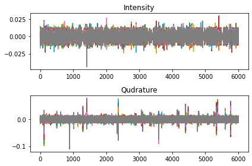
    


### BPSK Time Series of one I & Q sample


```python
import matplotlib.pyplot as plt
fig, axs = plt.subplots(2)
axs[0].plot(Intensity_BPSK_18[100])
axs[0].set_title('Intensity')

axs[1].plot(Qudrature_BPSK_18[100])
axs[1].set_title('Qudrature')
fig.tight_layout()
```


    
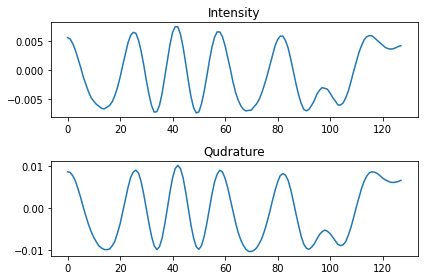
    


### BPSK FFT - Intensity only


```python
import numpy as np
from numpy.fft import *
import matplotlib.pyplot as plt

xf_BPSK = abs(np.fft.fftshift(fft(Intensity_BPSK_18[:]-np.mean(Intensity_BPSK_18[:]))))

power_I_BPSK = xf_BPSK **2 

import matplotlib.pyplot as plt
fig, axs = plt.subplots(2)

for intensityPlot in xf_BPSK:
    axs[0].plot(intensityPlot)
axs[0].set_title('INTENSITY_BPSK')

for powerPlot in power_I_BPSK:
    axs[1].plot(powerPlot)
axs[1].set_title('Power_INTENSITY_BPSK')

fig.tight_layout()
```


    
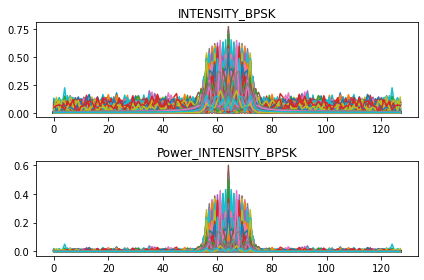
    


### BPSK FFT - Quadrature only


```python
import numpy as np
from numpy.fft import *
import matplotlib.pyplot as plt

xf_Q_BPSK = abs(np.fft.fftshift(fft(Qudrature_BPSK_18[:]-np.mean(Qudrature_BPSK_18[:]))))

power_Q_BPSK = xf_Q_BPSK **2 

import matplotlib.pyplot as plt
fig, axs = plt.subplots(2)

for intensityPlot in xf_Q_BPSK:
    axs[0].plot(intensityPlot)
axs[0].set_title('Qudrature_BPSK')

for powerPlot in power_Q_BPSK:
    axs[1].plot(powerPlot)
axs[1].set_title('Power_Qudrature_BPSK')

fig.tight_layout()
```


    
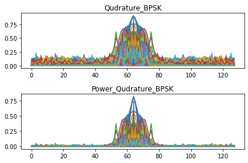
    


### BPSK FFT - Complex IQ


```python
complex_num = Intensity_BPSK_18 + 1j*Qudrature_BPSK_18
abs_complex = abs(complex_num)

xf_complex_abs = abs(np.fft.fftshift(fft(abs_complex[:]-np.mean(abs_complex[:]))))

power_complex_abs = xf_complex_abs **2 

import matplotlib.pyplot as plt
fig, axs = plt.subplots(2)

for intensityPlot in xf_complex_abs:
    axs[0].plot(intensityPlot)
axs[0].set_title('ComplexAbs_BPSK')

for powerPlot in power_complex_abs:
    axs[1].plot(powerPlot)
axs[1].set_title('Complex_ABS_power_BPSK')

fig.tight_layout()


```


    
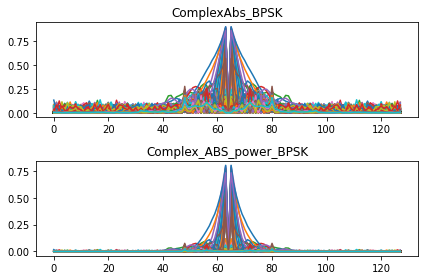
    


```python
CPFSK_18 = Xd[('CPFSK',18)]
CPFSK_18.shape
```


    (6000, 2, 128)


```python
Intensity_CPFSK_18 = CPFSK_18[:,0,:] 
Qudrature_CPFSK_18 = CPFSK_18[:,1,:]
```

### CPFSK Time Series I & Q


```python
import matplotlib.pyplot as plt
fig, axs = plt.subplots(2)
axs[0].plot(Intensity_CPFSK_18[0:100])
axs[0].set_title('Intensity')

axs[1].plot(Qudrature_CPFSK_18[0:100])
axs[1].set_title('Qudrature')
fig.tight_layout()
```


    
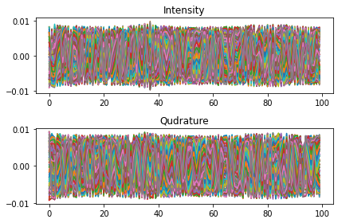
    


### CPFSK Time Series of one I & Q Sample


```python
import matplotlib.pyplot as plt
fig, axs = plt.subplots(2)
axs[0].plot(Intensity_CPFSK_18[99])
axs[0].set_title('Intensity of one IQ sample')

axs[1].plot(Qudrature_CPFSK_18[99])
axs[1].set_title('Qudrature of one IQ sample')
fig.tight_layout()
```


    
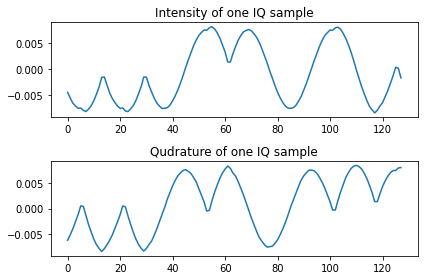
    


### CPFSK FFT - Intensity only


```python
import numpy as np
from numpy.fft import *
import matplotlib.pyplot as plt

xf_CPFSK = abs(np.fft.fftshift(fft(Intensity_CPFSK_18[:]-np.mean(Intensity_CPFSK_18[:]))))
power_I_CPFSK = xf_CPFSK**2 

import matplotlib.pyplot as plt
fig, axs = plt.subplots(2)

for intensityPlot in xf_CPFSK:
    axs[0].plot(intensityPlot)
axs[0].set_title('INTENSITY_CPFSK')

for powerPlot in power_I_CPFSK:
    axs[1].plot(powerPlot)
axs[1].set_title('Power_INTENSITY_CPFSK')

fig.tight_layout()
```


    
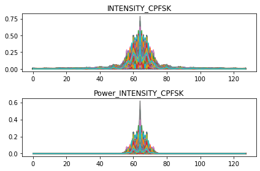
    


### CPFSK FFT - Quadrature only


```python
import numpy as np
from numpy.fft import *
import matplotlib.pyplot as plt

xf_Q_CPFSK = abs(np.fft.fftshift(fft(Qudrature_CPFSK_18[:]-np.mean(Qudrature_CPFSK_18[:]))))
#end_xf_Q_BPSK=xf_Q_BPSK.shape[1]
#xf_Q_BPSK_positive=xf_Q_BPSK[int(end_xf_Q_BPSK/2):end_xf_Q_BPSK] #Taking the positive spectrum only
power_Q_CPFSK = xf_Q_CPFSK **2 

import matplotlib.pyplot as plt
fig, axs = plt.subplots(2)

for intensityPlot in xf_Q_CPFSK:
    axs[0].plot(intensityPlot)
axs[0].set_title('Qudrature_CPFSK')

for powerPlot in power_Q_CPFSK:
    axs[1].plot(powerPlot)
axs[1].set_title('Power_Qudrature_CPFSK')

fig.tight_layout()
```


    
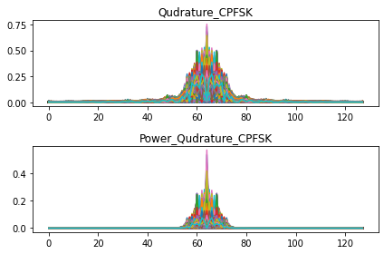
    


### CPFSK FFT - Complex IQ 


```python
import numpy as np
from numpy.fft import *
import matplotlib.pyplot as plt
complex_num_CPFSK = Intensity_CPFSK_18 + 1j*Qudrature_CPFSK_18

xf_complex_CPFSK = abs(np.fft.fftshift(fft(complex_num_CPFSK[:]-np.mean(complex_num_CPFSK[:]))))

power_complex_CPFSK = xf_complex_CPFSK **2 

import matplotlib.pyplot as plt
fig, axs = plt.subplots(2)

for intensityPlot in xf_complex_CPFSK:
    axs[0].plot(intensityPlot)
axs[0].set_title('Complex_CPFSK')

for powerPlot in power_complex_CPFSK:
    axs[1].plot(powerPlot)
axs[1].set_title('Complex_Power_CPFSK')

fig.tight_layout()
```


    
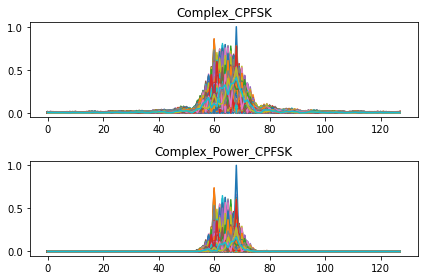
    


# PAM4 - SNR 18


```python
PAM4_18 = Xd[('PAM4',18)]
PAM4_18.shape
```


    (6000, 2, 128)


###  PAM4 Time Series I & Q


```python
Intensity_PAM4_18 = PAM4_18[:,0,:] #Taking only First 100 Intensity  
Qudrature_PAM4_18 = PAM4_18[:,1,:]
```


```python
import matplotlib.pyplot as plt
fig, axs = plt.subplots(2)
axs[0].plot(Intensity_PAM4_18[0:100])
axs[0].set_title('Intensity')

axs[1].plot(Qudrature_PAM4_18[0:100])
axs[1].set_title('Qudrature')
fig.tight_layout()
```


    
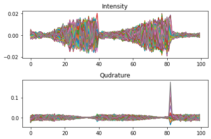
    


### PAM4 Time Seris of  one I & Q Sample


```python
import matplotlib.pyplot as plt
fig, axs = plt.subplots(2)
axs[0].plot(Intensity_PAM4_18[100])
axs[0].set_title('Intensity')

axs[1].plot(Qudrature_PAM4_18[100])
axs[1].set_title('Qudrature')
fig.tight_layout()
```


    
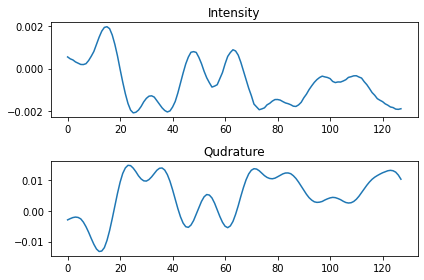
    


### PAM 14 FFT - Intensity only


```python
import numpy as np
from numpy.fft import *
import matplotlib.pyplot as plt

xf_PAM4 = abs(np.fft.fftshift(fft(Intensity_PAM4_18[:]-np.mean(Intensity_PAM4_18[:]))))
power_I_PAM4 = xf_PAM4**2 

import matplotlib.pyplot as plt
fig, axs = plt.subplots(2)

for intensityPlot in xf_PAM4:
    axs[0].plot(intensityPlot)
axs[0].set_title('INTENSITY_PAM4')

for powerPlot in power_I_PAM4:
    axs[1].plot(powerPlot)
axs[1].set_title('Power_INTENSITY_PAM4')

fig.tight_layout()
```


    
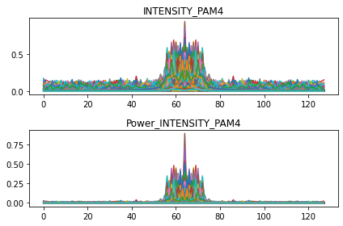
    


### PAM4 FFT -  Quadrature only


```python
import numpy as np
from numpy.fft import *
import matplotlib.pyplot as plt

xf_Q_PAM4 = abs(np.fft.fftshift(fft(Qudrature_PAM4_18[:]-np.mean(Qudrature_PAM4_18[:]))))
#end_xf_Q_BPSK=xf_Q_BPSK.shape[1]
#xf_Q_BPSK_positive=xf_Q_BPSK[int(end_xf_Q_BPSK/2):end_xf_Q_BPSK] #Taking the positive spectrum only
power_Q_PAM4 = xf_Q_PAM4 **2 

import matplotlib.pyplot as plt
fig, axs = plt.subplots(2)

for intensityPlot in xf_Q_PAM4:
    axs[0].plot(intensityPlot)
axs[0].set_title('Qudrature_PAM4')

for powerPlot in power_Q_PAM4:
    axs[1].plot(powerPlot)
axs[1].set_title('Power_Qudrature_PAM4')

fig.tight_layout()
```


    
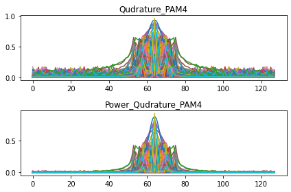
    


### PAM4 FFT - Complex IQ


```python
import numpy as np
from numpy.fft import *
import matplotlib.pyplot as plt
complex_num_PAM4 = Intensity_PAM4_18 + 1j*Qudrature_PAM4_18

xf_complex_PAM4 = abs(np.fft.fftshift(fft(complex_num_PAM4[:]-np.mean(complex_num_PAM4[:]))))

power_complex_PAM4 = xf_complex_PAM4 **2 

import matplotlib.pyplot as plt
fig, axs = plt.subplots(2)

for intensityPlot in xf_complex_PAM4:
    axs[0].plot(intensityPlot)
axs[0].set_title('Complex_PAM4')

for powerPlot in power_complex_PAM4:
    axs[1].plot(powerPlot)
axs[1].set_title('Complex_Power_PAM4')

fig.tight_layout()
```


    
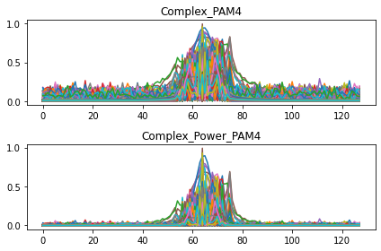
    


# QAM16 - SNR 18


```python
QAM16_18 = Xd[('QAM16',18)]
QAM16_18.shape
Intensity_QAM16_18 = QAM16_18[:,0,:] #Taking only First 100 Intensity  
Qudrature_QAM16_18 = QAM16_18[:,1,:]
```

###  QAM16 Time Series I & Q


```python
import matplotlib.pyplot as plt
fig, axs = plt.subplots(2)
axs[0].plot(Intensity_QAM16_18[0:100])
axs[0].set_title('Intensity')

axs[1].plot(Intensity_QAM16_18[0:100])
axs[1].set_title('Qudrature')
fig.tight_layout()
```


    
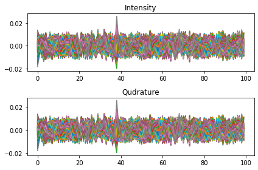
    


###  QAM16 Time Series of one I & Q sample


```python
import matplotlib.pyplot as plt
fig, axs = plt.subplots(2)
axs[0].plot(Intensity_QAM16_18[100])
axs[0].set_title('Intensity')

axs[1].plot(Intensity_QAM16_18[100])
axs[1].set_title('Qudrature')
fig.tight_layout()
```


    
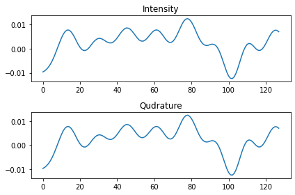
    


### QAM16 FFT - Intensity only


```python
import numpy as np
from numpy.fft import *
import matplotlib.pyplot as plt

xf_QAM16 = abs(np.fft.fftshift(fft(Intensity_QAM16_18[:]-np.mean(Intensity_QAM16_18[:]))))
power_I_QAM16 = xf_QAM16**2 

import matplotlib.pyplot as plt
fig, axs = plt.subplots(2)

for intensityPlot in xf_QAM16:
    axs[0].plot(intensityPlot)
axs[0].set_title('INTENSITY_QAM16')

for powerPlot in power_I_QAM16:
    axs[1].plot(powerPlot)
axs[1].set_title('Power_INTENSITY_QAM16')

fig.tight_layout()
```


    
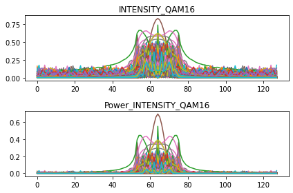
    


### QAM16 FFT - Quadrature only


```python
import numpy as np
from numpy.fft import *
import matplotlib.pyplot as plt

xf_Q_QAM16 = abs(np.fft.fftshift(fft(Qudrature_QAM16_18[:]-np.mean(Qudrature_QAM16_18[:]))))
#end_xf_Q_BPSK=xf_Q_BPSK.shape[1]
#xf_Q_BPSK_positive=xf_Q_BPSK[int(end_xf_Q_BPSK/2):end_xf_Q_BPSK] #Taking the positive spectrum only
power_Q_QAM16 = xf_Q_QAM16 **2 

import matplotlib.pyplot as plt
fig, axs = plt.subplots(2)

for intensityPlot in xf_Q_QAM16:
    axs[0].plot(intensityPlot)
axs[0].set_title('Qudrature_QAM16')

for powerPlot in power_Q_QAM16:
    axs[1].plot(powerPlot)
axs[1].set_title('Power_Qudrature_QAM16')

fig.tight_layout()

```


    
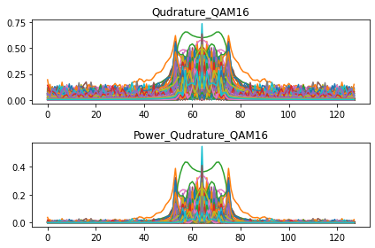
    


### QAM16 FFT - Complex IQ


```python
import numpy as np
from numpy.fft import *
import matplotlib.pyplot as plt
complex_num_QAM16 = Intensity_QAM16_18 + 1j*Qudrature_QAM16_18

xf_complex_QAM16 = abs(np.fft.fftshift(fft(complex_num_QAM16[:]-np.mean(complex_num_QAM16[:]))))

power_complex_QAM16 = xf_complex_QAM16 **2 

import matplotlib.pyplot as plt
fig, axs = plt.subplots(2)

for intensityPlot in xf_complex_QAM16:
    axs[0].plot(intensityPlot)
axs[0].set_title('Complex_QAM16')

for powerPlot in power_complex_QAM16:
    axs[1].plot(powerPlot)
axs[1].set_title('Complex_Power_QAM16')

fig.tight_layout()

```


    
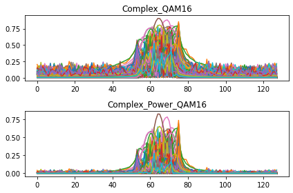
    


# QPSK - SNR 18


```python
QPSK_18 = Xd[('QPSK',18)]
QPSK_18.shape
```


    (6000, 2, 128)


```python
Intensity_QPSK_18 = QPSK_18[:,0,:] #Taking only First 100 Intensity  
Qudrature_QPSK_18= QPSK_18[:,1,:]
```

###  QPSK 18 Time Series I & Q


```python
import matplotlib.pyplot as plt
fig, axs = plt.subplots(2)
axs[0].plot(Intensity_QPSK_18[0:100])
axs[0].set_title('Intensity')

axs[1].plot(Intensity_QPSK_18[0:100])
axs[1].set_title('Qudrature')
fig.tight_layout()
```


    
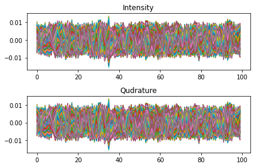
    


###  QPSK 18 Time Series of  one I & Q sample


```python
import matplotlib.pyplot as plt
fig, axs = plt.subplots(2)
axs[0].plot(Intensity_QPSK_18[100])
axs[0].set_title('Intensity')

axs[1].plot(Intensity_QPSK_18[100])
axs[1].set_title('Qudrature')
fig.tight_layout()
```


    
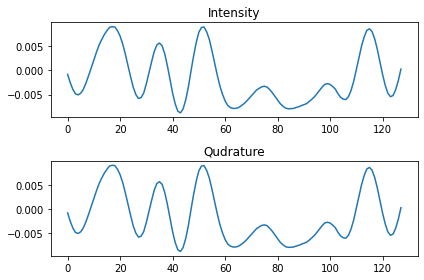
    


### QPSK FFT - Intensity only


```python
import numpy as np
from numpy.fft import *
import matplotlib.pyplot as plt

xf_QPSK= abs(np.fft.fftshift(fft(Intensity_QPSK_18[:]-np.mean(Intensity_QPSK_18[:]))))
power_I_QPSK = xf_QPSK**2 

import matplotlib.pyplot as plt
fig, axs = plt.subplots(2)

for intensityPlot in xf_QPSK:
    axs[0].plot(intensityPlot)
axs[0].set_title('INTENSITY_QPSK')

for powerPlot in power_I_QPSK:
    axs[1].plot(powerPlot)
axs[1].set_title('Power_INTENSITY_QPSK')

fig.tight_layout()

```


    
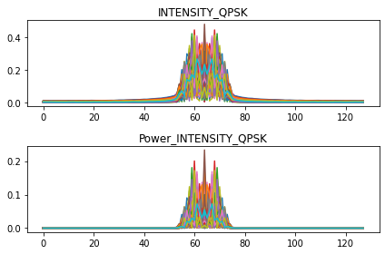
    


### QPSK FFT - Quadrature only


```python
import numpy as np
from numpy.fft import *
import matplotlib.pyplot as plt

xf_Q_QPSK = abs(np.fft.fftshift(fft(Qudrature_QPSK_18[:]-np.mean(Qudrature_QPSK_18[:]))))
#end_xf_Q_BPSK=xf_Q_BPSK.shape[1]
#xf_Q_BPSK_positive=xf_Q_BPSK[int(end_xf_Q_BPSK/2):end_xf_Q_BPSK] #Taking the positive spectrum only
power_Q_QPSK = xf_Q_QPSK **2 

import matplotlib.pyplot as plt
fig, axs = plt.subplots(2)

for intensityPlot in xf_Q_QPSK:
    axs[0].plot(intensityPlot)
axs[0].set_title('Qudrature_QPSK')

for powerPlot in power_Q_QPSK:
    axs[1].plot(powerPlot)
axs[1].set_title('Power_Qudrature_QPSK')

fig.tight_layout()

```


    
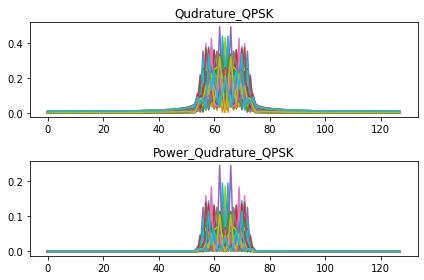
    


### QPSK FFT - Complex IQ 


```python
import numpy as np
from numpy.fft import *
import matplotlib.pyplot as plt
complex_num_QPSK = Intensity_QPSK_18 + 1j*Qudrature_QPSK_18

xf_complex_QPSK = abs(np.fft.fftshift(fft(complex_num_QPSK[:]-np.mean(complex_num_QPSK[:]))))

power_complex_QPSK = xf_complex_QPSK **2 

import matplotlib.pyplot as plt
fig, axs = plt.subplots(2)

for intensityPlot in xf_complex_QPSK:
    axs[0].plot(intensityPlot)
axs[0].set_title('Complex_QPSK')

for powerPlot in power_complex_QPSK:
    axs[1].plot(powerPlot)
axs[1].set_title('Complex_Power_QPSK')

fig.tight_layout()

```


    
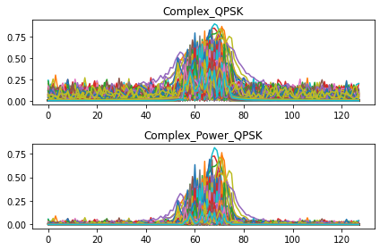
    


# GFSK - SNR 18


```python
import numpy as np
from numpy.fft import *
import matplotlib.pyplot as plt

GFSK_18 = Xd[('GFSK',18)]
GFSK_18.shape

```


    (6000, 2, 128)


###  GFSK 18 Time Series I & Q


```python
Intensity_GFSK_18 = GFSK_18[:,0,:] #Taking only First 100 Intensity  
Qudrature_GFSK_18= GFSK_18[:,1,:]# Taking only First 100 Quadrature

import matplotlib.pyplot as plt
fig, axs = plt.subplots(2)
axs[0].plot(Intensity_GFSK_18[0:100])
axs[0].set_title('Intensity')

axs[1].plot(Qudrature_GFSK_18[0:100])
axs[1].set_title('Qudrature')
fig.tight_layout()
```


    
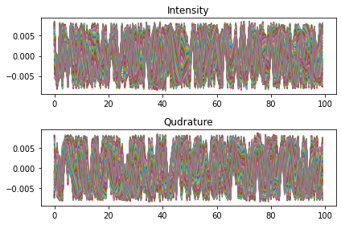
    


###  GFSK 18 Time Series of one I & Q sample


```python
import matplotlib.pyplot as plt
fig, axs = plt.subplots(2)
axs[0].plot(Intensity_GFSK_18[100])
axs[0].set_title('Intensity')

axs[1].plot(Qudrature_GFSK_18[100])
axs[1].set_title('Qudrature')
fig.tight_layout()
```


    
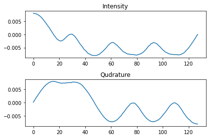
    


### GFSK FFT - Intensity only


```python
import numpy as np
from numpy.fft import *
import matplotlib.pyplot as plt

xf_GFSK = abs(np.fft.fftshift(fft(Intensity_GFSK_18[:]-np.mean(Intensity_GFSK_18[:]))))
power_I_GFSK = xf_GFSK**2 

import matplotlib.pyplot as plt
fig, axs = plt.subplots(2)

for intensityPlot in xf_GFSK:
    axs[0].plot(intensityPlot)
axs[0].set_title('INTENSITY_GFSK')

for powerPlot in power_I_GFSK:
    axs[1].plot(powerPlot)
axs[1].set_title('Power_INTENSITY_GFSK')

fig.tight_layout()


```


    

    


### GFSK FFT - Quadrature only


```python
import numpy as np
from numpy.fft import *
import matplotlib.pyplot as plt

xf_Q_GFSK = abs(np.fft.fftshift(fft(Qudrature_GFSK_18[:]-np.mean(Qudrature_GFSK_18[:]))))
#end_xf_Q_BPSK=xf_Q_BPSK.shape[1]
#xf_Q_BPSK_positive=xf_Q_BPSK[int(end_xf_Q_BPSK/2):end_xf_Q_BPSK] #Taking the positive spectrum only
power_Q_GFSK = xf_Q_GFSK **2 

import matplotlib.pyplot as plt
fig, axs = plt.subplots(2)

for intensityPlot in xf_Q_GFSK:
    axs[0].plot(intensityPlot)
axs[0].set_title('Qudrature_GFSK')

for powerPlot in power_Q_GFSK:
    axs[1].plot(powerPlot)
axs[1].set_title('Power_Qudrature_GFSK')

fig.tight_layout()


```


    
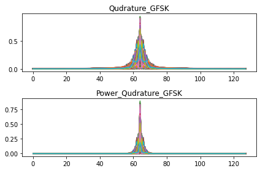
    


### GFSK FFT - Complex IQ


```python
import numpy as np
from numpy.fft import *
import matplotlib.pyplot as plt
complex_num_GFSK = Intensity_GFSK_18 + 1j*Qudrature_GFSK_18

xf_complex_GFSK = abs(np.fft.fftshift(fft(complex_num_GFSK[:]-np.mean(complex_num_GFSK[:]))))

power_complex_GFSK = xf_complex_GFSK **2 

import matplotlib.pyplot as plt
fig, axs = plt.subplots(2)

for intensityPlot in xf_complex_GFSK:
    axs[0].plot(intensityPlot)
axs[0].set_title('Complex_GFSK')

for powerPlot in power_complex_GFSK:
    axs[1].plot(powerPlot)
axs[1].set_title('Complex_Power_GFSK')

fig.tight_layout()

```


    
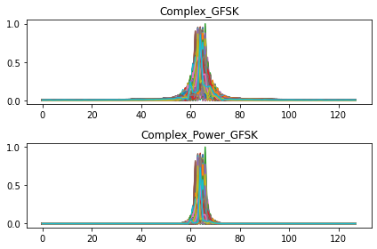
    


# AM-DSB - SNR 18


```python
AMDSB_18 = Xd[('AM-DSB',18)]
AMDSB_18.shape
Intensity_AMDSB_18 = AMDSB_18[:,0,:] #Taking only First 100 Intensity  
Qudrature_AMDSB_18= AMDSB_18[:,1,:]# Taking only First 100 Quadrature
```

### AM-DSB Time Series I & Q


```python
import matplotlib.pyplot as plt
fig, axs = plt.subplots(2)
axs[0].plot(Intensity_AMDSB_18[0:100])
axs[0].set_title('Intensity')

axs[1].plot(Qudrature_AMDSB_18[0:100])
axs[1].set_title('Qudrature')
fig.tight_layout()
```


    
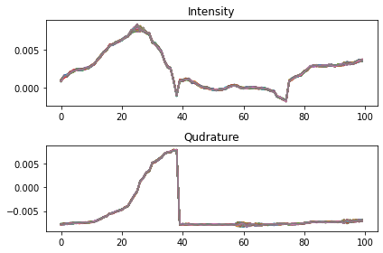
    


### AM-DSB Time Series of one I & Q sample


```python
import matplotlib.pyplot as plt
fig, axs = plt.subplots(2)
axs[0].plot(Intensity_AMDSB_18[100])
axs[0].set_title('Intensity')

axs[1].plot(Qudrature_AMDSB_18[100])
axs[1].set_title('Qudrature')
fig.tight_layout()
```


    
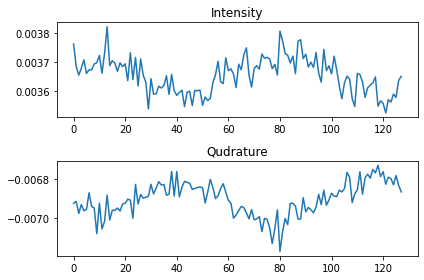
    


### AM-DSB FFT - Intensity only


```python
import numpy as np
from numpy.fft import *
import matplotlib.pyplot as plt

xf_AMDSB= abs(np.fft.fftshift(fft(Intensity_AMDSB_18[:]-np.mean(Intensity_AMDSB_18[:]))))
power_I_AMDSB = xf_AMDSB**2 

import matplotlib.pyplot as plt
fig, axs = plt.subplots(2)

for intensityPlot in xf_AMDSB:
    axs[0].plot(intensityPlot)
axs[0].set_title('INTENSITY_AMDSB')

for powerPlot in power_I_AMDSB:
    axs[1].plot(powerPlot)
axs[1].set_title('Power_INTENSITY_AMDSB')

fig.tight_layout()

```


    
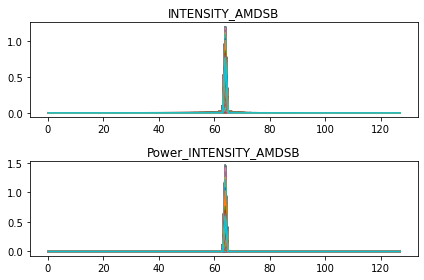
    


### AM-DSB FFT - Quadrature only


```python
import numpy as np
from numpy.fft import *
import matplotlib.pyplot as plt

xf_Q_AMDSB= abs(np.fft.fftshift(fft(Qudrature_AMDSB_18[:]-np.mean(Qudrature_AMDSB_18[:]))))
#end_xf_Q_BPSK=xf_Q_BPSK.shape[1]
#xf_Q_BPSK_positive=xf_Q_BPSK[int(end_xf_Q_BPSK/2):end_xf_Q_BPSK] #Taking the positive spectrum only
power_Q_AMDSB = xf_Q_AMDSB **2 

import matplotlib.pyplot as plt
fig, axs = plt.subplots(2)

for intensityPlot in xf_Q_AMDSB:
    axs[0].plot(intensityPlot)
axs[0].set_title('Qudrature_AMDSB')

for powerPlot in power_Q_AMDSB:
    axs[1].plot(powerPlot)
axs[1].set_title('Power_Qudrature_AMDSB')

fig.tight_layout()
```


    
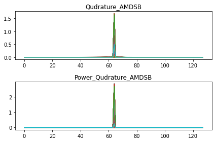
    


### AM-DSB FFT - Complex IQ


```python
import numpy as np
from numpy.fft import *
import matplotlib.pyplot as plt
complex_num_AMDSB = Intensity_AMDSB_18 + 1j*Qudrature_AMDSB_18

xf_complex_AMDSB = abs(np.fft.fftshift(fft(complex_num_AMDSB[:]-np.mean(complex_num_AMDSB[:]))))

power_complex_AMDSB = xf_complex_AMDSB **2 

import matplotlib.pyplot as plt
fig, axs = plt.subplots(2)

for intensityPlot in xf_complex_AMDSB:
    axs[0].plot(intensityPlot)
axs[0].set_title('Complex_AMDSB')

for powerPlot in power_complex_AMDSB:
    axs[1].plot(powerPlot)
axs[1].set_title('Complex_Power_AMDSB')

fig.tight_layout()
```


    
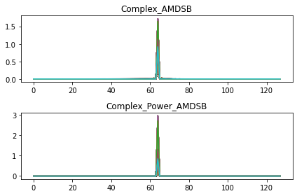
    


# WBFM - SNR 18


```python
WBFM_18 = Xd[('WBFM',18)]
WBFM_18.shape

Intensity_WBFM_18 = WBFM_18[:,0,:] #Taking only First 100 Intensity  
Qudrature_WBFM_18 = WBFM_18[:,1,:]# Taking only First 100 Quadrature
```

### WBFM Time Series I & Q


```python
import matplotlib.pyplot as plt
fig, axs = plt.subplots(2)
axs[0].plot(Intensity_WBFM_18[0:100])
axs[0].set_title('Intensity')

axs[1].plot(Qudrature_WBFM_18[0:100])
axs[1].set_title('Qudrature')
fig.tight_layout()
```


    
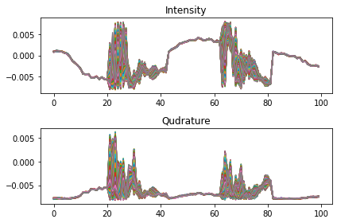
    


### WBFM Time series of one I & Q sample


```python
import matplotlib.pyplot as plt
fig, axs = plt.subplots(2)
axs[0].plot(Intensity_WBFM_18[100])
axs[0].set_title('Intensity')

axs[1].plot(Qudrature_WBFM_18[100])
axs[1].set_title('Qudrature')
fig.tight_layout()
```


    
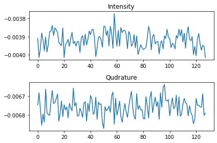
    


### WBFM FFT - Intensity only


```python
import numpy as np
from numpy.fft import *
import matplotlib.pyplot as plt

xf_WBFM = abs(np.fft.fftshift(fft(Intensity_WBFM_18[:]-np.mean(Intensity_WBFM_18[:]))))
power_I_WBFM = xf_WBFM**2 

import matplotlib.pyplot as plt
fig, axs = plt.subplots(2)

for intensityPlot in xf_WBFM:
    axs[0].plot(intensityPlot)
axs[0].set_title('INTENSITY_WBFM')

for powerPlot in power_I_WBFM:
    axs[1].plot(powerPlot)
axs[1].set_title('Power_INTENSITY_WBFM')

fig.tight_layout()

```


    
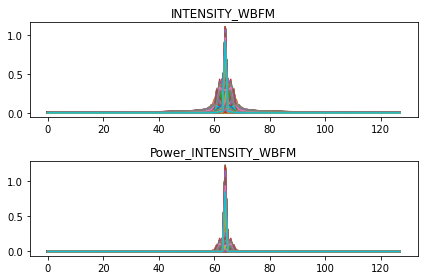
    


### WBFM FFT - Quadrature only


```python
import numpy as np
from numpy.fft import *
import matplotlib.pyplot as plt

xf_Q_WBFM = abs(np.fft.fftshift(fft(Qudrature_WBFM_18[:]-np.mean(Qudrature_WBFM_18[:]))))
#end_xf_Q_BPSK=xf_Q_BPSK.shape[1]
#xf_Q_BPSK_positive=xf_Q_BPSK[int(end_xf_Q_BPSK/2):end_xf_Q_BPSK] #Taking the positive spectrum only
power_Q_WBFM= xf_Q_WBFM **2 

import matplotlib.pyplot as plt
fig, axs = plt.subplots(2)

for intensityPlot in xf_Q_WBFM:
    axs[0].plot(intensityPlot)
axs[0].set_title('Qudrature_WBFM')

for powerPlot in power_Q_WBFM:
    axs[1].plot(powerPlot)
axs[1].set_title('Power_Qudrature_WBFM')

fig.tight_layout()

```


    
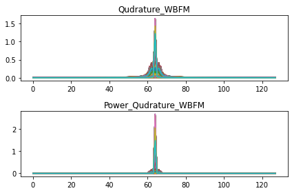
    


### WBFM FFT - Complex IQ


```python
import numpy as np
from numpy.fft import *
import matplotlib.pyplot as plt
complex_num_WBFM = Intensity_WBFM_18 + 1j*Qudrature_WBFM_18

xf_complex_WBFM = abs(np.fft.fftshift(fft(complex_num_WBFM[:]-np.mean(complex_num_WBFM[:]))))

power_complex_WBFM = xf_complex_WBFM **2 

import matplotlib.pyplot as plt
fig, axs = plt.subplots(2)

for intensityPlot in xf_complex_WBFM:
    axs[0].plot(intensityPlot)
axs[0].set_title('Complex_WBFM')

for powerPlot in power_complex_WBFM:
    axs[1].plot(powerPlot)
axs[1].set_title('Complex_Power_WBFM')

fig.tight_layout()

```


    

    


# 8PSK - SNR 18


```python
PSK8_18 = Xd[('8PSK',18)]
PSK8_18.shape

Intensity_PSK8_18= PSK8_18[:,0,:]  
Qudrature_PSK8_18 = PSK8_18[:,1,:]
```

### 8PSK Time Series I & Q


```python
import matplotlib.pyplot as plt
fig, axs = plt.subplots(2)
axs[0].plot(Intensity_PSK8_18[0:100])
axs[0].set_title('Intensity')

axs[1].plot(Qudrature_PSK8_18[0:100])
axs[1].set_title('Qudrature')
fig.tight_layout()
```


    

    


### 8PSK Time Series of one I & Q sample


```python
import matplotlib.pyplot as plt
fig, axs = plt.subplots(2)
axs[0].plot(Intensity_PSK8_18[100])
axs[0].set_title('Intensity')

axs[1].plot(Qudrature_PSK8_18[100])
axs[1].set_title('Qudrature')
fig.tight_layout()
```


    

    


### 8PSK FFT - Intensity only


```python
import numpy as np
from numpy.fft import *
import matplotlib.pyplot as plt

xf_PSK8 = abs(np.fft.fftshift(fft(Intensity_PSK8_18[:]-np.mean(Intensity_PSK8_18[:]))))
power_I_PSK8 = xf_PSK8**2 

import matplotlib.pyplot as plt
fig, axs = plt.subplots(2)

for intensityPlot in xf_PSK8:
    axs[0].plot(intensityPlot)
axs[0].set_title('INTENSITY_8PSK')

for powerPlot in power_I_PSK8:
    axs[1].plot(powerPlot)
axs[1].set_title('Power_INTENSITY_8PSK')

fig.tight_layout()

```


    

    


### 8PSK FFT - Quadrature only


```python
import numpy as np
from numpy.fft import *
import matplotlib.pyplot as plt

xf_Q_PSK8 = abs(np.fft.fftshift(fft(Qudrature_PSK8_18[:]-np.mean(Qudrature_PSK8_18[:]))))
#end_xf_Q_BPSK=xf_Q_BPSK.shape[1]
#xf_Q_BPSK_positive=xf_Q_BPSK[int(end_xf_Q_BPSK/2):end_xf_Q_BPSK] #Taking the positive spectrum only
power_Q_PSK8 = xf_Q_PSK8 **2 

import matplotlib.pyplot as plt
fig, axs = plt.subplots(2)

for intensityPlot in xf_Q_PSK8:
    axs[0].plot(intensityPlot)
axs[0].set_title('Qudrature_8PSK')

for powerPlot in power_Q_PSK8:
    axs[1].plot(powerPlot)
axs[1].set_title('Power_Qudrature_8PSK')

fig.tight_layout()

```

### 8PSK FFT - Complex IQ


```python
import numpy as np
from numpy.fft import *
import matplotlib.pyplot as plt
complex_num_PSK8 = Intensity_PSK8_18 + 1j*Qudrature_PSK8_18

xf_complex_PSK8 = abs(np.fft.fftshift(fft(complex_num_PSK8[:]-np.mean(complex_num_PSK8[:]))))

power_complex_PSK8= xf_complex_PSK8 **2 

import matplotlib.pyplot as plt
fig, axs = plt.subplots(2)

for intensityPlot in xf_complex_PSK8:
    axs[0].plot(intensityPlot)
axs[0].set_title('Complex_8PSK')

for powerPlot in power_complex_PSK8:
    axs[1].plot(powerPlot)
axs[1].set_title('Complex_Power_8PSK')

fig.tight_layout()

```


    

    


# QAM64 - SNR 18


```python
QAM64_18 = Xd[('QAM64',18)]
QAM64_18.shape

Intensity_QAM64_18= QAM64_18[:,0,:]  
Qudrature_QAM64_18 = QAM64_18[:,1,:]
```

### QAM64 Time Series I & Q 


```python
import matplotlib.pyplot as plt
fig, axs = plt.subplots(2)
axs[0].plot(Intensity_QAM64_18[0:100])
axs[0].set_title('Intensity')

axs[1].plot(Qudrature_QAM64_18[0:100])
axs[1].set_title('Qudrature')
fig.tight_layout()
```


    

    


### QAM64 Time Series of one  I & Q sample


```python
import matplotlib.pyplot as plt
fig, axs = plt.subplots(2)
axs[0].plot(Intensity_QAM64_18[100])
axs[0].set_title('Intensity')

axs[1].plot(Qudrature_QAM64_18[100])
axs[1].set_title('Qudrature')
fig.tight_layout()
```


    

    


### QAM64 FFT - Intensity only


```python
import numpy as np
from numpy.fft import *
import matplotlib.pyplot as plt

xf_QAM64 = abs(np.fft.fftshift(fft(Intensity_QAM64_18[:]-np.mean(Intensity_QAM64_18[:]))))
power_I_QAM64 = xf_QAM64**2 

import matplotlib.pyplot as plt
fig, axs = plt.subplots(2)

for intensityPlot in xf_QAM64:
    axs[0].plot(intensityPlot)
axs[0].set_title('INTENSITY_QAM64')

for powerPlot in power_I_QAM64:
    axs[1].plot(powerPlot)
axs[1].set_title('Power_INTENSITY_QAM64')

fig.tight_layout()
```


    

    


### QAM64 FFT - Quadrature only


```python
import numpy as np
from numpy.fft import *
import matplotlib.pyplot as plt

xf_Q_QAM64 = abs(np.fft.fftshift(fft(Qudrature_QAM64_18[:]-np.mean(Qudrature_QAM64_18[:]))))
#end_xf_Q_BPSK=xf_Q_BPSK.shape[1]
#xf_Q_BPSK_positive=xf_Q_BPSK[int(end_xf_Q_BPSK/2):end_xf_Q_BPSK] #Taking the positive spectrum only
power_Q_QAM64= xf_Q_QAM64 **2 

import matplotlib.pyplot as plt
fig, axs = plt.subplots(2)

for intensityPlot in xf_Q_QAM64:
    axs[0].plot(intensityPlot)
axs[0].set_title('Qudrature_QAM64')

for powerPlot in power_Q_QAM64:
    axs[1].plot(powerPlot)
axs[1].set_title('Power_Qudrature_QAM64')

fig.tight_layout()
```


    

    


### QAM64 FFT - Complex IQ 


```python
import numpy as np
from numpy.fft import *
import matplotlib.pyplot as plt
complex_num_QAM64 = Intensity_QAM64_18 + 1j*Qudrature_QAM64_18

xf_complex_QAM64 = abs(np.fft.fftshift(fft(complex_num_QAM64[:]-np.mean(complex_num_QAM64[:]))))

power_complex_QAM64= xf_complex_QAM64 **2 

import matplotlib.pyplot as plt
fig, axs = plt.subplots(2)

for intensityPlot in xf_complex_QAM64:
    axs[0].plot(intensityPlot)
axs[0].set_title('Complex_QAM64')

for powerPlot in power_complex_QAM64:
    axs[1].plot(powerPlot)
axs[1].set_title('Complex_Power_QAM64')
fig.tight_layout()

```


    ---------------------------------------------------------------------------

    NameError                                 Traceback (most recent call last)

    <ipython-input-5-a355a962df72> in <module>
          2 from numpy.fft import *
          3 import matplotlib.pyplot as plt
    ----> 4 complex_num_QAM64 = Intensity_QAM64_18 + 1j*Qudrature_QAM64_18
          5 
          6 xf_complex_QAM64 = abs(np.fft.fftshift(fft(complex_num_QAM64[:]-np.mean(complex_num_QAM64[:]))))


    NameError: name 'Intensity_QAM64_18' is not defined


## Machine Learning - Multiclass classification on SNR 18 Modulation using FFT 


```python
INTENSITY_AXIS=0
QUADRATURE_AXIS=1
import numpy as np
from numpy.fft import *
import matplotlib.pyplot as plt

snrs,mods = map(lambda j: sorted(list(set(map(lambda x: x[j], Xd.keys())))), [1,0])

```

### Preparing Dataset

The Intensity and Qudrature of every IQ samples for each modulation type of SNR 18 is stacked into X_Intensity or X_Quadrature list accordingly. At the same time, the type of modulation is appended to Label_string. It labels the stacked data in X_Intensity and X_Quadrature by indexing.


```python
X_Intensity = []  
X_Quadrature = []
Label_strings = []
for mod in mods:
    X_Intensity.append(Xd[(mod,18)][:,INTENSITY_AXIS,:])
    X_Quadrature.append(Xd[(mod,18)][:,QUADRATURE_AXIS,:])
    for label in range(len(Xd[(mod,18)][:,INTENSITY_AXIS,:])):
        Label_strings.append(mod)
X_Intensity = np.vstack(X_Intensity) # Quick way to create stacked dataset
X_Quadrature = np.vstack(X_Quadrature)

Label_strings=np.vstack(Label_strings)
complex_num = X_Intensity + 1j*X_Quadrature

```


```python
print(Label_strings)
print(Label_strings.shape)
```

    [['8PSK']
     ['8PSK']
     ['8PSK']
     ...
     ['WBFM']
     ['WBFM']
     ['WBFM']]
    (60000, 1)


### Applying FF function on X_Intensity and X_Qudrature


```python
X_Intensity_FFT = abs(np.fft.fftshift(fft(X_Intensity[:]-np.mean(X_Intensity[:]))))
X_Qudrature_FFT = abs(np.fft.fftshift(fft(X_Quadrature[:]-np.mean(X_Quadrature[:]))))
```

### Labelling

The labels inside Label_String is in string format. Hence, to train a model, these strings have to be represented in integers or bits. Label_String is pre-processed using LabelEncoder to convert into integer and subsequently one hot encoded.


```python
le= preprocessing.LabelEncoder()
le.fit(Label_strings)
Label_Y_numbers = le.transform(Label_strings)
depth = 10
Label = tf.one_hot(Label_Y_numbers,depth)
```

    /mnt/DATA/projects/signals/venv/lib/python3.7/site-packages/sklearn/utils/validation.py:72: DataConversionWarning: A column-vector y was passed when a 1d array was expected. Please change the shape of y to (n_samples, ), for example using ravel().
      return f(**kwargs)


```python

print(Label)
```

    tf.Tensor(
    [[1. 0. 0. ... 0. 0. 0.]
     [1. 0. 0. ... 0. 0. 0.]
     [1. 0. 0. ... 0. 0. 0.]
     ...
     [0. 0. 0. ... 0. 0. 1.]
     [0. 0. 0. ... 0. 0. 1.]
     [0. 0. 0. ... 0. 0. 1.]], shape=(60000, 10), dtype=float32)


The labels are concanated with the dataset for shuffling and model training


```python
X_Intensity_Label = np.c_[X_Intensity_FFT, Label]
X_Quadrature_Label = np.c_[X_Qudrature_FFT,Label]

```

A precaution step is to duplicate the labelled dataset before shuffling. This is to prevent any changes to the original dataset.


```python
import copy
X_Intensity_Label_shuffled = copy.copy(X_Intensity_Label) # Create another copy to shuffle
X_Quadratue_Label_shuffled = copy.copy(X_Quadrature_Label)
```


```python
np.random.shuffle(X_Intensity_Label_shuffled)
np.random.shuffle(X_Quadratue_Label_shuffled)
```

## Training (70%)  , Validation (20%) , Test (10%)

- Training Size : 42,000
- Validation Size : 12000


```python
length_of_X_train = int(0.7*X_Intensity_Label_shuffled.shape[0]) #42000
length_of_X_validation = (int(0.2*X_Intensity_Label_shuffled.shape[0]))+length_of_X_train #12000

```

    42000


```python
Train_Intensity = X_Intensity_Label_shuffled[0:length_of_X_train,0:128]
Y_Intensity = X_Intensity_Label_shuffled[0:length_of_X_train,128:]

Validation_Intensity = X_Intensity_Label_shuffled[length_of_X_train:length_of_X_validation,0:128]
Y_Validation = X_Intensity_Label_shuffled[length_of_X_train:length_of_X_validation,128:]
```

### Using DNN (4 layers) with relu and softmax as activation function - Classifying using <u>only Intensity FFT</u>  


```python

from tensorflow import keras
from tensorflow.keras import layers
from keras.models import Sequential
from keras.layers import Dense
import tensorflow as tf

callback = tf.keras.callbacks.EarlyStopping(monitor='loss', patience=6)
model2 = Sequential()
model2.add(Dense(128, input_dim=128, activation='relu'))
model2.add(Dense(64, activation='relu'))
model2.add(Dense(32, activation='relu'))
model2.add(Dense(10, activation='softmax'))

model2.compile(optimizer='rmsprop',loss='categorical_crossentropy',metrics=['accuracy'])
```


```python
history = model2.fit(Train_Intensity, Y_Intensity, epochs=250, batch_size=100,callbacks=[callback])
```

    Epoch 1/250
    420/420 [==============================] - 1s 2ms/step - loss: 1.5405 - accuracy: 0.3881
    Epoch 2/250
    420/420 [==============================] - 1s 2ms/step - loss: 1.2348 - accuracy: 0.4595
    Epoch 3/250
    420/420 [==============================] - 2s 4ms/step - loss: 1.1208 - accuracy: 0.4904
    Epoch 4/250
    420/420 [==============================] - 1s 3ms/step - loss: 1.0700 - accuracy: 0.5063
    Epoch 5/250
    420/420 [==============================] - 1s 2ms/step - loss: 1.0504 - accuracy: 0.5086
    Epoch 6/250
    420/420 [==============================] - 1s 3ms/step - loss: 1.0393 - accuracy: 0.5162
    Epoch 7/250
    420/420 [==============================] - 1s 3ms/step - loss: 1.0296 - accuracy: 0.5171
    Epoch 8/250
    420/420 [==============================] - 1s 3ms/step - loss: 1.0240 - accuracy: 0.5213
    Epoch 9/250
    420/420 [==============================] - 1s 3ms/step - loss: 1.0183 - accuracy: 0.5265
    Epoch 10/250
    420/420 [==============================] - 1s 2ms/step - loss: 1.0136 - accuracy: 0.5265
    Epoch 11/250
    420/420 [==============================] - 1s 1ms/step - loss: 1.0075 - accuracy: 0.5309
    Epoch 12/250
    420/420 [==============================] - 1s 1ms/step - loss: 1.0041 - accuracy: 0.5339
    Epoch 13/250
    420/420 [==============================] - 1s 3ms/step - loss: 1.0008 - accuracy: 0.5356
    Epoch 14/250
    420/420 [==============================] - 1s 3ms/step - loss: 0.9983 - accuracy: 0.5353
    Epoch 15/250
    420/420 [==============================] - 1s 3ms/step - loss: 0.9947 - accuracy: 0.5398
    Epoch 16/250
    420/420 [==============================] - 1s 3ms/step - loss: 0.9915 - accuracy: 0.5434
    Epoch 17/250
    420/420 [==============================] - 1s 3ms/step - loss: 0.9894 - accuracy: 0.5406
    Epoch 18/250
    420/420 [==============================] - 1s 3ms/step - loss: 0.9865 - accuracy: 0.5430
    Epoch 19/250
    420/420 [==============================] - 1s 2ms/step - loss: 0.9854 - accuracy: 0.5451
    Epoch 20/250
    420/420 [==============================] - 1s 2ms/step - loss: 0.9829 - accuracy: 0.5438
    Epoch 21/250
    420/420 [==============================] - 2s 4ms/step - loss: 0.9809 - accuracy: 0.5469
    Epoch 22/250
    420/420 [==============================] - 1s 4ms/step - loss: 0.9803 - accuracy: 0.5461
    Epoch 23/250
    420/420 [==============================] - 1s 3ms/step - loss: 0.9778 - accuracy: 0.5497
    Epoch 24/250
    420/420 [==============================] - 1s 3ms/step - loss: 0.9753 - accuracy: 0.5483
    Epoch 25/250
    420/420 [==============================] - 1s 2ms/step - loss: 0.9746 - accuracy: 0.5509
    Epoch 26/250
    420/420 [==============================] - 1s 3ms/step - loss: 0.9735 - accuracy: 0.5519
    Epoch 27/250
    420/420 [==============================] - 1s 2ms/step - loss: 0.9721 - accuracy: 0.5497
    Epoch 28/250
    420/420 [==============================] - 1s 1ms/step - loss: 0.9694 - accuracy: 0.5522
    Epoch 29/250
    420/420 [==============================] - 0s 1ms/step - loss: 0.9692 - accuracy: 0.5528
    Epoch 30/250
    420/420 [==============================] - 0s 1ms/step - loss: 0.9667 - accuracy: 0.5539
    Epoch 31/250
    420/420 [==============================] - 1s 3ms/step - loss: 0.9659 - accuracy: 0.5556
    Epoch 32/250
    420/420 [==============================] - 1s 2ms/step - loss: 0.9641 - accuracy: 0.5566
    Epoch 33/250
    420/420 [==============================] - 1s 2ms/step - loss: 0.9645 - accuracy: 0.5529
    Epoch 34/250
    420/420 [==============================] - 1s 3ms/step - loss: 0.9620 - accuracy: 0.5556
    Epoch 35/250
    420/420 [==============================] - 1s 2ms/step - loss: 0.9606 - accuracy: 0.5571
    Epoch 36/250
    420/420 [==============================] - 1s 1ms/step - loss: 0.9598 - accuracy: 0.5590
    Epoch 37/250
    420/420 [==============================] - 1s 1ms/step - loss: 0.9579 - accuracy: 0.5601
    Epoch 38/250
    420/420 [==============================] - 1s 3ms/step - loss: 0.9563 - accuracy: 0.5620
    Epoch 39/250
    420/420 [==============================] - 1s 3ms/step - loss: 0.9544 - accuracy: 0.5609
    Epoch 40/250
    420/420 [==============================] - 0s 1ms/step - loss: 0.9539 - accuracy: 0.5640
    Epoch 41/250
    420/420 [==============================] - 0s 1ms/step - loss: 0.9548 - accuracy: 0.5598
    Epoch 42/250
    420/420 [==============================] - 0s 1ms/step - loss: 0.9524 - accuracy: 0.5620
    Epoch 43/250
    420/420 [==============================] - 0s 1ms/step - loss: 0.9514 - accuracy: 0.5635
    Epoch 44/250
    420/420 [==============================] - 0s 1ms/step - loss: 0.9508 - accuracy: 0.5656
    Epoch 45/250
    420/420 [==============================] - 0s 1ms/step - loss: 0.9497 - accuracy: 0.5644
    Epoch 46/250
    420/420 [==============================] - 0s 1ms/step - loss: 0.9481 - accuracy: 0.5625
    Epoch 47/250
    420/420 [==============================] - 0s 1ms/step - loss: 0.9477 - accuracy: 0.5675
    Epoch 48/250
    420/420 [==============================] - 1s 3ms/step - loss: 0.9463 - accuracy: 0.5669
    Epoch 49/250
    420/420 [==============================] - 1s 3ms/step - loss: 0.9450 - accuracy: 0.5670
    Epoch 50/250
    420/420 [==============================] - 1s 3ms/step - loss: 0.9446 - accuracy: 0.5676
    Epoch 51/250
    420/420 [==============================] - 1s 3ms/step - loss: 0.9429 - accuracy: 0.5681
    Epoch 52/250
    420/420 [==============================] - 1s 3ms/step - loss: 0.9424 - accuracy: 0.5700
    Epoch 53/250
    420/420 [==============================] - 1s 1ms/step - loss: 0.9405 - accuracy: 0.5700
    Epoch 54/250
    420/420 [==============================] - 1s 2ms/step - loss: 0.9404 - accuracy: 0.5690
    Epoch 55/250
    420/420 [==============================] - 1s 3ms/step - loss: 0.9393 - accuracy: 0.5708
    Epoch 56/250
    420/420 [==============================] - 1s 3ms/step - loss: 0.9386 - accuracy: 0.5716
    Epoch 57/250
    420/420 [==============================] - 1s 3ms/step - loss: 0.9378 - accuracy: 0.5730
    Epoch 58/250
    420/420 [==============================] - 1s 3ms/step - loss: 0.9374 - accuracy: 0.5705
    Epoch 59/250
    420/420 [==============================] - 1s 3ms/step - loss: 0.9354 - accuracy: 0.5705
    Epoch 60/250
    420/420 [==============================] - 1s 2ms/step - loss: 0.9354 - accuracy: 0.5721
    Epoch 61/250
    420/420 [==============================] - 1s 3ms/step - loss: 0.9342 - accuracy: 0.5732
    Epoch 62/250
    420/420 [==============================] - 1s 2ms/step - loss: 0.9334 - accuracy: 0.5745
    Epoch 63/250
    420/420 [==============================] - 1s 3ms/step - loss: 0.9319 - accuracy: 0.5739
    Epoch 64/250
    420/420 [==============================] - 1s 2ms/step - loss: 0.9310 - accuracy: 0.5730
    Epoch 65/250
    420/420 [==============================] - 1s 1ms/step - loss: 0.9302 - accuracy: 0.5765
    Epoch 66/250
    420/420 [==============================] - 1s 1ms/step - loss: 0.9289 - accuracy: 0.5734
    Epoch 67/250
    420/420 [==============================] - 0s 1ms/step - loss: 0.9265 - accuracy: 0.5790
    Epoch 68/250
    420/420 [==============================] - 0s 1ms/step - loss: 0.9272 - accuracy: 0.5771
    Epoch 69/250
    420/420 [==============================] - 0s 1ms/step - loss: 0.9270 - accuracy: 0.5754
    Epoch 70/250
    420/420 [==============================] - 0s 1ms/step - loss: 0.9244 - accuracy: 0.5801
    Epoch 71/250
    420/420 [==============================] - 0s 1ms/step - loss: 0.9224 - accuracy: 0.5801
    Epoch 72/250
    420/420 [==============================] - 1s 2ms/step - loss: 0.9203 - accuracy: 0.5816
    Epoch 73/250
    420/420 [==============================] - 1s 3ms/step - loss: 0.9187 - accuracy: 0.5803
    Epoch 74/250
    420/420 [==============================] - 1s 3ms/step - loss: 0.9201 - accuracy: 0.5807
    Epoch 75/250
    420/420 [==============================] - 1s 2ms/step - loss: 0.9167 - accuracy: 0.5830
    Epoch 76/250
    420/420 [==============================] - 0s 1ms/step - loss: 0.9159 - accuracy: 0.5820
    Epoch 77/250
    420/420 [==============================] - 0s 1ms/step - loss: 0.9145 - accuracy: 0.5837
    Epoch 78/250
    420/420 [==============================] - 0s 1ms/step - loss: 0.9124 - accuracy: 0.5860
    Epoch 79/250
    420/420 [==============================] - 0s 1ms/step - loss: 0.9102 - accuracy: 0.5865
    Epoch 80/250
    420/420 [==============================] - 0s 1ms/step - loss: 0.9084 - accuracy: 0.5868
    Epoch 81/250
    420/420 [==============================] - 0s 1ms/step - loss: 0.9073 - accuracy: 0.5863
    Epoch 82/250
    420/420 [==============================] - 0s 1ms/step - loss: 0.9071 - accuracy: 0.5872
    Epoch 83/250
    420/420 [==============================] - 1s 2ms/step - loss: 0.9044 - accuracy: 0.5880
    Epoch 84/250
    420/420 [==============================] - 1s 3ms/step - loss: 0.9041 - accuracy: 0.5890
    Epoch 85/250
    420/420 [==============================] - 1s 3ms/step - loss: 0.9023 - accuracy: 0.5875
    Epoch 86/250
    420/420 [==============================] - 1s 3ms/step - loss: 0.9006 - accuracy: 0.5898
    Epoch 87/250
    420/420 [==============================] - 1s 3ms/step - loss: 0.8993 - accuracy: 0.5906
    Epoch 88/250
    420/420 [==============================] - 1s 3ms/step - loss: 0.8981 - accuracy: 0.5893
    Epoch 89/250
    420/420 [==============================] - 1s 1ms/step - loss: 0.8985 - accuracy: 0.5918
    Epoch 90/250
    420/420 [==============================] - 1s 1ms/step - loss: 0.8959 - accuracy: 0.5909
    Epoch 91/250
    420/420 [==============================] - 0s 1ms/step - loss: 0.8948 - accuracy: 0.5915
    Epoch 92/250
    420/420 [==============================] - 0s 1ms/step - loss: 0.8939 - accuracy: 0.5903
    Epoch 93/250
    420/420 [==============================] - 1s 1ms/step - loss: 0.8916 - accuracy: 0.5940
    Epoch 94/250
    420/420 [==============================] - 1s 2ms/step - loss: 0.8920 - accuracy: 0.5918
    Epoch 95/250
    420/420 [==============================] - 1s 3ms/step - loss: 0.8918 - accuracy: 0.5927
    Epoch 96/250
    420/420 [==============================] - 1s 3ms/step - loss: 0.8894 - accuracy: 0.5960
    Epoch 97/250
    420/420 [==============================] - 1s 3ms/step - loss: 0.8896 - accuracy: 0.5945
    Epoch 98/250
    420/420 [==============================] - 1s 3ms/step - loss: 0.8883 - accuracy: 0.5943
    Epoch 99/250
    420/420 [==============================] - 1s 3ms/step - loss: 0.8871 - accuracy: 0.5955
    Epoch 100/250
    420/420 [==============================] - 1s 1ms/step - loss: 0.8861 - accuracy: 0.5946
    Epoch 101/250
    420/420 [==============================] - 1s 1ms/step - loss: 0.8861 - accuracy: 0.5947
    Epoch 102/250
    420/420 [==============================] - 0s 1ms/step - loss: 0.8859 - accuracy: 0.5955
    Epoch 103/250
    420/420 [==============================] - 0s 1ms/step - loss: 0.8848 - accuracy: 0.5975
    Epoch 104/250
    420/420 [==============================] - 0s 1ms/step - loss: 0.8828 - accuracy: 0.5979
    Epoch 105/250
    420/420 [==============================] - 0s 1ms/step - loss: 0.8833 - accuracy: 0.5956
    Epoch 106/250
    420/420 [==============================] - 0s 1ms/step - loss: 0.8815 - accuracy: 0.5983
    Epoch 107/250
    420/420 [==============================] - 0s 1ms/step - loss: 0.8818 - accuracy: 0.5971
    Epoch 108/250
    420/420 [==============================] - 1s 2ms/step - loss: 0.8794 - accuracy: 0.5982
    Epoch 109/250
    420/420 [==============================] - 1s 1ms/step - loss: 0.8807 - accuracy: 0.5991
    Epoch 110/250
    420/420 [==============================] - 0s 1ms/step - loss: 0.8793 - accuracy: 0.5992
    Epoch 111/250
    420/420 [==============================] - 1s 3ms/step - loss: 0.8791 - accuracy: 0.5994
    Epoch 112/250
    420/420 [==============================] - 1s 3ms/step - loss: 0.8771 - accuracy: 0.6010
    Epoch 113/250
    420/420 [==============================] - 1s 3ms/step - loss: 0.8778 - accuracy: 0.5987
    Epoch 114/250
    420/420 [==============================] - 1s 2ms/step - loss: 0.8765 - accuracy: 0.5990
    Epoch 115/250
    420/420 [==============================] - 0s 1ms/step - loss: 0.8762 - accuracy: 0.6001
    Epoch 116/250
    420/420 [==============================] - 0s 1ms/step - loss: 0.8748 - accuracy: 0.6028
    Epoch 117/250
    420/420 [==============================] - 1s 1ms/step - loss: 0.8745 - accuracy: 0.6010
    Epoch 118/250
    420/420 [==============================] - 0s 1ms/step - loss: 0.8739 - accuracy: 0.6024
    Epoch 119/250
    420/420 [==============================] - 0s 1ms/step - loss: 0.8738 - accuracy: 0.6016
    Epoch 120/250
    420/420 [==============================] - 1s 1ms/step - loss: 0.8743 - accuracy: 0.6015
    Epoch 121/250
    420/420 [==============================] - 1s 2ms/step - loss: 0.8724 - accuracy: 0.6022
    Epoch 122/250
    420/420 [==============================] - 1s 3ms/step - loss: 0.8721 - accuracy: 0.6028
    Epoch 123/250
    420/420 [==============================] - 1s 3ms/step - loss: 0.8714 - accuracy: 0.6043
    Epoch 124/250
    420/420 [==============================] - 1s 1ms/step - loss: 0.8699 - accuracy: 0.6050
    Epoch 125/250
    420/420 [==============================] - 0s 1ms/step - loss: 0.8705 - accuracy: 0.6060
    Epoch 126/250
    420/420 [==============================] - 0s 1ms/step - loss: 0.8692 - accuracy: 0.6044
    Epoch 127/250
    420/420 [==============================] - 0s 1ms/step - loss: 0.8697 - accuracy: 0.6071
    Epoch 128/250
    420/420 [==============================] - 0s 1ms/step - loss: 0.8688 - accuracy: 0.6057
    Epoch 129/250
    420/420 [==============================] - 0s 1ms/step - loss: 0.8679 - accuracy: 0.6037
    Epoch 130/250
    420/420 [==============================] - 0s 1ms/step - loss: 0.8671 - accuracy: 0.6055
    Epoch 131/250
    420/420 [==============================] - 1s 1ms/step - loss: 0.8664 - accuracy: 0.6042
    Epoch 132/250
    420/420 [==============================] - 0s 1ms/step - loss: 0.8661 - accuracy: 0.6073
    Epoch 133/250
    420/420 [==============================] - 0s 1ms/step - loss: 0.8651 - accuracy: 0.6064
    Epoch 134/250
    420/420 [==============================] - 0s 1ms/step - loss: 0.8652 - accuracy: 0.6075
    Epoch 135/250
    420/420 [==============================] - 0s 1ms/step - loss: 0.8625 - accuracy: 0.6065
    Epoch 136/250
    420/420 [==============================] - 0s 1ms/step - loss: 0.8643 - accuracy: 0.6094
    Epoch 137/250
    420/420 [==============================] - 0s 1ms/step - loss: 0.8632 - accuracy: 0.6064
    Epoch 138/250
    420/420 [==============================] - 0s 1ms/step - loss: 0.8628 - accuracy: 0.6079
    Epoch 139/250
    420/420 [==============================] - 0s 1ms/step - loss: 0.8620 - accuracy: 0.6062
    Epoch 140/250
    420/420 [==============================] - 1s 1ms/step - loss: 0.8601 - accuracy: 0.6089
    Epoch 141/250
    420/420 [==============================] - 1s 3ms/step - loss: 0.8600 - accuracy: 0.6065
    Epoch 142/250
    420/420 [==============================] - 1s 3ms/step - loss: 0.8592 - accuracy: 0.6094
    Epoch 143/250
    420/420 [==============================] - 1s 3ms/step - loss: 0.8587 - accuracy: 0.6104
    Epoch 144/250
    420/420 [==============================] - 1s 3ms/step - loss: 0.8597 - accuracy: 0.6088
    Epoch 145/250
    420/420 [==============================] - 1s 2ms/step - loss: 0.8584 - accuracy: 0.6110
    Epoch 146/250
    420/420 [==============================] - 1s 1ms/step - loss: 0.8586 - accuracy: 0.6096
    Epoch 147/250
    420/420 [==============================] - 0s 1ms/step - loss: 0.8561 - accuracy: 0.6124
    Epoch 148/250
    420/420 [==============================] - 1s 3ms/step - loss: 0.8560 - accuracy: 0.6124
    Epoch 149/250
    420/420 [==============================] - 1s 2ms/step - loss: 0.8559 - accuracy: 0.6124
    Epoch 150/250
    420/420 [==============================] - 1s 1ms/step - loss: 0.8567 - accuracy: 0.6088
    Epoch 151/250
    420/420 [==============================] - 0s 1ms/step - loss: 0.8542 - accuracy: 0.6120
    Epoch 152/250
    420/420 [==============================] - 0s 1ms/step - loss: 0.8560 - accuracy: 0.6101
    Epoch 153/250
    420/420 [==============================] - 1s 3ms/step - loss: 0.8535 - accuracy: 0.6111
    Epoch 154/250
    420/420 [==============================] - 1s 3ms/step - loss: 0.8527 - accuracy: 0.6119
    Epoch 155/250
    420/420 [==============================] - 1s 3ms/step - loss: 0.8528 - accuracy: 0.6145
    Epoch 156/250
    420/420 [==============================] - 1s 3ms/step - loss: 0.8523 - accuracy: 0.6136
    Epoch 157/250
    420/420 [==============================] - 1s 2ms/step - loss: 0.8525 - accuracy: 0.6131
    Epoch 158/250
    420/420 [==============================] - 1s 3ms/step - loss: 0.8519 - accuracy: 0.6147
    Epoch 159/250
    420/420 [==============================] - 1s 2ms/step - loss: 0.8510 - accuracy: 0.6127
    Epoch 160/250
    420/420 [==============================] - 1s 2ms/step - loss: 0.8504 - accuracy: 0.6166
    Epoch 161/250
    420/420 [==============================] - 1s 3ms/step - loss: 0.8491 - accuracy: 0.6143
    Epoch 162/250
    420/420 [==============================] - 1s 3ms/step - loss: 0.8491 - accuracy: 0.6139
    Epoch 163/250
    420/420 [==============================] - 1s 3ms/step - loss: 0.8495 - accuracy: 0.6155
    Epoch 164/250
    420/420 [==============================] - 1s 3ms/step - loss: 0.8473 - accuracy: 0.6181
    Epoch 165/250
    420/420 [==============================] - 1s 3ms/step - loss: 0.8479 - accuracy: 0.6164
    Epoch 166/250
    420/420 [==============================] - 1s 2ms/step - loss: 0.8466 - accuracy: 0.6167
    Epoch 167/250
    420/420 [==============================] - 1s 2ms/step - loss: 0.8473 - accuracy: 0.6170
    Epoch 168/250
    420/420 [==============================] - 1s 3ms/step - loss: 0.8456 - accuracy: 0.6166
    Epoch 169/250
    420/420 [==============================] - 1s 3ms/step - loss: 0.8468 - accuracy: 0.6145
    Epoch 170/250
    420/420 [==============================] - 1s 3ms/step - loss: 0.8468 - accuracy: 0.6156
    Epoch 171/250
    420/420 [==============================] - 1s 3ms/step - loss: 0.8451 - accuracy: 0.6180
    Epoch 172/250
    420/420 [==============================] - 1s 3ms/step - loss: 0.8461 - accuracy: 0.6156
    Epoch 173/250
    420/420 [==============================] - 1s 3ms/step - loss: 0.8441 - accuracy: 0.6185
    Epoch 174/250
    420/420 [==============================] - 1s 2ms/step - loss: 0.8445 - accuracy: 0.6166
    Epoch 175/250
    420/420 [==============================] - 1s 1ms/step - loss: 0.8430 - accuracy: 0.6193
    Epoch 176/250
    420/420 [==============================] - 1s 3ms/step - loss: 0.8422 - accuracy: 0.6178
    Epoch 177/250
    420/420 [==============================] - 1s 3ms/step - loss: 0.8430 - accuracy: 0.6180
    Epoch 178/250
    420/420 [==============================] - 1s 2ms/step - loss: 0.8418 - accuracy: 0.6201
    Epoch 179/250
    420/420 [==============================] - 1s 3ms/step - loss: 0.8413 - accuracy: 0.6205
    Epoch 180/250
    420/420 [==============================] - 1s 1ms/step - loss: 0.8398 - accuracy: 0.6175
    Epoch 181/250
    420/420 [==============================] - 1s 1ms/step - loss: 0.8408 - accuracy: 0.6196
    Epoch 182/250
    420/420 [==============================] - 1s 3ms/step - loss: 0.8401 - accuracy: 0.6197
    Epoch 183/250
    420/420 [==============================] - 1s 3ms/step - loss: 0.8398 - accuracy: 0.6189
    Epoch 184/250
    420/420 [==============================] - 1s 2ms/step - loss: 0.8389 - accuracy: 0.6200
    Epoch 185/250
    420/420 [==============================] - 1s 1ms/step - loss: 0.8387 - accuracy: 0.6208
    Epoch 186/250
    420/420 [==============================] - 1s 3ms/step - loss: 0.8387 - accuracy: 0.6226
    Epoch 187/250
    420/420 [==============================] - 1s 3ms/step - loss: 0.8384 - accuracy: 0.6201
    Epoch 188/250
    420/420 [==============================] - 1s 3ms/step - loss: 0.8373 - accuracy: 0.6210
    Epoch 189/250
    420/420 [==============================] - 1s 3ms/step - loss: 0.8369 - accuracy: 0.6215
    Epoch 190/250
    420/420 [==============================] - 1s 3ms/step - loss: 0.8344 - accuracy: 0.6225
    Epoch 191/250
    420/420 [==============================] - 1s 3ms/step - loss: 0.8353 - accuracy: 0.6225
    Epoch 192/250
    420/420 [==============================] - 1s 3ms/step - loss: 0.8366 - accuracy: 0.6216
    Epoch 193/250
    420/420 [==============================] - 1s 2ms/step - loss: 0.8355 - accuracy: 0.6211
    Epoch 194/250
    420/420 [==============================] - 1s 3ms/step - loss: 0.8340 - accuracy: 0.6232
    Epoch 195/250
    420/420 [==============================] - 1s 3ms/step - loss: 0.8327 - accuracy: 0.6237
    Epoch 196/250
    420/420 [==============================] - 1s 3ms/step - loss: 0.8347 - accuracy: 0.6233
    Epoch 197/250
    420/420 [==============================] - 1s 3ms/step - loss: 0.8320 - accuracy: 0.6231
    Epoch 198/250
    420/420 [==============================] - 1s 4ms/step - loss: 0.8331 - accuracy: 0.6255
    Epoch 199/250
    420/420 [==============================] - 1s 3ms/step - loss: 0.8334 - accuracy: 0.6248
    Epoch 200/250
    420/420 [==============================] - 1s 2ms/step - loss: 0.8328 - accuracy: 0.6252
    Epoch 201/250
    420/420 [==============================] - 1s 1ms/step - loss: 0.8331 - accuracy: 0.6232
    Epoch 202/250
    420/420 [==============================] - 1s 1ms/step - loss: 0.8318 - accuracy: 0.6243
    Epoch 203/250
    420/420 [==============================] - 0s 1ms/step - loss: 0.8308 - accuracy: 0.6260
    Epoch 204/250
    420/420 [==============================] - 0s 1ms/step - loss: 0.8304 - accuracy: 0.6233
    Epoch 205/250
    420/420 [==============================] - 1s 3ms/step - loss: 0.8297 - accuracy: 0.6239
    Epoch 206/250
    420/420 [==============================] - 1s 3ms/step - loss: 0.8301 - accuracy: 0.6255
    Epoch 207/250
    420/420 [==============================] - 1s 3ms/step - loss: 0.8299 - accuracy: 0.6268
    Epoch 208/250
    420/420 [==============================] - 1s 3ms/step - loss: 0.8290 - accuracy: 0.6261
    Epoch 209/250
    420/420 [==============================] - 1s 3ms/step - loss: 0.8285 - accuracy: 0.6268
    Epoch 210/250
    420/420 [==============================] - 1s 3ms/step - loss: 0.8280 - accuracy: 0.6279
    Epoch 211/250
    420/420 [==============================] - 1s 3ms/step - loss: 0.8283 - accuracy: 0.6246
    Epoch 212/250
    420/420 [==============================] - 1s 1ms/step - loss: 0.8275 - accuracy: 0.6244
    Epoch 213/250
    420/420 [==============================] - 1s 1ms/step - loss: 0.8294 - accuracy: 0.6250
    Epoch 214/250
    420/420 [==============================] - 0s 1ms/step - loss: 0.8261 - accuracy: 0.6264
    Epoch 215/250
    420/420 [==============================] - 0s 1ms/step - loss: 0.8276 - accuracy: 0.6263
    Epoch 216/250
    420/420 [==============================] - 0s 1ms/step - loss: 0.8273 - accuracy: 0.6274
    Epoch 217/250
    420/420 [==============================] - 0s 1ms/step - loss: 0.8264 - accuracy: 0.6275
    Epoch 218/250
    420/420 [==============================] - 1s 2ms/step - loss: 0.8259 - accuracy: 0.6268
    Epoch 219/250
    420/420 [==============================] - 1s 3ms/step - loss: 0.8243 - accuracy: 0.6270
    Epoch 220/250
    420/420 [==============================] - 1s 3ms/step - loss: 0.8241 - accuracy: 0.6286
    Epoch 221/250
    420/420 [==============================] - 1s 3ms/step - loss: 0.8242 - accuracy: 0.6260
    Epoch 222/250
    420/420 [==============================] - 1s 3ms/step - loss: 0.8244 - accuracy: 0.6272
    Epoch 223/250
    420/420 [==============================] - 1s 2ms/step - loss: 0.8226 - accuracy: 0.6303
    Epoch 224/250
    420/420 [==============================] - 1s 2ms/step - loss: 0.8239 - accuracy: 0.6282
    Epoch 225/250
    420/420 [==============================] - 1s 1ms/step - loss: 0.8240 - accuracy: 0.6293
    Epoch 226/250
    420/420 [==============================] - 1s 1ms/step - loss: 0.8242 - accuracy: 0.6270
    Epoch 227/250
    420/420 [==============================] - 1s 2ms/step - loss: 0.8218 - accuracy: 0.6298
    Epoch 228/250
    420/420 [==============================] - 2s 4ms/step - loss: 0.8223 - accuracy: 0.6269
    Epoch 229/250
    420/420 [==============================] - 1s 3ms/step - loss: 0.8225 - accuracy: 0.6295
    Epoch 230/250
    420/420 [==============================] - 1s 3ms/step - loss: 0.8201 - accuracy: 0.6296
    Epoch 231/250
    420/420 [==============================] - 1s 4ms/step - loss: 0.8217 - accuracy: 0.6298
    Epoch 232/250
    420/420 [==============================] - 1s 3ms/step - loss: 0.8196 - accuracy: 0.6326
    Epoch 233/250
    420/420 [==============================] - 1s 3ms/step - loss: 0.8193 - accuracy: 0.6281
    Epoch 234/250
    420/420 [==============================] - 1s 2ms/step - loss: 0.8192 - accuracy: 0.6318
    Epoch 235/250
    420/420 [==============================] - 1s 1ms/step - loss: 0.8191 - accuracy: 0.6323
    Epoch 236/250
    420/420 [==============================] - 1s 2ms/step - loss: 0.8189 - accuracy: 0.6305
    Epoch 237/250
    420/420 [==============================] - 1s 2ms/step - loss: 0.8186 - accuracy: 0.6291
    Epoch 238/250
    420/420 [==============================] - 1s 4ms/step - loss: 0.8172 - accuracy: 0.6314
    Epoch 239/250
    420/420 [==============================] - 1s 3ms/step - loss: 0.8177 - accuracy: 0.6303
    Epoch 240/250
    420/420 [==============================] - 1s 3ms/step - loss: 0.8188 - accuracy: 0.6305
    Epoch 241/250
    420/420 [==============================] - 1s 3ms/step - loss: 0.8164 - accuracy: 0.6337
    Epoch 242/250
    420/420 [==============================] - 1s 3ms/step - loss: 0.8157 - accuracy: 0.6320
    Epoch 243/250
    420/420 [==============================] - 1s 1ms/step - loss: 0.8167 - accuracy: 0.6310
    Epoch 244/250
    420/420 [==============================] - 1s 1ms/step - loss: 0.8155 - accuracy: 0.6315
    Epoch 245/250
    420/420 [==============================] - 1s 1ms/step - loss: 0.8165 - accuracy: 0.6323
    Epoch 246/250
    420/420 [==============================] - 1s 3ms/step - loss: 0.8154 - accuracy: 0.6320
    Epoch 247/250
    420/420 [==============================] - 1s 3ms/step - loss: 0.8151 - accuracy: 0.6342
    Epoch 248/250
    420/420 [==============================] - 1s 3ms/step - loss: 0.8136 - accuracy: 0.6347
    Epoch 249/250
    420/420 [==============================] - 1s 3ms/step - loss: 0.8150 - accuracy: 0.6324
    Epoch 250/250
    420/420 [==============================] - 1s 3ms/step - loss: 0.8148 - accuracy: 0.6335


```python
_, accuracy = model2.evaluate(Validation_Intensity, Y_Validation)
print('Accuracy: %.2f' % (accuracy*100))
```

    375/375 [==============================] - 0s 824us/step - loss: 1.0510 - accuracy: 0.5655
    Accuracy: 56.55


```python
plt.figure()
plt.title('Training performance')
plt.plot(history.epoch, history.history['loss'], label='train loss+error')
plt.legend()

```


    <matplotlib.legend.Legend at 0x7f774f2fc128>


    

    


```python
Train_Quadrature = X_Quadratue_Label_shuffled[0:length_of_X_train,0:128]
Y_Quadrature = X_Quadratue_Label_shuffled[0:length_of_X_train,128:]

Validation_Quadraturey = X_Quadratue_Label_shuffled[length_of_X_train:length_of_X_validation,0:128]
Y_Validation_Quadrature = X_Quadratue_Label_shuffled[length_of_X_train:length_of_X_validation,128:]
```

### Using DNN (4 layers) with relu and softmax as activation function - Classifying using <u>only Quadrature FFT</u>


```python
#callback = tf.keras.callbacks.EarlyStopping(monitor='loss', patience=6)

model_Quadrature = Sequential()
model_Quadrature.add(Dense(128, input_dim=128, activation='relu'))
model_Quadrature.add(Dense(64, activation='relu'))
model_Quadrature.add(Dense(32, activation='relu'))
model_Quadrature.add(Dense(10, activation='softmax'))

model_Quadrature.compile(optimizer='rmsprop',loss='categorical_crossentropy',metrics=['accuracy'])
```


```python
history_Quadrature = model_Quadrature.fit(Train_Quadrature, Y_Quadrature, epochs=4000,validation_data=(Validation_Quadraturey, Y_Validation_Quadrature), batch_size=100,
                     callbacks = [keras.callbacks.EarlyStopping(monitor='val_loss', patience=10, verbose=0, mode='auto')])
```

    Epoch 1/4000
    420/420 [==============================] - 1s 2ms/step - loss: 1.5412 - accuracy: 0.3775 - val_loss: 1.3114 - val_accuracy: 0.4504
    Epoch 2/4000
    420/420 [==============================] - 1s 1ms/step - loss: 1.2067 - accuracy: 0.4791 - val_loss: 1.1254 - val_accuracy: 0.4929
    Epoch 3/4000
    420/420 [==============================] - 1s 1ms/step - loss: 1.1020 - accuracy: 0.5060 - val_loss: 1.0757 - val_accuracy: 0.5121
    Epoch 4/4000
    420/420 [==============================] - 1s 1ms/step - loss: 1.0667 - accuracy: 0.5173 - val_loss: 1.0420 - val_accuracy: 0.5244
    Epoch 5/4000
    420/420 [==============================] - 1s 1ms/step - loss: 1.0493 - accuracy: 0.5256 - val_loss: 1.0346 - val_accuracy: 0.5313
    Epoch 6/4000
    420/420 [==============================] - 1s 1ms/step - loss: 1.0383 - accuracy: 0.5249 - val_loss: 1.0559 - val_accuracy: 0.5113
    Epoch 7/4000
    420/420 [==============================] - 1s 2ms/step - loss: 1.0297 - accuracy: 0.5305 - val_loss: 1.0129 - val_accuracy: 0.5303
    Epoch 8/4000
    420/420 [==============================] - 1s 2ms/step - loss: 1.0203 - accuracy: 0.5335 - val_loss: 1.0085 - val_accuracy: 0.5354
    Epoch 9/4000
    420/420 [==============================] - 1s 1ms/step - loss: 1.0153 - accuracy: 0.5366 - val_loss: 1.0002 - val_accuracy: 0.5464
    Epoch 10/4000
    420/420 [==============================] - 1s 1ms/step - loss: 1.0074 - accuracy: 0.5402 - val_loss: 1.0023 - val_accuracy: 0.5515
    Epoch 11/4000
    420/420 [==============================] - 1s 1ms/step - loss: 1.0018 - accuracy: 0.5451 - val_loss: 1.0432 - val_accuracy: 0.5353
    Epoch 12/4000
    420/420 [==============================] - 1s 2ms/step - loss: 0.9969 - accuracy: 0.5435 - val_loss: 0.9878 - val_accuracy: 0.5472
    Epoch 13/4000
    420/420 [==============================] - 1s 1ms/step - loss: 0.9915 - accuracy: 0.5501 - val_loss: 1.0146 - val_accuracy: 0.5438
    Epoch 14/4000
    420/420 [==============================] - 1s 1ms/step - loss: 0.9881 - accuracy: 0.5499 - val_loss: 0.9746 - val_accuracy: 0.5570
    Epoch 15/4000
    420/420 [==============================] - 1s 1ms/step - loss: 0.9839 - accuracy: 0.5526 - val_loss: 0.9746 - val_accuracy: 0.5527
    Epoch 16/4000
    420/420 [==============================] - 1s 1ms/step - loss: 0.9813 - accuracy: 0.5533 - val_loss: 0.9893 - val_accuracy: 0.5452
    Epoch 17/4000
    420/420 [==============================] - 1s 1ms/step - loss: 0.9761 - accuracy: 0.5530 - val_loss: 0.9738 - val_accuracy: 0.5498
    Epoch 18/4000
    420/420 [==============================] - 1s 1ms/step - loss: 0.9746 - accuracy: 0.5546 - val_loss: 0.9870 - val_accuracy: 0.5480
    Epoch 19/4000
    420/420 [==============================] - 1s 2ms/step - loss: 0.9711 - accuracy: 0.5556 - val_loss: 1.0119 - val_accuracy: 0.5408
    Epoch 20/4000
    420/420 [==============================] - 1s 1ms/step - loss: 0.9693 - accuracy: 0.5574 - val_loss: 0.9789 - val_accuracy: 0.5539
    Epoch 21/4000
    420/420 [==============================] - 1s 1ms/step - loss: 0.9666 - accuracy: 0.5605 - val_loss: 0.9770 - val_accuracy: 0.5628
    Epoch 22/4000
    420/420 [==============================] - 1s 1ms/step - loss: 0.9649 - accuracy: 0.5594 - val_loss: 0.9714 - val_accuracy: 0.5582
    Epoch 23/4000
    420/420 [==============================] - 1s 1ms/step - loss: 0.9623 - accuracy: 0.5593 - val_loss: 0.9662 - val_accuracy: 0.5651
    Epoch 24/4000
    420/420 [==============================] - 1s 2ms/step - loss: 0.9608 - accuracy: 0.5619 - val_loss: 0.9583 - val_accuracy: 0.5589
    Epoch 25/4000
    420/420 [==============================] - 1s 1ms/step - loss: 0.9587 - accuracy: 0.5625 - val_loss: 0.9634 - val_accuracy: 0.5658
    Epoch 26/4000
    420/420 [==============================] - 1s 1ms/step - loss: 0.9552 - accuracy: 0.5653 - val_loss: 0.9653 - val_accuracy: 0.5607
    Epoch 27/4000
    420/420 [==============================] - 1s 1ms/step - loss: 0.9538 - accuracy: 0.5651 - val_loss: 0.9585 - val_accuracy: 0.5687
    Epoch 28/4000
    420/420 [==============================] - 1s 1ms/step - loss: 0.9522 - accuracy: 0.5654 - val_loss: 0.9696 - val_accuracy: 0.5546
    Epoch 29/4000
    420/420 [==============================] - 1s 1ms/step - loss: 0.9497 - accuracy: 0.5653 - val_loss: 0.9758 - val_accuracy: 0.5490
    Epoch 30/4000
    420/420 [==============================] - 1s 1ms/step - loss: 0.9479 - accuracy: 0.5679 - val_loss: 0.9616 - val_accuracy: 0.5574
    Epoch 31/4000
    420/420 [==============================] - 1s 1ms/step - loss: 0.9471 - accuracy: 0.5646 - val_loss: 0.9562 - val_accuracy: 0.5713
    Epoch 32/4000
    420/420 [==============================] - 1s 1ms/step - loss: 0.9446 - accuracy: 0.5666 - val_loss: 0.9603 - val_accuracy: 0.5549
    Epoch 33/4000
    420/420 [==============================] - 1s 1ms/step - loss: 0.9422 - accuracy: 0.5710 - val_loss: 0.9592 - val_accuracy: 0.5711
    Epoch 34/4000
    420/420 [==============================] - 1s 1ms/step - loss: 0.9402 - accuracy: 0.5698 - val_loss: 0.9565 - val_accuracy: 0.5493
    Epoch 35/4000
    420/420 [==============================] - 1s 1ms/step - loss: 0.9402 - accuracy: 0.5712 - val_loss: 0.9476 - val_accuracy: 0.5750
    Epoch 36/4000
    420/420 [==============================] - 1s 2ms/step - loss: 0.9382 - accuracy: 0.5708 - val_loss: 0.9495 - val_accuracy: 0.5647
    Epoch 37/4000
    420/420 [==============================] - 1s 1ms/step - loss: 0.9371 - accuracy: 0.5710 - val_loss: 0.9477 - val_accuracy: 0.5583
    Epoch 38/4000
    420/420 [==============================] - 1s 1ms/step - loss: 0.9360 - accuracy: 0.5735 - val_loss: 0.9387 - val_accuracy: 0.5738
    Epoch 39/4000
    420/420 [==============================] - 1s 1ms/step - loss: 0.9337 - accuracy: 0.5754 - val_loss: 0.9515 - val_accuracy: 0.5638
    Epoch 40/4000
    420/420 [==============================] - 1s 1ms/step - loss: 0.9332 - accuracy: 0.5727 - val_loss: 0.9531 - val_accuracy: 0.5583
    Epoch 41/4000
    420/420 [==============================] - 1s 2ms/step - loss: 0.9312 - accuracy: 0.5727 - val_loss: 0.9514 - val_accuracy: 0.5706
    Epoch 42/4000
    420/420 [==============================] - 1s 1ms/step - loss: 0.9300 - accuracy: 0.5738 - val_loss: 0.9530 - val_accuracy: 0.5722
    Epoch 43/4000
    420/420 [==============================] - 1s 1ms/step - loss: 0.9287 - accuracy: 0.5748 - val_loss: 0.9548 - val_accuracy: 0.5535
    Epoch 44/4000
    420/420 [==============================] - 1s 1ms/step - loss: 0.9277 - accuracy: 0.5770 - val_loss: 0.9434 - val_accuracy: 0.5727
    Epoch 45/4000
    420/420 [==============================] - 1s 1ms/step - loss: 0.9258 - accuracy: 0.5734 - val_loss: 0.9448 - val_accuracy: 0.5630
    Epoch 46/4000
    420/420 [==============================] - 1s 1ms/step - loss: 0.9245 - accuracy: 0.5781 - val_loss: 0.9481 - val_accuracy: 0.5733
    Epoch 47/4000
    420/420 [==============================] - 1s 1ms/step - loss: 0.9231 - accuracy: 0.5800 - val_loss: 0.9394 - val_accuracy: 0.5720
    Epoch 48/4000
    420/420 [==============================] - 1s 1ms/step - loss: 0.9225 - accuracy: 0.5788 - val_loss: 0.9489 - val_accuracy: 0.5573


```python
_, accuracy = model_Quadrature.evaluate(Validation_Quadraturey, Y_Validation_Quadrature)
print('Accuracy: %.2f' % (accuracy*100))

```

    375/375 [==============================] - 0s 1ms/step - loss: 0.9489 - accuracy: 0.5573
    Accuracy: 55.73


```python
plt.figure()
plt.title('Training performance')
plt.plot(history_Quadrature.history['loss'], label='train_loss')
plt.plot(history_Quadrature.history['val_loss'], label='Validation')
plt.legend()
plt.show()

```


    

    


### Using DNN (4 layers) with relu and softmax as activation function - Classifying using <u> only Complex I & Q FFT </u>


```python
X_complex_FFT = abs(np.fft.fftshift(fft(complex_num[:]-np.mean(complex_num[:]))))
X_complex_Label = np.c_[X_complex_FFT,Label]
import copy
X_complex_Label_shuffled = copy.copy(X_complex_Label) # Create another copy to shuffle

```


```python
np.random.shuffle(X_complex_Label_shuffled)
```


```python
Train_complex = X_complex_Label_shuffled[0:length_of_X_train,0:128]
Y_complex = X_complex_Label_shuffled[0:length_of_X_train,128:]

print(Train_complex.shape)
Validation_complex = X_complex_Label_shuffled[length_of_X_train:length_of_X_validation,0:128]
Y_validation_complex = X_complex_Label_shuffled[length_of_X_train:length_of_X_validation,128:]
```

    (42000, 128)


```python
#callback = tf.keras.callbacks.EarlyStopping(monitor='loss', patience=10)

model3 = Sequential()
model3.add(Dense(128, input_dim=128, activation='relu'))
model3.add(Dense(64, activation='relu'))
model3.add(Dense(32, activation='relu'))
model3.add(Dense(10, activation='softmax'))

model3.compile(optimizer='rmsprop',loss='categorical_crossentropy',metrics=['accuracy'])
```


```python
history3 = model3.fit(Train_complex, Y_complex, epochs=6000, batch_size=100,validation_data=(Validation_complex, Y_validation_complex),
    callbacks = [keras.callbacks.EarlyStopping(monitor='val_loss', patience=10, verbose=0, mode='auto')])
```

    Epoch 1/6000
    420/420 [==============================] - 1s 2ms/step - loss: 1.4795 - accuracy: 0.4053 - val_loss: 1.3265 - val_accuracy: 0.4485
    Epoch 2/6000
    420/420 [==============================] - 1s 2ms/step - loss: 1.2182 - accuracy: 0.4839 - val_loss: 1.1321 - val_accuracy: 0.5122
    Epoch 3/6000
    420/420 [==============================] - 1s 1ms/step - loss: 1.0319 - accuracy: 0.5417 - val_loss: 0.9519 - val_accuracy: 0.5849
    Epoch 4/6000
    420/420 [==============================] - 1s 1ms/step - loss: 0.9068 - accuracy: 0.5743 - val_loss: 0.9513 - val_accuracy: 0.5278
    Epoch 5/6000
    420/420 [==============================] - 1s 1ms/step - loss: 0.8440 - accuracy: 0.5947 - val_loss: 0.8054 - val_accuracy: 0.6112
    Epoch 6/6000
    420/420 [==============================] - 1s 1ms/step - loss: 0.8124 - accuracy: 0.6025 - val_loss: 0.8263 - val_accuracy: 0.5788
    Epoch 7/6000
    420/420 [==============================] - 1s 1ms/step - loss: 0.7880 - accuracy: 0.6135 - val_loss: 0.8064 - val_accuracy: 0.6101
    Epoch 8/6000
    420/420 [==============================] - 1s 1ms/step - loss: 0.7736 - accuracy: 0.6206 - val_loss: 0.7580 - val_accuracy: 0.6276
    Epoch 9/6000
    420/420 [==============================] - 1s 1ms/step - loss: 0.7589 - accuracy: 0.6261 - val_loss: 0.7524 - val_accuracy: 0.6435
    Epoch 10/6000
    420/420 [==============================] - 1s 1ms/step - loss: 0.7488 - accuracy: 0.6302 - val_loss: 0.8523 - val_accuracy: 0.5768
    Epoch 11/6000
    420/420 [==============================] - 1s 1ms/step - loss: 0.7378 - accuracy: 0.6346 - val_loss: 0.7221 - val_accuracy: 0.6323
    Epoch 12/6000
    420/420 [==============================] - 1s 1ms/step - loss: 0.7292 - accuracy: 0.6380 - val_loss: 0.7280 - val_accuracy: 0.6465
    Epoch 13/6000
    420/420 [==============================] - 1s 1ms/step - loss: 0.7203 - accuracy: 0.6422 - val_loss: 0.7192 - val_accuracy: 0.6236
    Epoch 14/6000
    420/420 [==============================] - 1s 1ms/step - loss: 0.7124 - accuracy: 0.6494 - val_loss: 0.7065 - val_accuracy: 0.6202
    Epoch 15/6000
    420/420 [==============================] - 1s 1ms/step - loss: 0.7065 - accuracy: 0.6497 - val_loss: 0.6989 - val_accuracy: 0.6573
    Epoch 16/6000
    420/420 [==============================] - 1s 1ms/step - loss: 0.7001 - accuracy: 0.6537 - val_loss: 0.6806 - val_accuracy: 0.6712
    Epoch 17/6000
    420/420 [==============================] - 1s 1ms/step - loss: 0.6932 - accuracy: 0.6534 - val_loss: 0.6783 - val_accuracy: 0.6688
    Epoch 18/6000
    420/420 [==============================] - 1s 1ms/step - loss: 0.6879 - accuracy: 0.6579 - val_loss: 0.6892 - val_accuracy: 0.6590
    Epoch 19/6000
    420/420 [==============================] - 1s 1ms/step - loss: 0.6804 - accuracy: 0.6604 - val_loss: 0.7004 - val_accuracy: 0.6298
    Epoch 20/6000
    420/420 [==============================] - 1s 2ms/step - loss: 0.6764 - accuracy: 0.6611 - val_loss: 0.6848 - val_accuracy: 0.6687
    Epoch 21/6000
    420/420 [==============================] - 1s 1ms/step - loss: 0.6725 - accuracy: 0.6638 - val_loss: 0.6922 - val_accuracy: 0.6538
    Epoch 22/6000
    420/420 [==============================] - 1s 1ms/step - loss: 0.6700 - accuracy: 0.6638 - val_loss: 0.6609 - val_accuracy: 0.6774
    Epoch 23/6000
    420/420 [==============================] - 1s 1ms/step - loss: 0.6609 - accuracy: 0.6683 - val_loss: 0.7153 - val_accuracy: 0.6417
    Epoch 24/6000
    420/420 [==============================] - 1s 1ms/step - loss: 0.6599 - accuracy: 0.6694 - val_loss: 0.6644 - val_accuracy: 0.6528
    Epoch 25/6000
    420/420 [==============================] - 1s 1ms/step - loss: 0.6546 - accuracy: 0.6713 - val_loss: 0.6955 - val_accuracy: 0.6530
    Epoch 26/6000
    420/420 [==============================] - 1s 1ms/step - loss: 0.6503 - accuracy: 0.6741 - val_loss: 0.6523 - val_accuracy: 0.6737
    Epoch 27/6000
    420/420 [==============================] - 1s 2ms/step - loss: 0.6494 - accuracy: 0.6742 - val_loss: 0.6388 - val_accuracy: 0.6755
    Epoch 28/6000
    420/420 [==============================] - 1s 1ms/step - loss: 0.6449 - accuracy: 0.6751 - val_loss: 0.6483 - val_accuracy: 0.6719
    Epoch 29/6000
    420/420 [==============================] - 1s 2ms/step - loss: 0.6411 - accuracy: 0.6759 - val_loss: 0.6506 - val_accuracy: 0.6597
    Epoch 30/6000
    420/420 [==============================] - 1s 2ms/step - loss: 0.6367 - accuracy: 0.6797 - val_loss: 0.6429 - val_accuracy: 0.6816
    Epoch 31/6000
    420/420 [==============================] - 1s 1ms/step - loss: 0.6383 - accuracy: 0.6800 - val_loss: 0.6532 - val_accuracy: 0.6583
    Epoch 32/6000
    420/420 [==============================] - 1s 1ms/step - loss: 0.6345 - accuracy: 0.6825 - val_loss: 0.6433 - val_accuracy: 0.6832
    Epoch 33/6000
    420/420 [==============================] - 1s 1ms/step - loss: 0.6308 - accuracy: 0.6793 - val_loss: 0.6872 - val_accuracy: 0.6651
    Epoch 34/6000
    420/420 [==============================] - 1s 3ms/step - loss: 0.6286 - accuracy: 0.6865 - val_loss: 0.6739 - val_accuracy: 0.6566
    Epoch 35/6000
    420/420 [==============================] - 1s 1ms/step - loss: 0.6237 - accuracy: 0.6866 - val_loss: 0.6412 - val_accuracy: 0.6851
    Epoch 36/6000
    420/420 [==============================] - 1s 1ms/step - loss: 0.6215 - accuracy: 0.6901 - val_loss: 0.7201 - val_accuracy: 0.6617
    Epoch 37/6000
    420/420 [==============================] - 1s 1ms/step - loss: 0.6219 - accuracy: 0.6875 - val_loss: 0.6388 - val_accuracy: 0.6783


```python
_, accuracy = model3.evaluate(Validation_complex, Y_validation_complex)
print('Accuracy: %.2f' % (accuracy*100))
```

    375/375 [==============================] - 0s 1ms/step - loss: 0.6388 - accuracy: 0.6783
    Accuracy: 67.83


```python
plt.figure()
plt.title('Training performance')
#plt.plot(history3.epoch, history3.history['loss'], label='train loss+error')
#plt.plot(history3.epoch, history3.history['val_loss'], label= 'val_loss')
plt.plot(history3.history['loss'], label='train_loss')
plt.plot(history3.history['val_loss'], label='Validation')
plt.legend()
plt.show()

```


    

    


## Classifying using Support Vector Machine (SVM)


```python
X_Intensity_FFT = abs(np.fft.fftshift(fft(X_Intensity[:]-np.mean(X_Intensity[:]))))
X_Quadrature_FFT = abs(np.fft.fftshift(fft(X_Quadrature[:]-np.mean(X_Quadrature[:]))))
X_complex_FFT = abs(np.fft.fftshift(fft(complex_num[:]-np.mean(complex_num[:]))))

X_Power_Intensity_FFT = X_Intensity_FFT**2
X_Power_Quadrature_FFT = X_Quadrature_FFT**2
X_Power_complex_FFT = X_complex_FFT**2

le_svm= preprocessing.LabelEncoder()
le_svm.fit(Label_strings)
Label_Y_numbers_SVM = le.transform(Label_strings)
```


```python
X_Intensity_Label_SVM = np.c_[X_Intensity_FFT, Label_Y_numbers_SVM]
X_Quadrature_Label_SVM = np.c_[X_Quadrature_FFT,Label_Y_numbers_SVM]
X_complex_Label_SVM = np.c_[X_complex_FFT,Label_Y_numbers_SVM]

X_Intensity_Label_SVM.shape
```


    (60000, 129)


```python
import copy
X_Intensity_Label_shuffled_SVM = copy.copy(X_Intensity_Label_SVM) # Create another copy to shuffle
X_Quadratue_Label_shuffled_SVM = copy.copy(X_Quadrature_Label_SVM)
X_complex_Label_shuffled_SVM = copy.copy(X_complex_Label_SVM)

np.random.shuffle(X_Intensity_Label_shuffled_SVM)
np.random.shuffle(X_Quadratue_Label_shuffled_SVM)
np.random.shuffle(X_complex_Label_shuffled_SVM)

length_of_X_train_SVM = int(0.7*X_Intensity_Label_shuffled_SVM.shape[0]) #42000
length_of_X_validation_SVM = (int(0.2*X_Intensity_Label_shuffled_SVM.shape[0]))+length_of_X_train #12000
length_of_X_train_SVM
```


    42000


### SVM with only Intensity FFT


```python
Train_Intensity_SVM = X_Intensity_Label_shuffled_SVM[0:length_of_X_train_SVM,0:128]
Y_Intensity_SVM = X_Intensity_Label_shuffled_SVM[0:length_of_X_train_SVM,128:]

Validation_Intensity_SVM = X_Intensity_Label_shuffled_SVM[length_of_X_train_SVM:length_of_X_validation_SVM,0:128]
Y_Validation_SVM = X_Intensity_Label_shuffled_SVM[length_of_X_train_SVM:length_of_X_validation_SVM,128:]

```


```python
Y_Intensity_1D_SVM = np.ravel(Y_Intensity_SVM,order = 'C')
Y_Intensity_1D_SVM
```


    array([1., 1., 8., ..., 6., 6., 8.])


```python
from sklearn import svm
# Creating a SVM Classifier 
svm_classifier_rbf = svm.SVC(kernel='rbf')
svm_classifier_rbf.fit(Train_Intensity_SVM,Y_Intensity_1D_SVM)
```


    SVC()


```python
y_pred_rbf=svm_classifier_rbf.predict(Validation_Intensity_SVM)#using Radial Base Function Kernal
y_pred_rbf
```


    array([3., 3., 5., ..., 1., 0., 3.])


```python
from sklearn import metrics
print("Accuracy:",metrics.accuracy_score(Y_Validation_SVM, y_pred_rbf))
```

    Accuracy: 0.5334166666666667


### SVM with Complex I & Q FFT


```python
Train_complex_SVM = X_complex_Label_shuffled_SVM[0:length_of_X_train_SVM,0:128]
Y_complex_SVM = X_complex_Label_shuffled_SVM[0:length_of_X_train_SVM,128:]

print(Train_complex_SVM.shape)
Validation_complex_SVM = X_complex_Label_shuffled_SVM[length_of_X_train_SVM:length_of_X_validation_SVM,0:128]
Y_validation_complex_SVM = X_complex_Label_shuffled_SVM[length_of_X_train_SVM:length_of_X_validation_SVM,128:]
```

    (42000, 128)


```python
Y_complex_1D_SVM = np.ravel(Y_complex_SVM,order='C')
```


```python
from sklearn import svm
# Creating a SVM Classifier 
svm_classifier_rbf_Complex_SVM = svm.SVC(kernel='rbf')
svm_classifier_rbf_Complex_SVM.fit(Train_complex_SVM,Y_complex_1D_SVM)
```


    SVC()


```python
from sklearn import metrics
y_pred_rbf_complex_SVM=svm_classifier_rbf_Complex_SVM.predict(Validation_complex_SVM)
```


```python
Y_validation_complex_1D_SVM = np.ravel(Y_validation_complex_SVM,order= 'C')
y_pred_rbf_complex_SVM
```


    array([2., 1., 2., ..., 0., 6., 7.])


```python
print("Accuracy:",metrics.accuracy_score(Y_validation_complex_1D_SVM, y_pred_rbf_complex_SVM))
```

    Accuracy: 0.6800833333333334


## Random Forest Classifier - Complex I & Q FFT


```python
from sklearn.ensemble import RandomForestClassifier
classifier = RandomForestClassifier(n_estimators = 500, criterion = 'entropy', random_state = 150)
classifier.fit(Train_complex_SVM, Y_complex_1D_SVM)
```


    RandomForestClassifier(criterion='entropy', n_estimators=500, random_state=150)


```python
y_pred_random = classifier.predict(Validation_complex_SVM)
```


```python
print("Accuracy:",metrics.accuracy_score(Y_validation_complex_1D_SVM, y_pred_random))
```

    Accuracy: 0.6933333333333334


```python
np.random.seed(2016)
X_Intensity_Dataset = np.c_[X_Intensity, Label]
```


```python
import copy
X_Intensity_Dataset_Label_shuffled = copy.copy(X_Intensity_Dataset)
np.random.shuffle(X_Intensity_Dataset_Label_shuffled)

length_of_X_train = int(0.7*X_Intensity_Dataset_Label_shuffled.shape[0]) #42000
length_of_X_validation = (int(0.2*X_Intensity_Dataset_Label_shuffled.shape[0]))+length_of_X_train #12000
print(length_of_X_validation)
```

    54000


## Convolution 1D - Time Series


```python
Train_Intensity_Dataset_Time1D = X_Intensity_Dataset_Label_shuffled[0:length_of_X_train,0:128]
Y_Train_Intensity_Dataset_Time1D  = X_Intensity_Dataset_Label_shuffled[0:length_of_X_train,128:]

Validation_Intensity_Dataset_Time1D  = X_Intensity_Dataset_Label_shuffled[length_of_X_train:length_of_X_validation,0:128]
Y_Validation_Intensity_Dataset_Time1D  = X_Intensity_Dataset_Label_shuffled[length_of_X_train:length_of_X_validation,128:]

Validation_Intensity_Dataset_Time1D .shape
```


    (12000, 128)


```python
BATCH_SIZE = 100
```


```python
from tensorflow.keras.layers import Reshape,Dense,Dropout,Activation,Flatten
from tensorflow.keras.layers import GlobalMaxPooling1D,Conv1D,MaxPooling1D
model_m = Sequential()
model_m.add(Conv1D(100, 10, activation='relu', input_shape=(128,1)))
model_m.add(Conv1D(100, 10, activation='relu'))
model_m.add(MaxPooling1D(3))
model_m.add(Conv1D(160, 10, activation='relu'))
model_m.add(Conv1D(160, 10, activation='relu'))
model_m.add(GlobalMaxPooling1D())
model_m.add(Dropout(0.5))
model_m.add(Dense(10, activation='softmax'))
print(model_m.summary())
```

    Model: "sequential_5"
    _________________________________________________________________
    Layer (type)                 Output Shape              Param #   
    =================================================================
    conv1d_4 (Conv1D)            (None, 119, 100)          1100      
    _________________________________________________________________
    conv1d_5 (Conv1D)            (None, 110, 100)          100100    
    _________________________________________________________________
    max_pooling1d_1 (MaxPooling1 (None, 36, 100)           0         
    _________________________________________________________________
    conv1d_6 (Conv1D)            (None, 27, 160)           160160    
    _________________________________________________________________
    conv1d_7 (Conv1D)            (None, 18, 160)           256160    
    _________________________________________________________________
    global_max_pooling1d_1 (Glob (None, 160)               0         
    _________________________________________________________________
    dropout_1 (Dropout)          (None, 160)               0         
    _________________________________________________________________
    dense_17 (Dense)             (None, 10)                1610      
    =================================================================
    Total params: 519,130
    Trainable params: 519,130
    Non-trainable params: 0
    _________________________________________________________________
    None


```python
model_m.compile(loss='categorical_crossentropy',
                optimizer='adam', metrics=['accuracy'])
```


```python

Train_Intensity_Dataset_Time1D=Train_Intensity_Dataset_Time1D.reshape(42000,128,1)
Validation_Intensity_Dataset_Time1D=Validation_Intensity_Dataset_Time1D.reshape(12000,128,1)
print(Validation_Intensity_Dataset_Time1D.shape)
```

    (12000, 128, 1)


```python
import tensorflow.keras
from tensorflow.keras import layers
from tensorflow.keras.models import Sequential
from tensorflow.keras.layers import Dense
# import tensorflow as tf

EPOCHS = 300
historyTime1D = model_m.fit(Train_Intensity_Dataset_Time1D,
                      Y_Train_Intensity_Dataset_Time1D,
                      batch_size=BATCH_SIZE,
                      epochs=EPOCHS,
                     validation_data=(Validation_Intensity_Dataset_Time1D, Y_Validation_Intensity_Dataset_Time1D),
                    callbacks = [tensorflow.keras.callbacks.EarlyStopping(monitor='val_loss', patience=5, verbose=0, mode='auto')])
```

    Epoch 1/300
      1/420 [..............................] - ETA: 0s - loss: 2.3026 - accuracy: 0.0900WARNING:tensorflow:Callbacks method `on_train_batch_end` is slow compared to the batch time (batch time: 0.0021s vs `on_train_batch_end` time: 0.0043s). Check your callbacks.
    419/420 [============================>.] - ETA: 0s - loss: 1.7292 - accuracy: 0.3161WARNING:tensorflow:Callbacks method `on_test_batch_end` is slow compared to the batch time (batch time: 0.0008s vs `on_test_batch_end` time: 0.0015s). Check your callbacks.
    420/420 [==============================] - 3s 6ms/step - loss: 1.7282 - accuracy: 0.3166 - val_loss: 1.3117 - val_accuracy: 0.4272
    Epoch 2/300
    420/420 [==============================] - 3s 6ms/step - loss: 1.2841 - accuracy: 0.4556 - val_loss: 1.0462 - val_accuracy: 0.5378
    Epoch 3/300
    420/420 [==============================] - 3s 6ms/step - loss: 1.1313 - accuracy: 0.5141 - val_loss: 0.9404 - val_accuracy: 0.5926
    Epoch 4/300
    420/420 [==============================] - 3s 6ms/step - loss: 1.0540 - accuracy: 0.5385 - val_loss: 0.9074 - val_accuracy: 0.6070
    Epoch 5/300
    420/420 [==============================] - 3s 6ms/step - loss: 1.0097 - accuracy: 0.5601 - val_loss: 0.8721 - val_accuracy: 0.6169
    Epoch 6/300
    420/420 [==============================] - 3s 6ms/step - loss: 0.9766 - accuracy: 0.5714 - val_loss: 0.8644 - val_accuracy: 0.6281
    Epoch 7/300
    420/420 [==============================] - 3s 6ms/step - loss: 0.9479 - accuracy: 0.5834 - val_loss: 0.8308 - val_accuracy: 0.6309
    Epoch 8/300
    420/420 [==============================] - 3s 6ms/step - loss: 0.9258 - accuracy: 0.5973 - val_loss: 0.8224 - val_accuracy: 0.6399
    Epoch 9/300
    420/420 [==============================] - 3s 6ms/step - loss: 0.9014 - accuracy: 0.6055 - val_loss: 0.8123 - val_accuracy: 0.6412
    Epoch 10/300
    420/420 [==============================] - 3s 6ms/step - loss: 0.8911 - accuracy: 0.6100 - val_loss: 0.8159 - val_accuracy: 0.6357
    Epoch 11/300
    420/420 [==============================] - 3s 6ms/step - loss: 0.8703 - accuracy: 0.6190 - val_loss: 0.7677 - val_accuracy: 0.6597
    Epoch 12/300
    420/420 [==============================] - 3s 6ms/step - loss: 0.8606 - accuracy: 0.6224 - val_loss: 0.7533 - val_accuracy: 0.6489
    Epoch 13/300
    420/420 [==============================] - 3s 6ms/step - loss: 0.8485 - accuracy: 0.6253 - val_loss: 0.7702 - val_accuracy: 0.6438
    Epoch 14/300
    420/420 [==============================] - 3s 6ms/step - loss: 0.8319 - accuracy: 0.6320 - val_loss: 0.7437 - val_accuracy: 0.6649
    Epoch 15/300
    420/420 [==============================] - 3s 6ms/step - loss: 0.8400 - accuracy: 0.6281 - val_loss: 0.7333 - val_accuracy: 0.6658
    Epoch 16/300
    420/420 [==============================] - 3s 6ms/step - loss: 0.8161 - accuracy: 0.6400 - val_loss: 0.7425 - val_accuracy: 0.6655
    Epoch 17/300
    420/420 [==============================] - 3s 6ms/step - loss: 0.8044 - accuracy: 0.6423 - val_loss: 0.7177 - val_accuracy: 0.6701
    Epoch 18/300
    420/420 [==============================] - 3s 6ms/step - loss: 0.8022 - accuracy: 0.6405 - val_loss: 0.7142 - val_accuracy: 0.6793
    Epoch 19/300
    420/420 [==============================] - 3s 6ms/step - loss: 0.7953 - accuracy: 0.6462 - val_loss: 0.7096 - val_accuracy: 0.6822
    Epoch 20/300
    420/420 [==============================] - 3s 6ms/step - loss: 0.7948 - accuracy: 0.6453 - val_loss: 0.7020 - val_accuracy: 0.6806
    Epoch 21/300
    420/420 [==============================] - 3s 6ms/step - loss: 0.7795 - accuracy: 0.6521 - val_loss: 0.6992 - val_accuracy: 0.6696
    Epoch 22/300
    420/420 [==============================] - 3s 6ms/step - loss: 0.7699 - accuracy: 0.6552 - val_loss: 0.6938 - val_accuracy: 0.6835
    Epoch 23/300
    420/420 [==============================] - 3s 6ms/step - loss: 0.7690 - accuracy: 0.6557 - val_loss: 0.6947 - val_accuracy: 0.6875
    Epoch 24/300
    420/420 [==============================] - 3s 6ms/step - loss: 0.7595 - accuracy: 0.6624 - val_loss: 0.6908 - val_accuracy: 0.6811
    Epoch 25/300
    420/420 [==============================] - 3s 6ms/step - loss: 0.7550 - accuracy: 0.6605 - val_loss: 0.6824 - val_accuracy: 0.6844
    Epoch 26/300
    420/420 [==============================] - 3s 6ms/step - loss: 0.7468 - accuracy: 0.6650 - val_loss: 0.6993 - val_accuracy: 0.6798
    Epoch 27/300
    420/420 [==============================] - 3s 6ms/step - loss: 0.7478 - accuracy: 0.6638 - val_loss: 0.6700 - val_accuracy: 0.6907
    Epoch 28/300
    420/420 [==============================] - 3s 6ms/step - loss: 0.7415 - accuracy: 0.6678 - val_loss: 0.6760 - val_accuracy: 0.6908
    Epoch 29/300
    420/420 [==============================] - 3s 6ms/step - loss: 0.7568 - accuracy: 0.6620 - val_loss: 0.6776 - val_accuracy: 0.6946
    Epoch 30/300
    420/420 [==============================] - 3s 6ms/step - loss: 0.7246 - accuracy: 0.6764 - val_loss: 0.6711 - val_accuracy: 0.6973
    Epoch 31/300
    420/420 [==============================] - 3s 6ms/step - loss: 0.7201 - accuracy: 0.6764 - val_loss: 0.6670 - val_accuracy: 0.6947
    Epoch 32/300
    420/420 [==============================] - 3s 6ms/step - loss: 0.7177 - accuracy: 0.6765 - val_loss: 0.6671 - val_accuracy: 0.6984
    Epoch 33/300
    420/420 [==============================] - 3s 6ms/step - loss: 0.7213 - accuracy: 0.6778 - val_loss: 0.6967 - val_accuracy: 0.6808
    Epoch 34/300
    420/420 [==============================] - 3s 6ms/step - loss: 0.7081 - accuracy: 0.6789 - val_loss: 0.6497 - val_accuracy: 0.6981
    Epoch 35/300
    420/420 [==============================] - 3s 6ms/step - loss: 0.7001 - accuracy: 0.6855 - val_loss: 0.6633 - val_accuracy: 0.6988
    Epoch 36/300
    420/420 [==============================] - 3s 6ms/step - loss: 0.7072 - accuracy: 0.6806 - val_loss: 0.6539 - val_accuracy: 0.7024
    Epoch 37/300
    420/420 [==============================] - 3s 6ms/step - loss: 0.7000 - accuracy: 0.6823 - val_loss: 0.6448 - val_accuracy: 0.6996
    Epoch 38/300
    420/420 [==============================] - 3s 6ms/step - loss: 0.6988 - accuracy: 0.6855 - val_loss: 0.6436 - val_accuracy: 0.7026
    Epoch 39/300
    420/420 [==============================] - 3s 6ms/step - loss: 0.6919 - accuracy: 0.6853 - val_loss: 0.6487 - val_accuracy: 0.7025
    Epoch 40/300
    420/420 [==============================] - 3s 6ms/step - loss: 0.6876 - accuracy: 0.6910 - val_loss: 0.6562 - val_accuracy: 0.6980
    Epoch 41/300
    420/420 [==============================] - 3s 6ms/step - loss: 0.6952 - accuracy: 0.6855 - val_loss: 0.6497 - val_accuracy: 0.7053
    Epoch 42/300
    420/420 [==============================] - 3s 6ms/step - loss: 0.6837 - accuracy: 0.6924 - val_loss: 0.6421 - val_accuracy: 0.7038
    Epoch 43/300
    420/420 [==============================] - 3s 6ms/step - loss: 0.6779 - accuracy: 0.6929 - val_loss: 0.6365 - val_accuracy: 0.7093
    Epoch 44/300
    420/420 [==============================] - 3s 6ms/step - loss: 0.6802 - accuracy: 0.6926 - val_loss: 0.6451 - val_accuracy: 0.6995
    Epoch 45/300
    420/420 [==============================] - 3s 7ms/step - loss: 0.6672 - accuracy: 0.6957 - val_loss: 0.6550 - val_accuracy: 0.6987
    Epoch 46/300
    420/420 [==============================] - 3s 6ms/step - loss: 0.6729 - accuracy: 0.6947 - val_loss: 0.6548 - val_accuracy: 0.6982
    Epoch 47/300
    420/420 [==============================] - 3s 6ms/step - loss: 0.6683 - accuracy: 0.6963 - val_loss: 0.6461 - val_accuracy: 0.6998
    Epoch 48/300
    420/420 [==============================] - 3s 6ms/step - loss: 0.6651 - accuracy: 0.6974 - val_loss: 0.6405 - val_accuracy: 0.7042


```python
_, accuracy = model_m.evaluate(Validation_Intensity_Dataset_Time1D, Y_Validation_Intensity_Dataset_Time1D)
print('Accuracy: %.2f' % (accuracy*100))
```

    375/375 [==============================] - 1s 2ms/step - loss: 0.6405 - accuracy: 0.7042
    Accuracy: 70.42


```python
plt.figure()
plt.title('Training performance')
plt.plot(historyTime1D.history['loss'], label='train_loss')
plt.plot(historyTime1D.history['val_loss'], label='Validation')
plt.legend()
plt.show()

```


    

    


```python
import copy
X_Dataset_complex = np.c_[X_Intensity,X_Quadrature, Label]

X_Dataset_complex_Label_shuffled = copy.copy(X_Dataset_complex)
np.random.shuffle(X_Dataset_complex_Label_shuffled)

length_of_X_train_complex = int(0.7*X_Dataset_complex_Label_shuffled.shape[0]) #42000
length_of_X_validation_complex = (int(0.2*X_Dataset_complex_Label_shuffled.shape[0]))+length_of_X_train #12000


Train_Dataset_complex = X_Dataset_complex_Label_shuffled[0:length_of_X_train_complex,0:256]
Y_Train_Dataset_complex = X_Dataset_complex_Label_shuffled[0:length_of_X_train_complex,256:]

Validation_Dataset_complex = X_Dataset_complex_Label_shuffled[length_of_X_train_complex:length_of_X_validation_complex,0:256]
Y_Validation_Dataset_complex = X_Dataset_complex_Label_shuffled[length_of_X_train_complex:length_of_X_validation_complex,256:]


```


```python
from tensorflow.keras.layers import Reshape,Dense,Dropout,Activation,Flatten
from tensorflow.keras.layers import GlobalMaxPooling1D,Conv1D,MaxPooling1D

model_Dataset = Sequential()
model_Dataset.add(Conv1D(100, 10, activation='relu', input_shape=(256,1)))
model_Dataset.add(Conv1D(100, 10, activation='relu'))
model_Dataset.add(MaxPooling1D(3))
model_Dataset.add(Conv1D(160, 10, activation='relu'))
model_Dataset.add(Conv1D(160, 10, activation='relu'))
model_Dataset.add(GlobalMaxPooling1D())
model_Dataset.add(Dropout(0.5))
model_Dataset.add(Dense(10, activation='softmax'))
print(model_Dataset.summary())

model_Dataset.compile(loss='categorical_crossentropy',
                optimizer='adam', metrics=['accuracy'])
```

    Model: "sequential_9"
    _________________________________________________________________
    Layer (type)                 Output Shape              Param #   
    =================================================================
    conv1d_20 (Conv1D)           (None, 247, 100)          1100      
    _________________________________________________________________
    conv1d_21 (Conv1D)           (None, 238, 100)          100100    
    _________________________________________________________________
    max_pooling1d_5 (MaxPooling1 (None, 79, 100)           0         
    _________________________________________________________________
    conv1d_22 (Conv1D)           (None, 70, 160)           160160    
    _________________________________________________________________
    conv1d_23 (Conv1D)           (None, 61, 160)           256160    
    _________________________________________________________________
    global_max_pooling1d_5 (Glob (None, 160)               0         
    _________________________________________________________________
    dropout_5 (Dropout)          (None, 160)               0         
    _________________________________________________________________
    dense_21 (Dense)             (None, 10)                1610      
    =================================================================
    Total params: 519,130
    Trainable params: 519,130
    Non-trainable params: 0
    _________________________________________________________________
    None


```python
Train_Dataset_complex=Train_Dataset_complex.reshape(42000,256,1)
Validation_Dataset_complex=Validation_Dataset_complex.reshape(12000,256,1)

```


```python
EPOCHS = 300
history_Dataset = model_Dataset.fit(Train_Dataset_complex,
                      Y_Train_Dataset_complex,
                      batch_size=BATCH_SIZE,
                      epochs=EPOCHS,
                      validation_data=(Validation_Dataset_complex, Y_Validation_Dataset_complex),
                    callbacks =[tensorflow.keras.callbacks.EarlyStopping(monitor='val_loss', patience=5, verbose=0, mode='auto')])
```

    Epoch 1/300
      1/420 [..............................] - ETA: 0s - loss: 2.3026 - accuracy: 0.1000WARNING:tensorflow:Callbacks method `on_train_batch_end` is slow compared to the batch time (batch time: 0.0016s vs `on_train_batch_end` time: 0.0132s). Check your callbacks.
    416/420 [============================>.] - ETA: 0s - loss: 1.6390 - accuracy: 0.3422WARNING:tensorflow:Callbacks method `on_test_batch_end` is slow compared to the batch time (batch time: 0.0010s vs `on_test_batch_end` time: 0.0023s). Check your callbacks.
    420/420 [==============================] - 5s 12ms/step - loss: 1.6355 - accuracy: 0.3437 - val_loss: 1.0581 - val_accuracy: 0.5772
    Epoch 2/300
    420/420 [==============================] - 5s 11ms/step - loss: 1.0907 - accuracy: 0.5454 - val_loss: 0.8988 - val_accuracy: 0.6438
    Epoch 3/300
    420/420 [==============================] - 5s 11ms/step - loss: 0.9364 - accuracy: 0.5971 - val_loss: 0.7668 - val_accuracy: 0.6817
    Epoch 4/300
    420/420 [==============================] - 5s 12ms/step - loss: 0.8578 - accuracy: 0.6255 - val_loss: 0.7270 - val_accuracy: 0.6762
    Epoch 5/300
    420/420 [==============================] - 5s 12ms/step - loss: 0.8204 - accuracy: 0.6361 - val_loss: 0.7267 - val_accuracy: 0.6790
    Epoch 6/300
    420/420 [==============================] - 5s 12ms/step - loss: 0.7777 - accuracy: 0.6542 - val_loss: 0.7144 - val_accuracy: 0.6790
    Epoch 7/300
    420/420 [==============================] - 5s 12ms/step - loss: 0.7595 - accuracy: 0.6601 - val_loss: 0.6522 - val_accuracy: 0.7126
    Epoch 8/300
    420/420 [==============================] - 5s 12ms/step - loss: 0.7344 - accuracy: 0.6703 - val_loss: 0.7046 - val_accuracy: 0.6917
    Epoch 9/300
    420/420 [==============================] - 5s 12ms/step - loss: 0.7198 - accuracy: 0.6775 - val_loss: 0.6230 - val_accuracy: 0.7217
    Epoch 10/300
    420/420 [==============================] - 5s 12ms/step - loss: 0.7039 - accuracy: 0.6854 - val_loss: 0.6303 - val_accuracy: 0.7141
    Epoch 11/300
    420/420 [==============================] - 5s 12ms/step - loss: 0.6848 - accuracy: 0.6876 - val_loss: 0.6148 - val_accuracy: 0.7168
    Epoch 12/300
    420/420 [==============================] - 5s 12ms/step - loss: 0.6779 - accuracy: 0.6953 - val_loss: 0.5866 - val_accuracy: 0.7268
    Epoch 13/300
    420/420 [==============================] - 5s 12ms/step - loss: 0.6722 - accuracy: 0.6984 - val_loss: 0.5793 - val_accuracy: 0.7338
    Epoch 14/300
    420/420 [==============================] - 5s 12ms/step - loss: 0.6525 - accuracy: 0.7015 - val_loss: 0.5725 - val_accuracy: 0.7260
    Epoch 15/300
    420/420 [==============================] - 5s 12ms/step - loss: 0.6541 - accuracy: 0.7014 - val_loss: 0.5599 - val_accuracy: 0.7366
    Epoch 16/300
    420/420 [==============================] - 5s 12ms/step - loss: 0.6489 - accuracy: 0.7041 - val_loss: 0.5562 - val_accuracy: 0.7401
    Epoch 17/300
    420/420 [==============================] - 5s 12ms/step - loss: 0.6348 - accuracy: 0.7081 - val_loss: 0.5518 - val_accuracy: 0.7423
    Epoch 18/300
    420/420 [==============================] - 5s 12ms/step - loss: 0.6220 - accuracy: 0.7156 - val_loss: 0.5668 - val_accuracy: 0.7423
    Epoch 19/300
    420/420 [==============================] - 5s 12ms/step - loss: 0.6167 - accuracy: 0.7175 - val_loss: 0.5374 - val_accuracy: 0.7483
    Epoch 20/300
    420/420 [==============================] - 5s 12ms/step - loss: 0.6102 - accuracy: 0.7197 - val_loss: 0.5191 - val_accuracy: 0.7577
    Epoch 21/300
    420/420 [==============================] - 5s 12ms/step - loss: 0.6028 - accuracy: 0.7234 - val_loss: 0.5193 - val_accuracy: 0.7549
    Epoch 22/300
    420/420 [==============================] - 5s 12ms/step - loss: 0.5983 - accuracy: 0.7214 - val_loss: 0.5519 - val_accuracy: 0.7486
    Epoch 23/300
    420/420 [==============================] - 5s 12ms/step - loss: 0.5887 - accuracy: 0.7295 - val_loss: 0.5097 - val_accuracy: 0.7678
    Epoch 24/300
    420/420 [==============================] - 5s 12ms/step - loss: 0.5827 - accuracy: 0.7290 - val_loss: 0.5013 - val_accuracy: 0.7588
    Epoch 25/300
    420/420 [==============================] - 5s 12ms/step - loss: 0.5807 - accuracy: 0.7298 - val_loss: 0.5380 - val_accuracy: 0.7365
    Epoch 26/300
    420/420 [==============================] - 5s 12ms/step - loss: 0.5750 - accuracy: 0.7339 - val_loss: 0.4950 - val_accuracy: 0.7637
    Epoch 27/300
    420/420 [==============================] - 5s 12ms/step - loss: 0.5681 - accuracy: 0.7390 - val_loss: 0.4956 - val_accuracy: 0.7650
    Epoch 28/300
    420/420 [==============================] - 5s 12ms/step - loss: 0.5719 - accuracy: 0.7351 - val_loss: 0.4966 - val_accuracy: 0.7649
    Epoch 29/300
    420/420 [==============================] - 5s 12ms/step - loss: 0.5563 - accuracy: 0.7397 - val_loss: 0.4944 - val_accuracy: 0.7649
    Epoch 30/300
    420/420 [==============================] - 5s 12ms/step - loss: 0.5506 - accuracy: 0.7440 - val_loss: 0.4795 - val_accuracy: 0.7680
    Epoch 31/300
    420/420 [==============================] - 5s 12ms/step - loss: 0.5473 - accuracy: 0.7446 - val_loss: 0.4848 - val_accuracy: 0.7713
    Epoch 32/300
    420/420 [==============================] - 5s 12ms/step - loss: 0.5409 - accuracy: 0.7474 - val_loss: 0.4948 - val_accuracy: 0.7703
    Epoch 33/300
    420/420 [==============================] - 5s 12ms/step - loss: 0.5386 - accuracy: 0.7476 - val_loss: 0.4894 - val_accuracy: 0.7625
    Epoch 34/300
    420/420 [==============================] - 5s 12ms/step - loss: 0.5411 - accuracy: 0.7467 - val_loss: 0.4704 - val_accuracy: 0.7717
    Epoch 35/300
    420/420 [==============================] - 5s 12ms/step - loss: 0.5278 - accuracy: 0.7517 - val_loss: 0.4663 - val_accuracy: 0.7784
    Epoch 36/300
    420/420 [==============================] - 5s 12ms/step - loss: 0.5228 - accuracy: 0.7549 - val_loss: 0.4876 - val_accuracy: 0.7667
    Epoch 37/300
    420/420 [==============================] - 5s 12ms/step - loss: 0.5227 - accuracy: 0.7548 - val_loss: 0.4761 - val_accuracy: 0.7735
    Epoch 38/300
    420/420 [==============================] - 5s 12ms/step - loss: 0.5166 - accuracy: 0.7571 - val_loss: 0.4558 - val_accuracy: 0.7787
    Epoch 39/300
    420/420 [==============================] - 5s 12ms/step - loss: 0.5114 - accuracy: 0.7579 - val_loss: 0.4627 - val_accuracy: 0.7793
    Epoch 40/300
    420/420 [==============================] - 5s 12ms/step - loss: 0.5140 - accuracy: 0.7583 - val_loss: 0.4610 - val_accuracy: 0.7797
    Epoch 41/300
    420/420 [==============================] - 5s 12ms/step - loss: 0.5015 - accuracy: 0.7627 - val_loss: 0.4608 - val_accuracy: 0.7792
    Epoch 42/300
    420/420 [==============================] - 5s 12ms/step - loss: 0.5089 - accuracy: 0.7596 - val_loss: 0.4604 - val_accuracy: 0.7753
    Epoch 43/300
    420/420 [==============================] - 5s 12ms/step - loss: 0.4963 - accuracy: 0.7638 - val_loss: 0.4477 - val_accuracy: 0.7814
    Epoch 44/300
    420/420 [==============================] - 5s 12ms/step - loss: 0.4941 - accuracy: 0.7656 - val_loss: 0.4867 - val_accuracy: 0.7664
    Epoch 45/300
    420/420 [==============================] - 5s 12ms/step - loss: 0.4902 - accuracy: 0.7691 - val_loss: 0.4537 - val_accuracy: 0.7835
    Epoch 46/300
    420/420 [==============================] - 5s 12ms/step - loss: 0.4968 - accuracy: 0.7659 - val_loss: 0.4557 - val_accuracy: 0.7762
    Epoch 47/300
    420/420 [==============================] - 5s 12ms/step - loss: 0.4880 - accuracy: 0.7684 - val_loss: 0.4646 - val_accuracy: 0.7723
    Epoch 48/300
    420/420 [==============================] - 5s 12ms/step - loss: 0.4813 - accuracy: 0.7719 - val_loss: 0.4527 - val_accuracy: 0.7828


```python
_, accuracy = model_Dataset.evaluate(Validation_Dataset_complex, Y_Validation_Dataset_complex)
print('Accuracy: %.2f' % (accuracy*100))
```

    375/375 [==============================] - 1s 3ms/step - loss: 0.4527 - accuracy: 0.7828
    Accuracy: 78.28


```python
plt.figure()
plt.title('Training performance')
plt.plot(history_Dataset.history['loss'], label='train_loss')
plt.plot(history_Dataset.history['val_loss'], label='Validation')
plt.legend()
plt.show()
```


    

    


```python

```

# Building Own Dataset

#### Robot under analysis 

This dataset is build based on RF signals from Robomaster S1 DJI robot. It is control via the RoboMaster DJI App which is  operating at 2.4GHz or 5.8GHz. The RoboMaster DJI App allows the user to select a specific transmission channel to prevent channel hopping. For this dataset, the channel was fixed at channel 161, which is from 5805MHz to 5825MHz .


#### Radio Frequency Sensing Module


  
A RF sensing recevier is used to intercept the robot's RF communication between the robot and the RF controller (phone for this case). For this dataset, the recevier used is <b>RSA507A analyser from Tektronic</b> which is capable of detecting RF signal with a frequency range from 9kHz to 18GHz. For more information about this specification, you may view it at the following URL : https://sg.tek.com/datasheet/spectrum-analyzer 

This anlayser operates together with SignalVu-PC, a powerful computer program that allows real-time processing, recording and displaying of RF signal in time domain,spectrogram etc. You may refer to <b>"Procedures to record RF signals with Tektronic"</b> for the step by step guide of how this dataset is collected using SignalVu-PC


The modes collected in this dataset are :

- <b>Background RF activities</b> (Noise)
- <b>Searching for connection</b> (RoboMaster is turned on without connecting to phone's Wifi)
- <b>Searching with WIFI established</b>  (RoboMaster is connected to phone's wifi <b>BUT</b> RoboMaster DJI app is not turned on )
- <b>Connected</b>  (connected and operating RoboMaster App with robomaster )


#### Experimental  & Database Setup
 
This dataset is collected in an office environment on a normal working day on 3 and 16 Decemeber 2020. The 2D sketchup of this experiment set up is shown below.


This dataset records all modes at different distance to observe the RF signals at different SNRs level. The distances are labelled as Stickers.

- <b>0 Meter</b> [First Sticker ]
- <b>5 Meter</b> [Second Sticker ]
- <b>11 Meter</b> [Third Sticker ]
- <b>17 Meter</b> [Fourth Sticker]
- <b>22 Meter</b> [Fifth Sticker ]


```python

```
